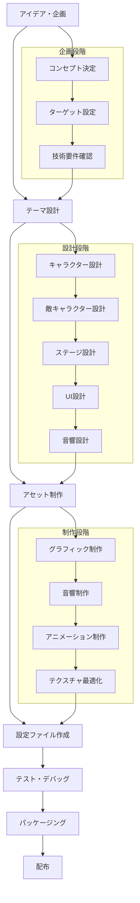
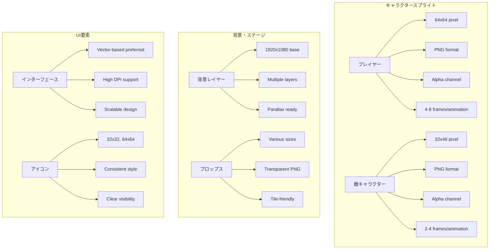
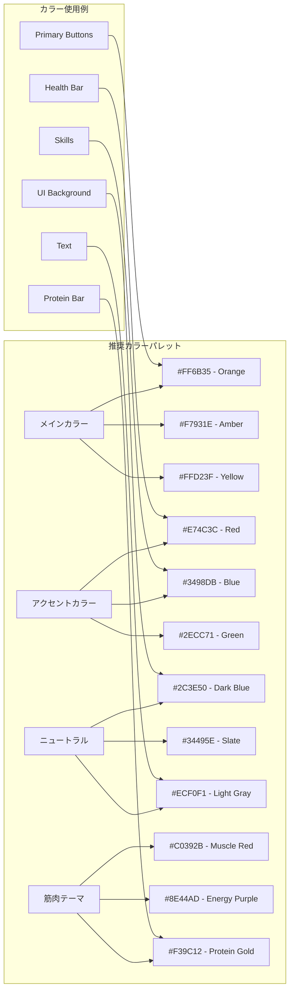
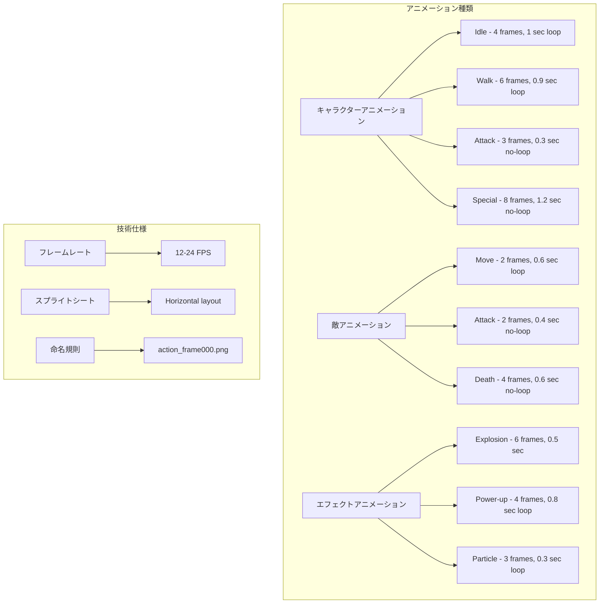
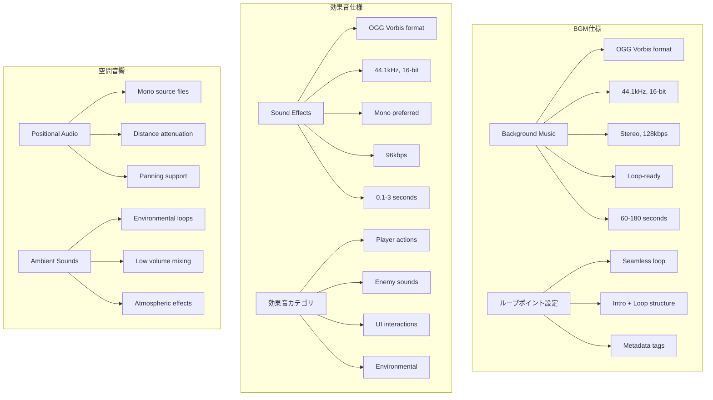
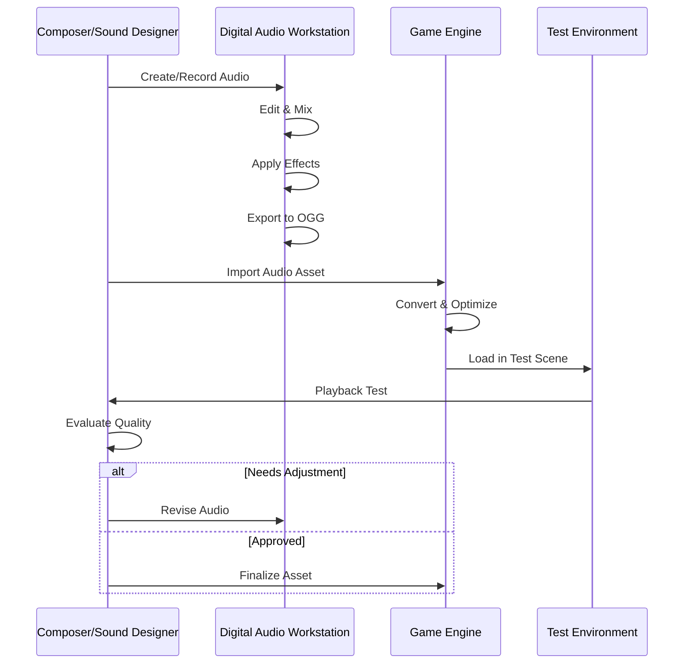
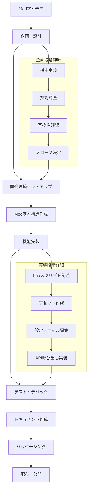
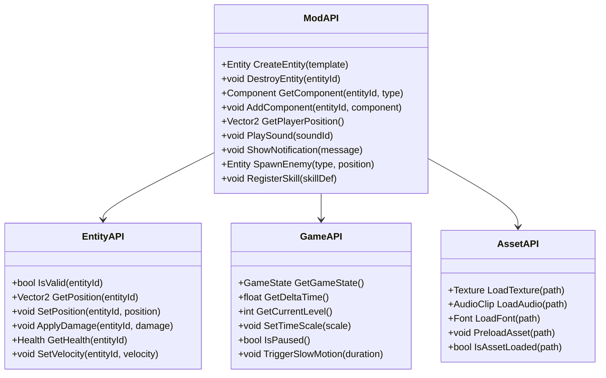

# マッスルドリーマー コンテンツ作成ガイド
*テーマ作成・Mod開発完全マニュアル 2025年版*

## 🎨 テーマ作成ガイド

### テーマ作成ワークフロー



### テーマディレクトリ構造

```
my_theme/
├── theme.yaml              # メインテーマ設定
├── assets/                 # アセットディレクトリ
│   ├── characters/          # キャラクタースプライト
│   │   ├── player_idle.png
│   │   ├── player_walk.png
│   │   └── player_special.png
│   ├── enemies/            # 敵キャラクタースプライト
│   │   ├── enemy_food_1.png
│   │   ├── enemy_food_2.png
│   │   └── boss_giant_cake.png
│   ├── stages/             # ステージ背景
│   │   ├── stage_1_bg.png
│   │   ├── stage_1_fg.png
│   │   └── stage_1_props.png
│   ├── ui/                 # UI要素
│   │   ├── health_bar.png
│   │   ├── skill_icons.png
│   │   └── menu_bg.png
│   ├── audio/              # 音声ファイル
│   │   ├── bgm/
│   │   │   ├── main_theme.ogg
│   │   │   └── boss_theme.ogg
│   │   └── sfx/
│   │       ├── jump.ogg
│   │       ├── attack.ogg
│   │       └── pickup.ogg
│   └── effects/            # エフェクト画像
│       ├── explosion.png
│       ├── power_up.png
│       └── particles.png
├── scripts/                # カスタムスクリプト（オプション）
│   ├── enemy_behavior.lua
│   └── special_effects.lua
├── localization/           # 多言語対応
│   ├── ja.yaml
│   ├── en.yaml
│   └── zh.yaml
└── README.md              # テーマ説明書
```

### theme.yaml 完全仕様

```yaml
# テーマメタデータ
metadata:
  id: "my_awesome_theme"                    # 一意のテーマID（英数字とアンダースコアのみ）
  name: "My Awesome Theme"                  # 表示名
  version: "1.0.0"                         # セマンティックバージョニング
  author: "Your Name"                       # 作者名
  description: "An amazing custom theme"    # 説明文
  tags: ["custom", "adventure", "fantasy"] # タグ（検索・分類用）
  dependencies: []                          # 依存テーマ（存在する場合）
  game_version: ">=1.0.0"                  # 対応ゲームバージョン
  license: "MIT"                           # ライセンス
  homepage: "https://example.com"          # ホームページ（オプション）
  
# キャラクター定義
characters:
  player:
    name: "Custom Hero"                     # プレイヤー名
    description: "A brave warrior"          # 説明
    sprite_sheets:
      idle: "assets/characters/player_idle.png"      # 待機アニメーション
      walk: "assets/characters/player_walk.png"      # 歩行アニメーション
      jump: "assets/characters/player_jump.png"      # ジャンプアニメーション
      attack: "assets/characters/player_attack.png"  # 攻撃アニメーション
      special: "assets/characters/player_special.png" # 特殊アニメーション
    
    # アニメーション設定
    animations:
      idle:
        frame_count: 4                      # フレーム数
        frame_duration: 0.25               # 1フレームの時間（秒）
        loop: true                         # ループするか
      walk:
        frame_count: 6
        frame_duration: 0.15
        loop: true
      attack:
        frame_count: 3
        frame_duration: 0.1
        loop: false
    
    # ステータス設定
    stats:
      base_speed: 120                      # 基本移動速度
      base_health: 100                     # 基本体力
      muscle_power: 50                     # 筋肉パワー
      protein_capacity: 200                # プロテイン最大容量
    
    # コリジョン設定
    collision:
      width: 32                           # 当たり判定幅
      height: 48                          # 当たり判定高さ
      offset_x: 0                         # X軸オフセット
      offset_y: -8                        # Y軸オフセット

# 敵キャラクター定義
enemies:
  categories:
    - id: "junk_food"
      name: "ジャンクフード"
      description: "体に悪い誘惑食品"
      enemies:
        - id: "burger"
          name: "誘惑バーガー"
          sprite: "assets/enemies/burger.png"
          health: 30
          speed: 80
          damage: 15
          temptation_power: 25
          behavior: "chase_player"          # AI行動パターン
          spawn_weight: 1.0                # 出現確率重み
          collision:
            width: 24
            height: 24
          
        - id: "pizza"
          name: "魔性ピザ"
          sprite: "assets/enemies/pizza.png"
          health: 50
          speed: 60
          damage: 20
          temptation_power: 35
          behavior: "circle_player"
          spawn_weight: 0.8
          
        - id: "donut"
          name: "甘美ドーナツ"
          sprite: "assets/enemies/donut.png"
          health: 20
          speed: 100
          damage: 10
          temptation_power: 30
          behavior: "bounce_around"
          spawn_weight: 1.2

    - id: "alcohol"
      name: "アルコール類"
      description: "筋肉の敵・アルコール"
      enemies:
        - id: "beer"
          name: "悪魔ビール"
          sprite: "assets/enemies/beer.png"
          health: 40
          speed: 70
          damage: 25
          temptation_power: 40
          behavior: "drunk_movement"
          special_effects: ["slow_player"]

# ステージ定義
stages:
  locations:
    - id: "muscle_beach"
      name: "マッスルビーチ"
      description: "筋トレの聖地で誘惑と戦う"
      
      # 背景設定
      background:
        layers:
          - file: "assets/stages/beach_sky.png"
            scroll_speed: 0.1              # パララックス速度
            z_order: -3
          - file: "assets/stages/beach_bg.png"
            scroll_speed: 0.3
            z_order: -2
          - file: "assets/stages/beach_props.png"
            scroll_speed: 0.8
            z_order: -1
      
      # 音響設定
      audio:
        bgm: "assets/audio/bgm/beach_theme.ogg"
        ambient_sounds:
          - file: "assets/audio/sfx/waves.ogg"
            volume: 0.3
            loop: true
          - file: "assets/audio/sfx/seagulls.ogg"
            volume: 0.2
            loop: true
      
      # ステージ固有設定
      stage_config:
        duration: 180                      # ステージ時間（秒）
        difficulty_multiplier: 1.0         # 難易度倍率
        spawn_rate_multiplier: 1.0         # 敵出現率倍率
        special_events:
          - time: 60
            type: "enemy_rush"
            duration: 10
            description: "敵大量出現"
          - time: 120
            type: "boss_spawn"
            enemy: "giant_burger_boss"
            description: "ボス出現"
      
      # 専用敵・アイテム
      special_enemies: ["beach_volleyball", "ice_cream_truck"]
      special_items: ["protein_shake", "muscle_supplement"]

# スキルシステム定義
skills:
  muscle_skills:
    - id: "protein_beam"
      name: "プロテインビーム"
      description: "純粋なタンパク質光線で誘惑を浄化"
      icon: "assets/ui/skills/protein_beam.png"
      max_level: 5
      
      # レベル別設定
      levels:
        1:
          damage: 30
          range: 150
          cooldown: 3.0
          protein_cost: 20
        2:
          damage: 40
          range: 180
          cooldown: 2.8
          protein_cost: 18
        # ... レベル5まで
      
      # エフェクト設定
      effects:
        projectile_sprite: "assets/effects/protein_beam.png"
        hit_effect: "assets/effects/protein_explosion.png"
        sound_cast: "assets/audio/sfx/beam_cast.ogg"
        sound_hit: "assets/audio/sfx/beam_hit.ogg"
    
    - id: "muscle_barrier"
      name: "筋肉バリア"
      description: "鍛え上げた筋肉で誘惑をブロック"
      icon: "assets/ui/skills/muscle_barrier.png"
      max_level: 3
      type: "defensive"
      
      levels:
        1:
          duration: 5.0
          damage_reduction: 0.5
          cooldown: 15.0
          protein_cost: 30

# UI設定
ui:
  theme_colors:
    primary: "#FF6B35"                     # メインカラー
    secondary: "#F7931E"                   # サブカラー
    background: "#2C3E50"                  # 背景色
    text: "#FFFFFF"                        # テキスト色
    accent: "#E74C3C"                      # アクセント色
  
  fonts:
    main: "assets/fonts/game_font.ttf"     # メインフォント
    ui: "assets/fonts/ui_font.ttf"         # UIフォント
    title: "assets/fonts/title_font.ttf"   # タイトルフォント
  
  elements:
    health_bar:
      sprite: "assets/ui/health_bar.png"
      position: [20, 20]                   # 画面上の位置
      size: [200, 20]
    
    protein_meter:
      sprite: "assets/ui/protein_meter.png"
      position: [20, 50]
      size: [200, 15]
    
    skill_icons:
      sprite: "assets/ui/skill_frame.png"
      position: [20, 80]
      icon_size: [32, 32]
      spacing: 40

# ローカライゼーション設定
localization:
  default_language: "ja"
  supported_languages: ["ja", "en", "zh"]
  
  # テキスト定義（メインファイルでは最小限に）
  text:
    theme_name: "My Awesome Theme"
    theme_description: "An amazing custom theme for muscle dreamers"
    player_name: "Custom Hero"
    # 他のテキストはlocalization/フォルダ内のファイルで定義

# パフォーマンス設定
performance:
  max_enemies_on_screen: 50              # 同時表示敵数制限
  particle_limit: 100                    # パーティクル制限
  texture_compression: true              # テクスチャ圧縮有効
  asset_preloading: ["characters", "ui"] # 事前読み込みカテゴリ
```

---

## 🎯 アセット制作ガイドライン

### グラフィックアセット仕様



### カラーパレット設計



### アニメーション仕様



---

## 🔊 音響アセット制作

### 音響ファイル仕様



### 音響制作ワークフロー



---

## 🔧 Mod開発ガイド

### Mod作成ワークフロー



### Modディレクトリ構造

```
my_mod/
├── mod.yaml                # Modメタデータ
├── scripts/                # Luaスクリプト
│   ├── main.lua            # メインロジック
│   ├── enemies/            # 敵AI関連
│   │   ├── zombie_ai.lua
│   │   └── boss_ai.lua
│   ├── skills/             # スキル関連
│   │   └── new_skill.lua
│   └── utils/              # ユーティリティ
│       └── helpers.lua
├── assets/                 # Mod固有アセット
│   ├── sprites/
│   ├── audio/
│   └── ui/
├── config/                 # 設定ファイル
│   ├── enemies.yaml
│   ├── skills.yaml
│   └── balance.yaml
├── localization/           # 多言語対応
│   ├── ja.yaml
│   └── en.yaml
├── themes/                 # テーマオーバーライド
│   └── zombie_theme/
├── docs/                   # ドキュメント
│   ├── README.md
│   ├── CHANGELOG.md
│   └── API_USAGE.md
└── tests/                  # テストファイル
    ├── test_enemies.lua
    └── test_skills.lua
```

### mod.yaml 仕様

```yaml
# Modメタデータ
metadata:
  id: "zombie_apocalypse"
  name: "Zombie Apocalypse Mod"
  version: "1.2.0"
  author: "ModCreator"
  description: "Transform enemies into zombies with new AI behavior"
  
  # 互換性・依存関係
  game_version: ">=1.0.0"
  api_version: "1.0"
  dependencies:
    - mod_id: "enhanced_ai"
      version: ">=0.5.0"
      optional: true
  
  # Mod分類・タグ
  category: "gameplay"
  tags: ["zombies", "horror", "ai", "enemies"]
  
  # 法的・技術情報
  license: "MIT"
  homepage: "https://github.com/creator/zombie-mod"
  repository: "https://github.com/creator/zombie-mod"
  
  # セキュリティ・権限
  permissions:
    - "create_entities"         # エンティティ作成
    - "modify_ai"              # AI動作変更
    - "load_assets"            # アセット読み込み
    - "play_sounds"            # 音声再生
    - "modify_ui"              # UI変更
  
  # パフォーマンス制限
  limits:
    max_entities: 100          # 最大エンティティ数
    max_memory_mb: 50          # 最大メモリ使用量
    max_script_time_ms: 10     # スクリプト実行時間制限

# テーマオーバーライド（オプション）
theme_overrides:
  enemies:
    categories:
      - id: "undead"
        name: "Undead Enemies"
        enemies:
          - id: "zombie"
            name: "Zombie"
            sprite: "assets/sprites/zombie.png"
            health: 60
            speed: 40
            damage: 25
            behavior: "zombie_shamble"

# スクリプト定義
scripts:
  - file: "scripts/main.lua"
    type: "main"
    description: "Main mod initialization"
    
  - file: "scripts/enemies/zombie_ai.lua"
    type: "ai_behavior"
    description: "Zombie AI behavior implementation"
    
  - file: "scripts/skills/necromancy.lua"
    type: "skill"
    description: "Necromancy skill implementation"

# アセット定義
assets:
  - file: "assets/sprites/zombie.png"
    type: "sprite"
    description: "Zombie character sprite"
    
  - file: "assets/audio/zombie_growl.ogg"
    type: "audio"
    description: "Zombie sound effect"

# 設定オプション
config:
  zombie_spawn_rate:
    type: "float"
    default: 0.3
    min: 0.0
    max: 1.0
    description: "Probability of spawning zombies instead of normal enemies"
  
  zombie_health_multiplier:
    type: "float"
    default: 1.5
    min: 0.5
    max: 3.0
    description: "Health multiplier for zombie enemies"
  
  enable_necromancy:
    type: "boolean"
    default: true
    description: "Enable necromancy skill for player"
```

---

## 🖥️ Lua スクリプティング API

### 基本API構造



### Luaスクリプト例：カスタム敵AI

```lua
-- scripts/enemies/zombie_ai.lua
-- ゾンビAIの実装例

local ZombieAI = {}

-- ゾンビAIの初期化
function ZombieAI.Initialize(entityId)
    local ai_component = {
        state = "wandering",        -- 初期状態
        target = nil,              -- ターゲット
        last_moan_time = 0,        -- 最後にうめき声を出した時間
        health_threshold = 0.3,     -- 狂暴化する体力閾値
        wander_timer = 0,          -- 徘徊タイマー
        detection_radius = 100,     -- 検出範囲
        attack_radius = 30,        -- 攻撃範囲
        movement_speed = 40        -- 移動速度
    }
    
    -- AIコンポーネントを追加
    ModAPI.AddComponent(entityId, "AIComponent", ai_component)
    
    -- 初期位置設定
    local position = ModAPI.GetComponent(entityId, "Transform").position
    print("Zombie spawned at: " .. position.x .. ", " .. position.y)
end

-- フレーム毎のAI更新
function ZombieAI.Update(entityId, deltaTime)
    if not ModAPI.IsValid(entityId) then
        return
    end
    
    local ai = ModAPI.GetComponent(entityId, "AIComponent")
    local transform = ModAPI.GetComponent(entityId, "Transform")
    local health = ModAPI.GetComponent(entityId, "Health")
    
    -- 体力が低い場合は狂暴化
    if health.current / health.max < ai.health_threshold then
        ai.state = "berserk"
        ai.movement_speed = 80
    end
    
    -- 状態に応じた行動
    if ai.state == "wandering" then
        ZombieAI.WanderBehavior(entityId, ai, transform, deltaTime)
    elseif ai.state == "chasing" then
        ZombieAI.ChaseBehavior(entityId, ai, transform, deltaTime)
    elseif ai.state == "attacking" then
        ZombieAI.AttackBehavior(entityId, ai, transform, deltaTime)
    elseif ai.state == "berserk" then
        ZombieAI.BerserkBehavior(entityId, ai, transform, deltaTime)
    end
    
    -- プレイヤー検出
    ZombieAI.DetectPlayer(entityId, ai, transform)
    
    -- 定期的なうめき声
    ZombieAI.PlayMoanSound(entityId, ai, deltaTime)
end

-- 徘徊行動
function ZombieAI.WanderBehavior(entityId, ai, transform, deltaTime)
    ai.wander_timer = ai.wander_timer + deltaTime
    
    if ai.wander_timer > 3.0 then  -- 3秒毎に方向変更
        -- ランダムな方向に移動
        local angle = math.random() * 2 * math.pi
        local velocity = {
            x = math.cos(angle) * ai.movement_speed * 0.3,  -- 徘徊は遅め
            y = math.sin(angle) * ai.movement_speed * 0.3
        }
        ModAPI.SetVelocity(entityId, velocity)
        ai.wander_timer = 0
    end
end

-- 追跡行動
function ZombieAI.ChaseBehavior(entityId, ai, transform, deltaTime)
    if ai.target then
        local player_pos = ModAPI.GetPlayerPosition()
        local zombie_pos = transform.position
        
        -- プレイヤーへの方向ベクトル計算
        local dx = player_pos.x - zombie_pos.x
        local dy = player_pos.y - zombie_pos.y
        local distance = math.sqrt(dx * dx + dy * dy)
        
        if distance < ai.attack_radius then
            ai.state = "attacking"
        elseif distance > ai.detection_radius * 1.5 then
            ai.state = "wandering"  -- 見失った
            ai.target = nil
        else
            -- プレイヤーに向かって移動
            local velocity = {
                x = (dx / distance) * ai.movement_speed,
                y = (dy / distance) * ai.movement_speed
            }
            ModAPI.SetVelocity(entityId, velocity)
        end
    else
        ai.state = "wandering"
    end
end

-- 攻撃行動
function ZombieAI.AttackBehavior(entityId, ai, transform, deltaTime)
    -- 攻撃アニメーション再生
    ModAPI.PlayAnimation(entityId, "attack")
    
    -- プレイヤーにダメージ
    local player_pos = ModAPI.GetPlayerPosition()
    local zombie_pos = transform.position
    local distance = math.sqrt(
        (player_pos.x - zombie_pos.x)^2 + 
        (player_pos.y - zombie_pos.y)^2
    )
    
    if distance < ai.attack_radius then
        ModAPI.DamagePlayer(25)  -- 25ダメージ
        ModAPI.PlaySound("zombie_attack")
    end
    
    -- 攻撃後は一時停止
    ModAPI.SetVelocity(entityId, {x = 0, y = 0})
    
    -- 1秒後に追跡状態に戻る
    ai.attack_cooldown = 1.0
    ai.state = "chasing"
end

-- 狂暴化行動
function ZombieAI.BerserkBehavior(entityId, ai, transform, deltaTime)
    -- 狂暴化状態では常にプレイヤーを追跡
    ai.state = "chasing"
    ai.detection_radius = 200  -- 検出範囲拡大
    
    -- 移動速度アップ済み（Initialize時に設定）
    ZombieAI.ChaseBehavior(entityId, ai, transform, deltaTime)
    
    -- 狂暴化エフェクト表示
    if math.random() < 0.1 then  -- 10%の確率で
        ModAPI.CreateEffect("berserk_aura", transform.position)
    end
end

-- プレイヤー検出
function ZombieAI.DetectPlayer(entityId, ai, transform)
    local player_pos = ModAPI.GetPlayerPosition()
    local zombie_pos = transform.position
    
    local distance = math.sqrt(
        (player_pos.x - zombie_pos.x)^2 + 
        (player_pos.y - zombie_pos.y)^2
    )
    
    if distance < ai.detection_radius and ai.state == "wandering" then
        ai.state = "chasing"
        ai.target = "player"
        ModAPI.PlaySound("zombie_detect")
    end
end

-- うめき声の再生
function ZombieAI.PlayMoanSound(entityId, ai, deltaTime)
    ai.last_moan_time = ai.last_moan_time + deltaTime
    
    if ai.last_moan_time > 5.0 + math.random() * 3.0 then  -- 5-8秒間隔
        ModAPI.PlaySound("zombie_moan")
        ai.last_moan_time = 0
    end