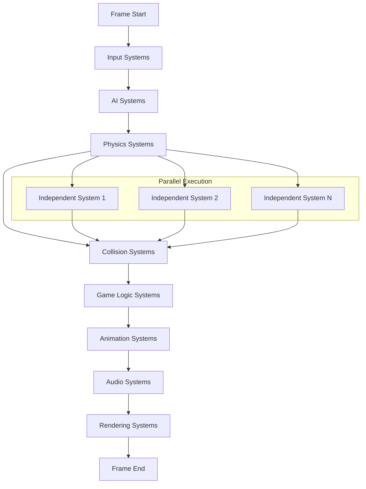

# ECSフレームワーク アーキテクチャ設計

## 設計概要

**設計日時**: 2025-08-07  
**対象プロジェクト**: Muscle Dreamer ECSフレームワーク  
**設計根拠**: `docs/spec/ecs-framework-requirements.md`  
**設計思想**: 高性能・メモリ効率・型安全・拡張性  

## システム概要

Muscle Dreamer ECSフレームワークは、高性能な2Dゲームエンジンの中核を成すEntity Component Systemアーキテクチャです。10,000以上のエンティティを60FPSで処理し、MODシステムとの安全な統合を提供します。

## アーキテクチャパターン

### 選択パターン: Data-Oriented Design (DOD) + ECS
- **理由**: メモリ効率とCPUキャッシュ効率を最大化し、大量エンティティの高速処理を実現
- **特徴**: コンポーネントデータをメモリ連続配置し、システムがバッチ処理で効率的にアクセス

### 設計原則
1. **データ駆動設計**: ロジックよりもデータレイアウトを重視
2. **関心の分離**: Entity（識別）・Component（データ）・System（ロジック）の明確な分離
3. **組み合わせ可能性**: コンポーネントの自由な組み合わせによる柔軟なエンティティ構成
4. **パフォーマンス優先**: キャッシュ効率・メモリ効率・並列処理を考慮した設計

## コンポーネント構成

### Core ECS Layer
```go
internal/core/ecs/
├── entity.go          # EntityManager - エンティティライフサイクル管理
├── component.go       # ComponentStore - 型安全なコンポーネントストレージ
├── system.go          # SystemManager - システム実行順序・依存関係管理
├── query.go           # QueryEngine - 高速エンティティ検索・フィルタリング
├── memory.go          # MemoryManager - メモリプール・ガベージコレクション最適化
└── world.go           # World - ECS全体の統合管理
```

### Component Types Layer
```go
internal/core/components/
├── transform.go       # 位置・回転・スケール
├── sprite.go          # スプライト描画
├── physics.go         # 物理演算
├── health.go          # HP・ステータス管理
├── ai.go              # AI行動
└── inventory.go       # アイテム管理
```

### System Types Layer
```go
internal/core/systems/
├── movement.go        # 移動・物理更新
├── rendering.go       # 描画・アニメーション
├── collision.go       # 衝突判定
├── audio.go           # 音響効果
├── input.go           # 入力処理
└── gameplay.go        # ゲームロジック
```

### MOD Integration Layer
```go
internal/mod/ecs/
├── sandbox.go         # MOD向けECS API制限
├── validator.go       # MODコンポーネント・システム検証
├── bridge.go          # Go ↔ Lua ブリッジ
└── security.go        # セキュリティポリシー
```

## メモリアーキテクチャ

### Component Storage Design
```
エンティティID: [0, 1, 2, 3, 4, ...]

TransformComponent配列:
[Transform0, Transform1, Transform2, ...]
   X,Y,Rot     X,Y,Rot     X,Y,Rot

SpriteComponent配列:
[Sprite0, Sprite2, Sprite4, ...]  // エンティティ1,3はSpriteを持たない
 Image,W,H   Image,W,H   Image,W,H

スパースセット:
EntityID -> ComponentIndex マッピング
Dense配列: 実際のコンポーネントデータ
```

### メモリレイアウト戦略
1. **AoS vs SoA**: Structure of Arrays使用でキャッシュ効率最大化
2. **メモリプール**: 固定サイズブロックによる断片化防止
3. **コンポーネントパッキング**: 関連コンポーネントの隣接配置
4. **ガベージコレクション**: 明示的メモリ管理とGC圧力軽減

## システム実行アーキテクチャ

### System Execution Pipeline


### システム依存関係管理
- **依存関係グラフ**: システム間の実行順序を定義
- **並列実行**: 独立システムの並列処理によるCPU効率化
- **エラー隔離**: システム実行エラーの他システムへの波及防止

## パフォーマンス最適化戦略

### エンティティ管理最適化
1. **EntityID再利用**: 削除済みIDの再利用による断片化防止
2. **バッチ操作**: 大量エンティティの一括作成・削除
3. **階層化**: 親子関係を持つエンティティの効率的管理

### コンポーネントアクセス最適化
1. **キャッシュフレンドリーアクセス**: 連続メモリアクセスパターン
2. **プリフェッチ**: 次に必要なデータの事前読み込み
3. **SIMD活用**: ベクトル演算による並列計算

### システム最適化
1. **Early Exit**: 条件を満たさないエンティティの早期スキップ
2. **Dirty Flag**: 変更のあったエンティティのみ処理
3. **Level of Detail**: 距離・重要度に応じた処理品質調整

## セキュリティアーキテクチャ

### MODサンドボックス設計
```go
type ModECSAPI struct {
    allowedComponents []ComponentType  // 許可されたコンポーネント型
    allowedSystems    []SystemType     // 許可されたシステム型
    entityLimit       int              // 作成可能エンティティ数制限
    memoryLimit       int64            // メモリ使用量制限
}
```

### セキュリティレイヤー
1. **API制限**: MODが使用可能なECS機能の制限
2. **メモリ保護**: MODによる不正メモリアクセス防止
3. **実行時間制限**: MODシステムの実行時間制限
4. **リソース制限**: エンティティ・コンポーネント数制限

## エラーハンドリング設計

### エラー分類
```go
type ECSError interface {
    error
    GetSeverity() ErrorSeverity
    GetComponent() string
    IsRecoverable() bool
}

const (
    ErrorSeverityInfo     ErrorSeverity = iota  // 情報
    ErrorSeverityWarning                        // 警告
    ErrorSeverityError                          // エラー
    ErrorSeverityFatal                          // 致命的
)
```

### エラー処理戦略
1. **グレースフル処理**: システムエラーが他に影響しない設計
2. **エラーログ**: 詳細なデバッグ情報の記録
3. **自動復旧**: 可能な範囲での自動エラー復旧
4. **フォールバック**: エラー時の安全な代替処理

## テスト戦略

### テスト分類
1. **単体テスト**: 各コンポーネント・システムの個別テスト
2. **統合テスト**: ECS全体の協調動作テスト
3. **パフォーマンステスト**: 大量データでの性能測定
4. **ストレステスト**: 限界条件での安定性確認

### テスト自動化
- **継続的テスト**: プルリクエスト毎の自動テスト実行
- **ベンチマーク**: 性能劣化の自動検出
- **メモリリークテスト**: 長時間実行での安定性確認

## 実装フェーズ

### Phase 1: Core ECS (週1-2)
- EntityManager基本実装
- ComponentStore実装
- 基本SystemManager実装

### Phase 2: Performance Optimization (週3-4)
- メモリプール実装
- クエリエンジン最適化
- システム並列実行

### Phase 3: MOD Integration (週5-6)
- MOD API実装
- セキュリティレイヤー
- Luaブリッジ

### Phase 4: Advanced Features (週7-8)
- パフォーマンス監視
- エラーハンドリング
- テストスイート完成

## 設計決定記録

### 決定1: Goジェネリクス使用
- **理由**: 型安全性とパフォーマンスの両立
- **トレードオフ**: Go 1.18+要求、コンパイル時間増加

### 決定2: スパースセット採用
- **理由**: エンティティ-コンポーネントマッピングの高速化
- **トレードオフ**: メモリ使用量増加、実装複雑化

### 決定3: システム依存関係グラフ
- **理由**: 実行順序の明確化と並列実行最適化
- **トレードオフ**: 循環依存検出の複雑化

---

この設計により、Muscle DreamerのECSフレームワークは高性能・高拡張性・高セキュリティを実現し、大規模ゲーム開発を支える堅牢な基盤となります。