# ECSフレームワーク データフロー設計

## システム全体データフロー

### 高レベルアーキテクチャフロー
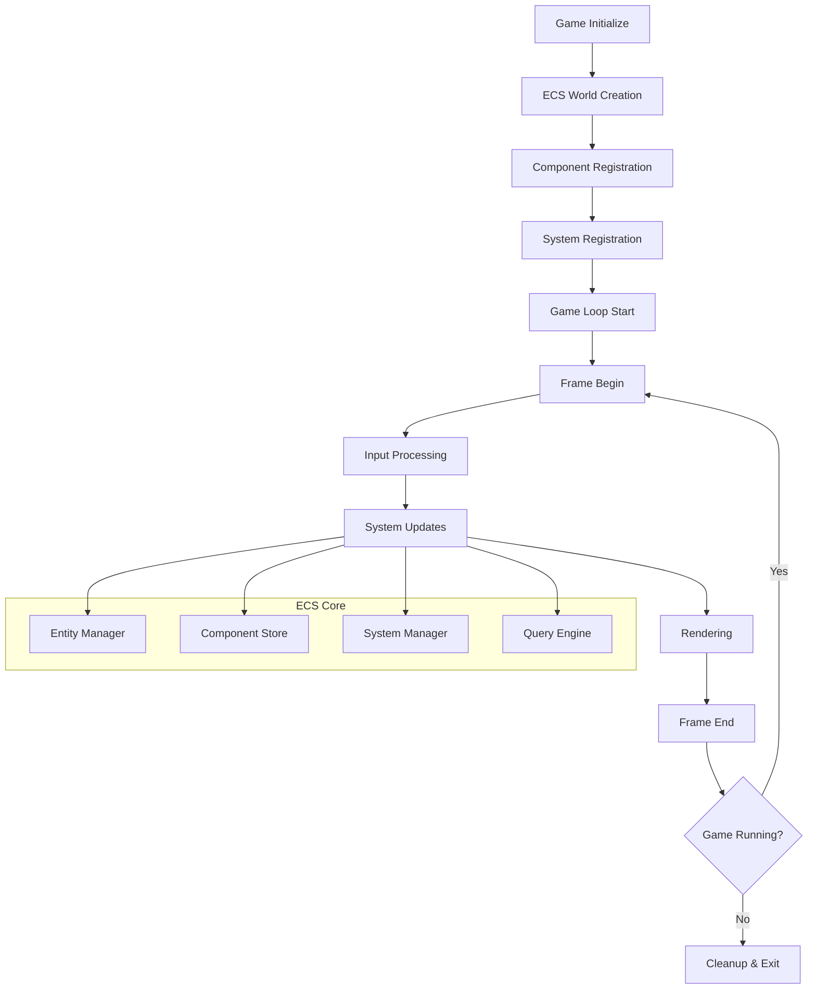

## エンティティライフサイクルフロー

### エンティティ作成・削除フロー
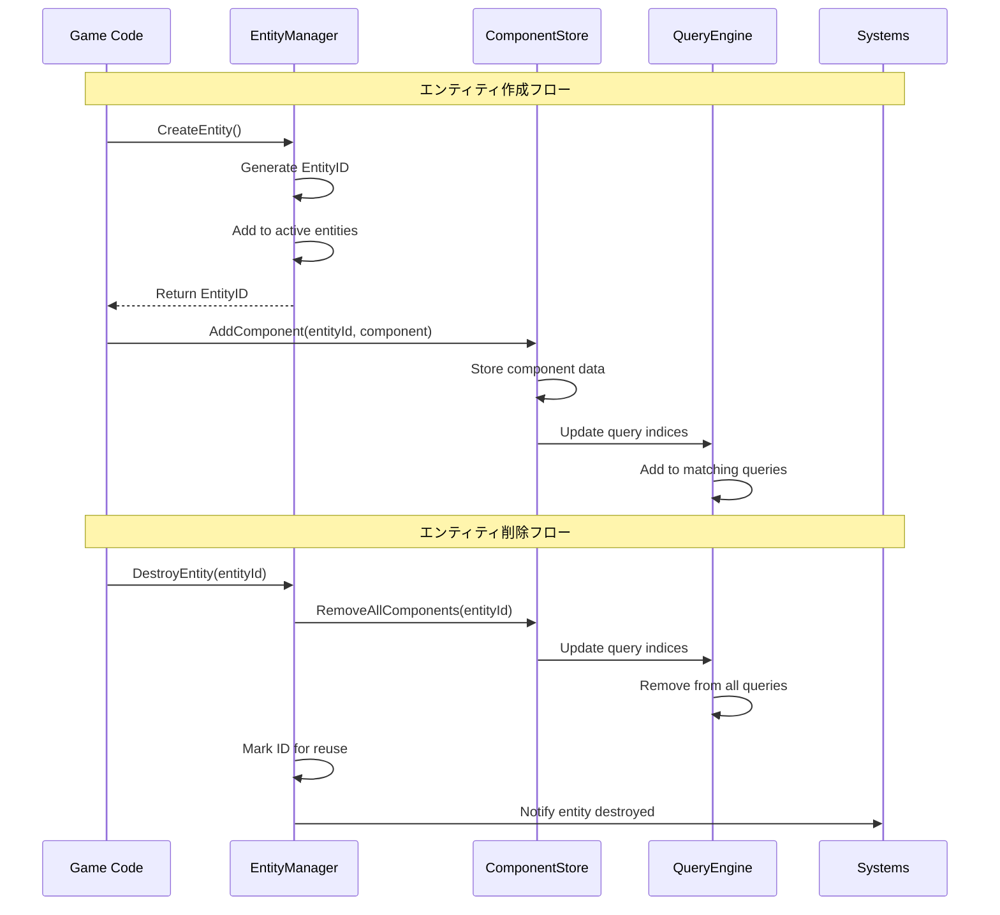

## コンポーネント管理データフロー

### コンポーネントストレージフロー
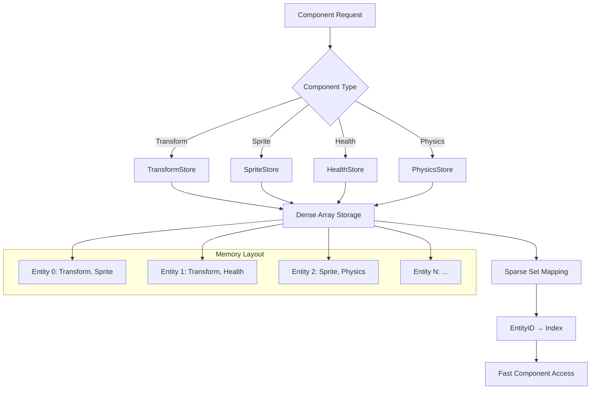

### コンポーネントアクセスパターン
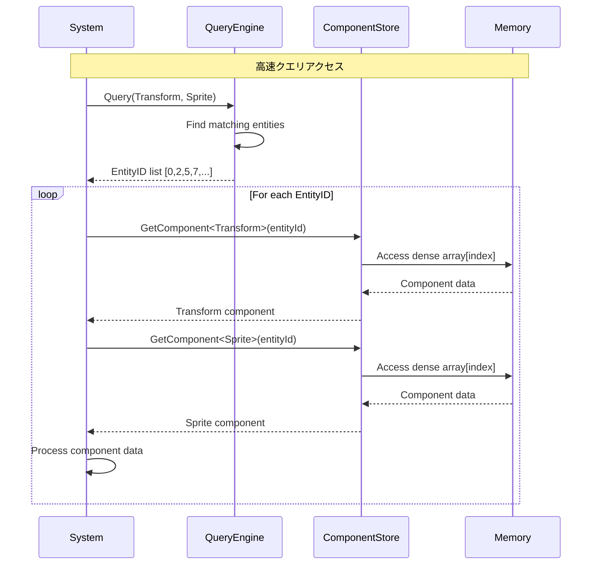

## システム実行データフロー

### システム更新パイプライン
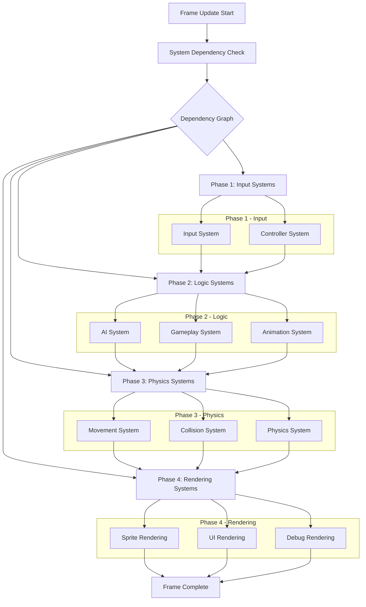

### システム並列実行フロー
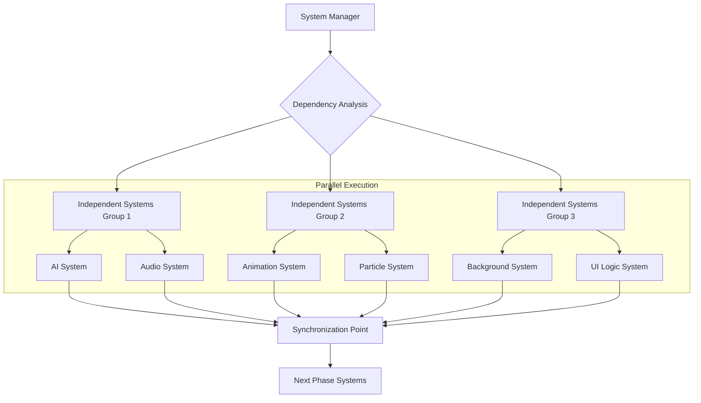

## メモリ管理データフロー

### メモリプール管理フロー
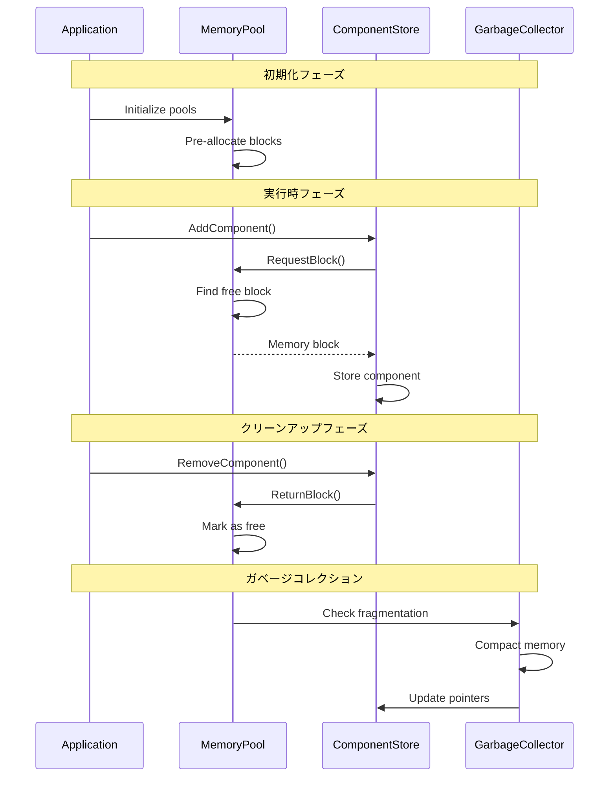

### メモリレイアウト最適化
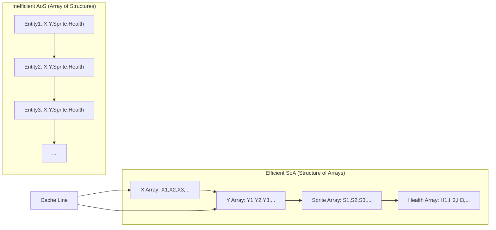

## クエリエンジンデータフロー

### 高速エンティティ検索フロー
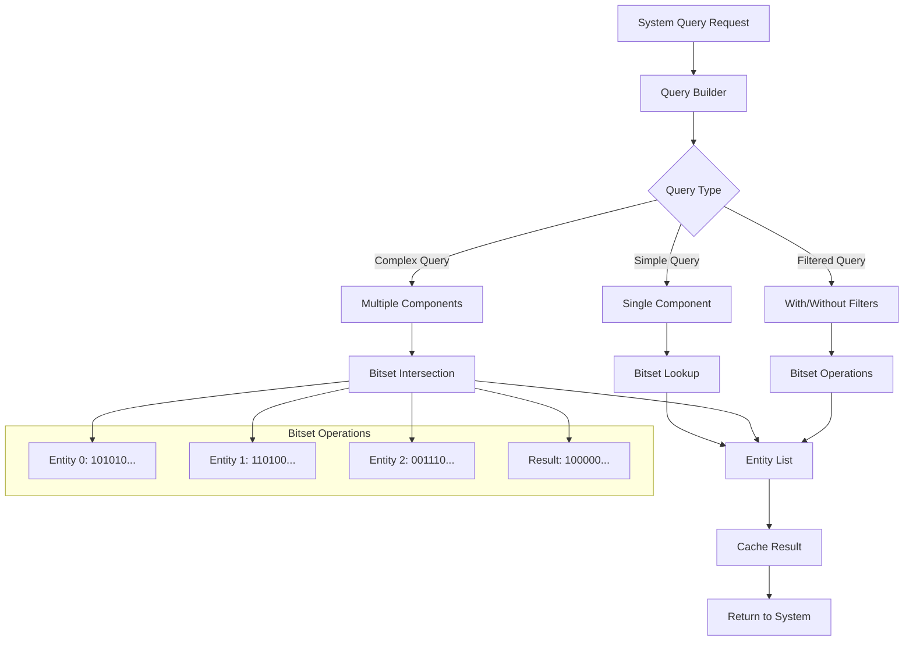

## MODシステム統合データフロー

### MOD ECS API フロー
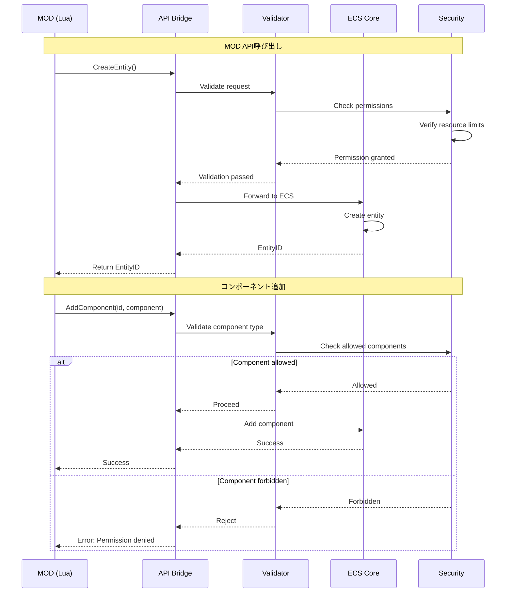

### MODセキュリティフロー
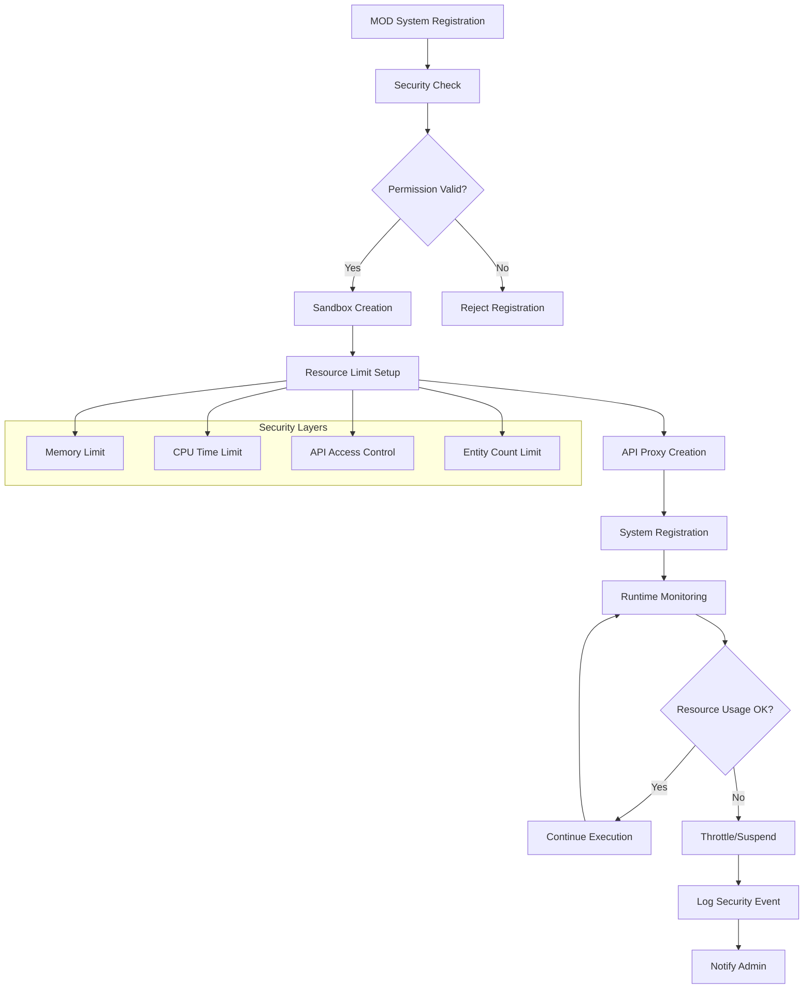

## パフォーマンス監視データフロー

### メトリクス収集フロー
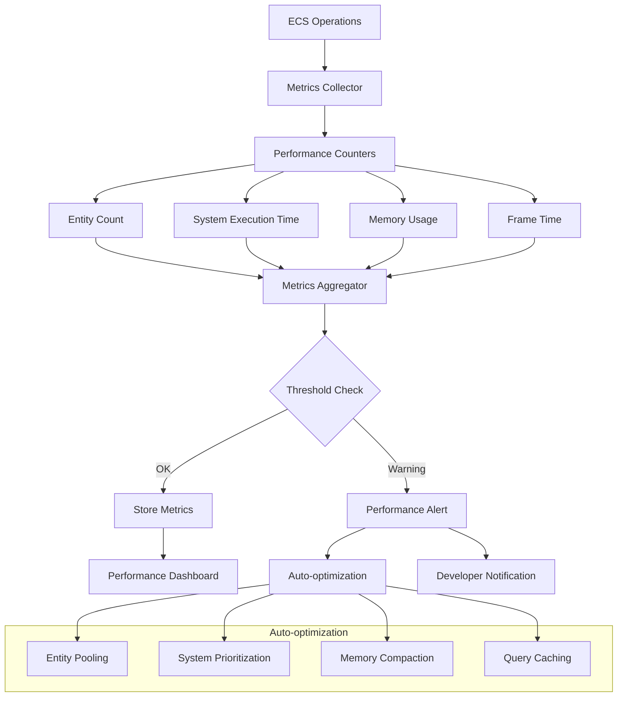

## エラーハンドリングフロー

### エラー処理・復旧フロー
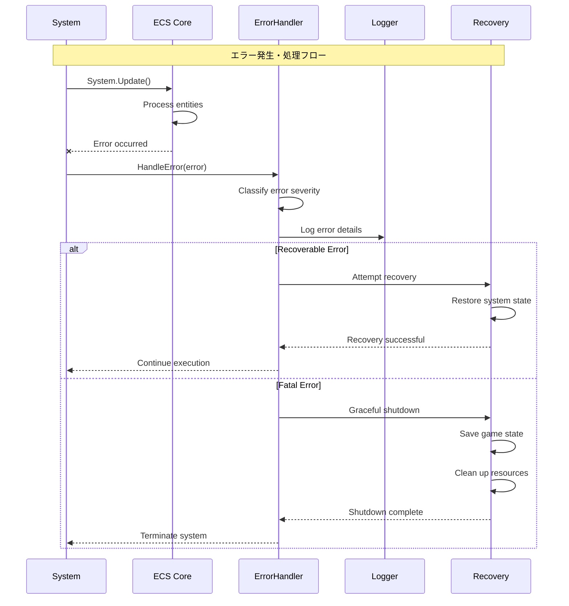

---

このデータフロー設計により、ECSフレームワークの各コンポーネント間の相互作用が明確になり、高性能・高信頼性・高セキュリティを実現する実装指針が提供されます。