# ECSフレームワーク データフロー図

## システム全体のデータフロー

### 1. ECS アーキテクチャ概要

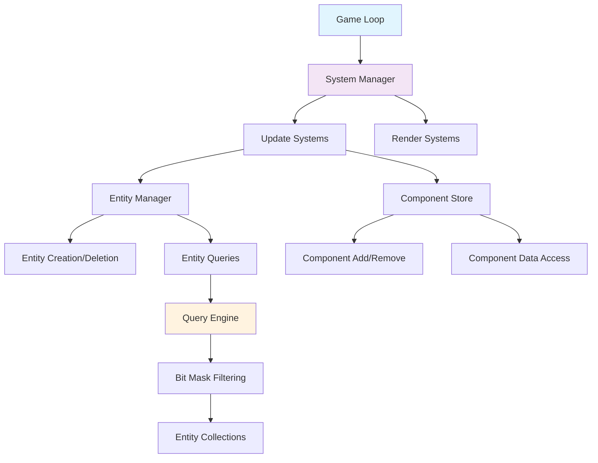

### 2. エンティティライフサイクル

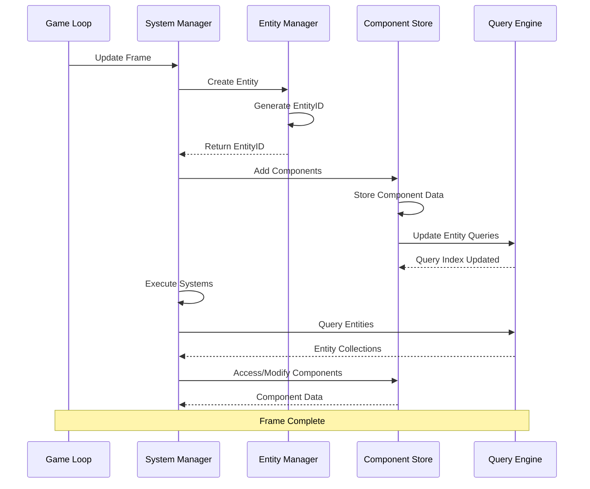

### 3. システム実行フロー

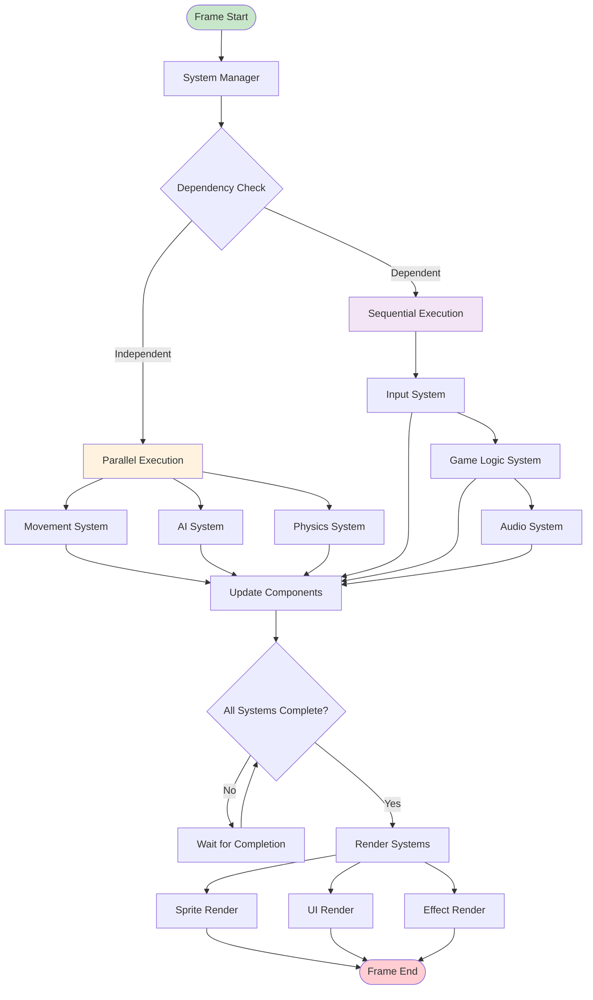

### 4. コンポーネントクエリ処理

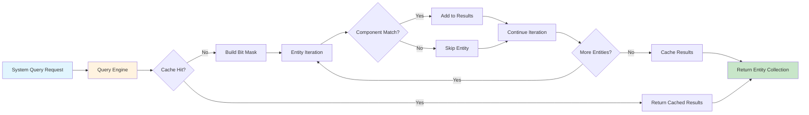

### 5. メモリ管理データフロー

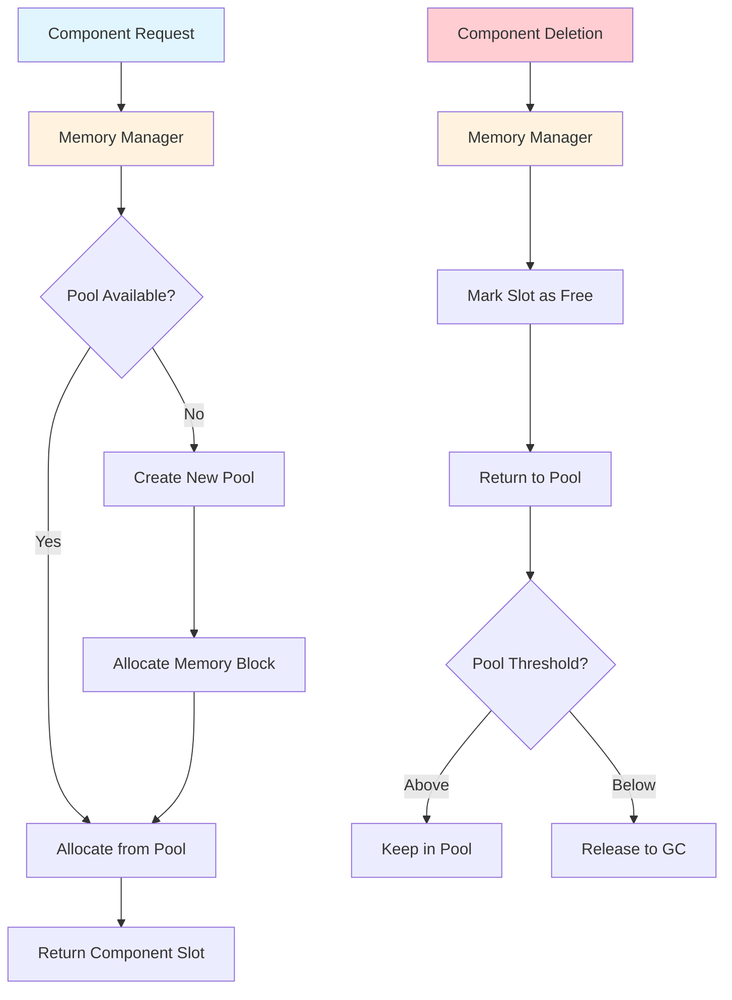

## 詳細データフロー仕様

### エンティティ作成フロー

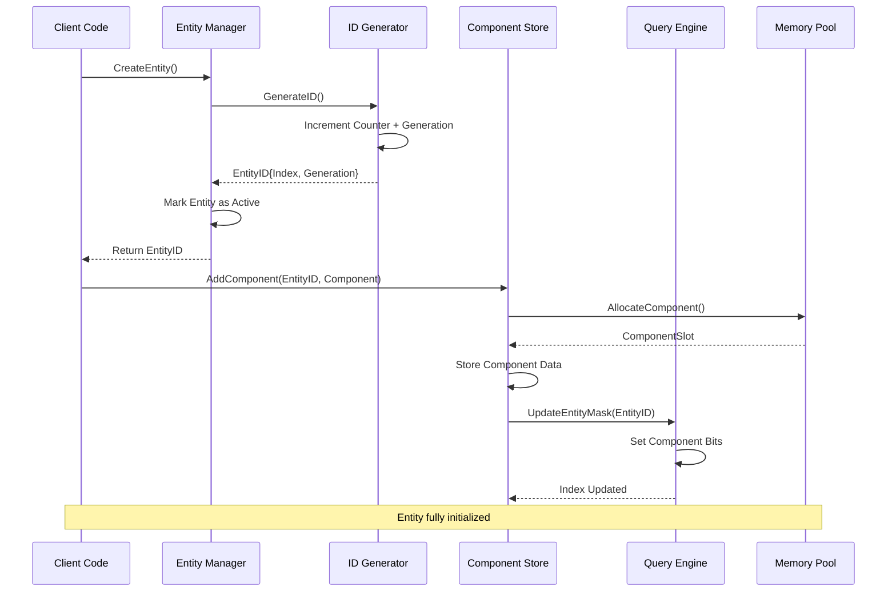

### システム並列実行フロー

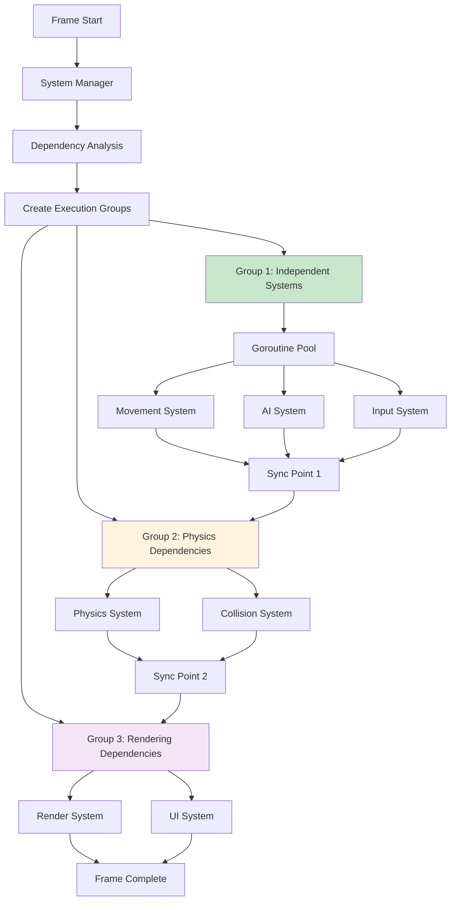

### 高性能クエリシステム

```mermaid
flowchart LR
    A[System Query] --> B[Component Mask]
    B --> C[Mask: 0011010]
    
    C --> D[Entity Iteration]
    D --> E[Entity 1: 0011010]
    D --> F[Entity 2: 0010010]
    D --> G[Entity 3: 0011110]
    
    E --> H{Mask & Entity == Mask?}
    F --> I{Mask & Entity == Mask?}
    G --> J{Mask & Entity == Mask?}
    
    H -->|Yes: 0011010| K[Include Entity 1]
    I -->|No: 0010010| L[Skip Entity 2]
    J -->|Yes: 0011110| M[Include Entity 3]
    
    K --> N[Result Collection]
    M --> N
    
    N --> O[Return [Entity1, Entity3]]
    
    style C fill:#fff3e0
    style H fill:#c8e6c9
    style I fill:#ffcdd2
    style J fill:#c8e6c9
```

## パフォーマンス最適化フロー

### キャッシュフレンドリーなデータアクセス

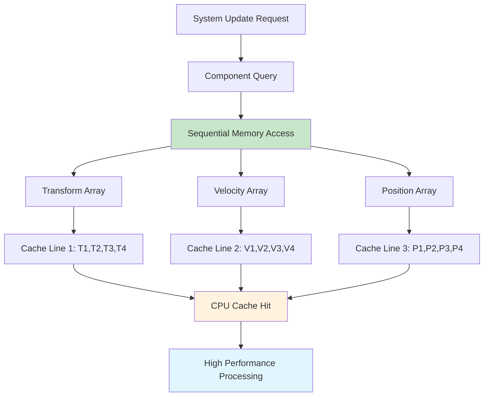

### メモリプール効率化

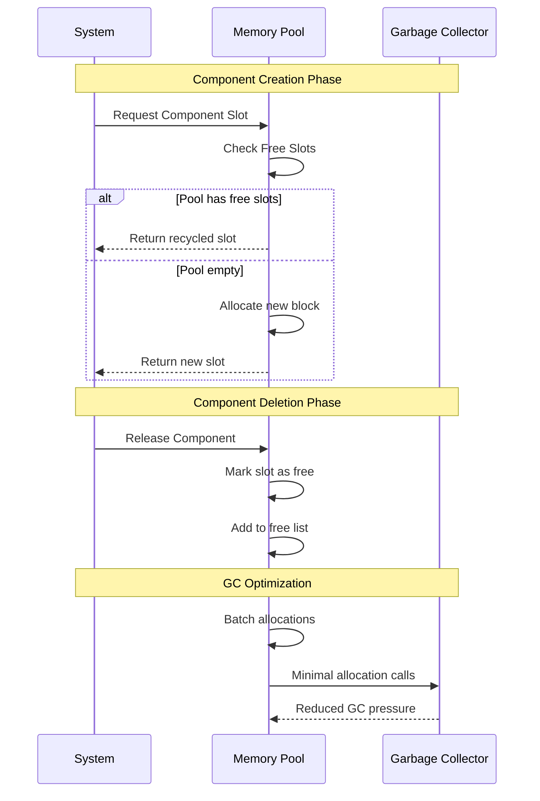

## エラーハンドリングフロー

### 防御的プログラミング

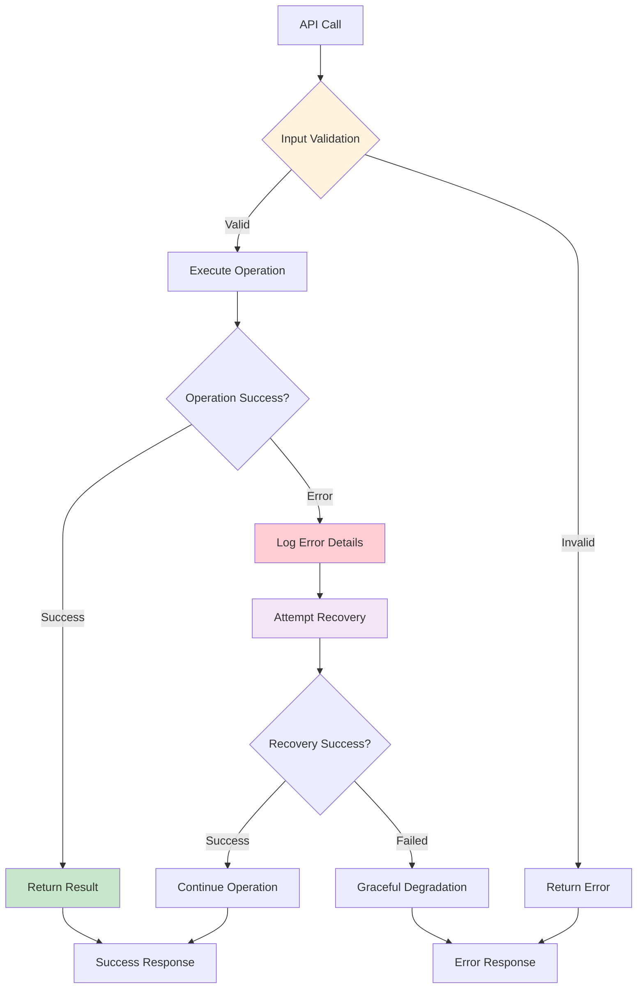

## MODセキュリティデータフロー

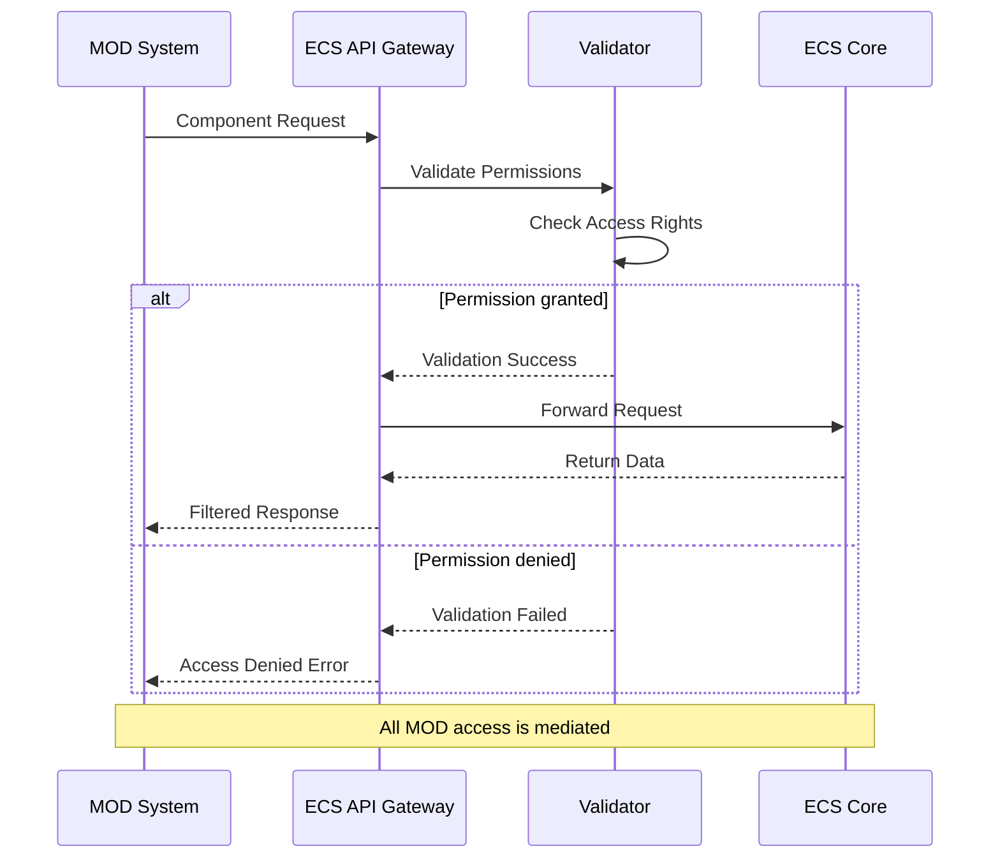

このデータフロー設計により、ECSフレームワークは高性能・安全性・拡張性を同時に実現します。