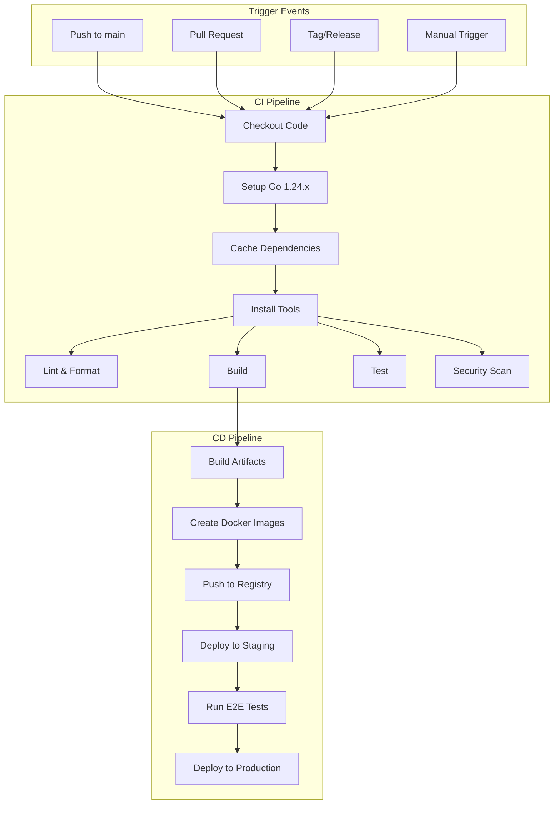

# CI/CD Pipeline 設計書

## 概要
Go 1.24.xアップグレードに対応したCI/CDパイプラインの設計と実装戦略。GitHub ActionsとDockerを活用した自動化されたビルド、テスト、デプロイプロセスを構築する。

## パイプラインアーキテクチャ

### 全体構成


## GitHub Actions Workflows

### .github/workflows/ci.yml
```yaml
name: CI Pipeline

on:
  push:
    branches: [main, develop, 'feat/*']
  pull_request:
    branches: [main, develop]
  workflow_dispatch:

env:
  GO_VERSION: '1.24.5'
  GOLANGCI_LINT_VERSION: 'v1.54.2'

jobs:
  lint:
    name: Lint Code
    runs-on: ubuntu-latest
    steps:
      - name: Checkout code
        uses: actions/checkout@v4
        
      - name: Setup Go
        uses: actions/setup-go@v5
        with:
          go-version: ${{ env.GO_VERSION }}
          cache: true
          
      - name: Install golangci-lint
        run: |
          curl -sSfL https://raw.githubusercontent.com/golangci/golangci-lint/master/install.sh | \
          sh -s -- -b $(go env GOPATH)/bin ${{ env.GOLANGCI_LINT_VERSION }}
          
      - name: Run golangci-lint
        run: golangci-lint run --timeout 5m
        
      - name: Check formatting
        run: |
          if [ -n "$(gofmt -l .)" ]; then
            echo "Go files are not formatted"
            gofmt -d .
            exit 1
          fi

  test:
    name: Test
    runs-on: ${{ matrix.os }}
    strategy:
      matrix:
        os: [ubuntu-latest, windows-latest, macos-latest]
        go: ['1.24.5']
    steps:
      - name: Checkout code
        uses: actions/checkout@v4
        
      - name: Setup Go
        uses: actions/setup-go@v5
        with:
          go-version: ${{ matrix.go }}
          cache: true
          
      - name: Get dependencies
        run: |
          go mod download
          go mod verify
          
      - name: Run tests
        run: |
          go test -v -race -coverprofile=coverage.txt -covermode=atomic ./...
          
      - name: Upload coverage
        if: matrix.os == 'ubuntu-latest'
        uses: codecov/codecov-action@v3
        with:
          file: ./coverage.txt
          flags: unittests
          name: codecov-umbrella
          
      - name: Run benchmarks
        if: matrix.os == 'ubuntu-latest'
        run: go test -bench=. -benchmem ./...

  build:
    name: Build
    needs: [lint, test]
    runs-on: ubuntu-latest
    strategy:
      matrix:
        include:
          - goos: linux
            goarch: amd64
          - goos: linux
            goarch: arm64
          - goos: windows
            goarch: amd64
          - goos: windows
            goarch: arm64
          - goos: darwin
            goarch: amd64
          - goos: darwin
            goarch: arm64
          - goos: js
            goarch: wasm
    steps:
      - name: Checkout code
        uses: actions/checkout@v4
        
      - name: Setup Go
        uses: actions/setup-go@v5
        with:
          go-version: ${{ env.GO_VERSION }}
          cache: true
          
      - name: Build binary
        env:
          GOOS: ${{ matrix.goos }}
          GOARCH: ${{ matrix.goarch }}
        run: |
          output="muscle-dreamer-${{ matrix.goos }}-${{ matrix.goarch }}"
          if [ "${{ matrix.goos }}" = "windows" ]; then
            output="${output}.exe"
          fi
          if [ "${{ matrix.goos }}" = "js" ]; then
            output="muscle-dreamer.wasm"
          fi
          go build -v -o "dist/${output}" ./cmd/game
          
      - name: Upload artifacts
        uses: actions/upload-artifact@v3
        with:
          name: binaries-${{ matrix.goos }}-${{ matrix.goarch }}
          path: dist/*
          retention-days: 7

  security:
    name: Security Scan
    runs-on: ubuntu-latest
    steps:
      - name: Checkout code
        uses: actions/checkout@v4
        
      - name: Setup Go
        uses: actions/setup-go@v5
        with:
          go-version: ${{ env.GO_VERSION }}
          cache: true
          
      - name: Run go mod audit
        run: go mod audit
        
      - name: Run gosec
        uses: securego/gosec@master
        with:
          args: ./...
          
      - name: Run Trivy vulnerability scanner
        uses: aquasecurity/trivy-action@master
        with:
          scan-type: 'fs'
          scan-ref: '.'
          format: 'sarif'
          output: 'trivy-results.sarif'
          
      - name: Upload Trivy results
        uses: github/codeql-action/upload-sarif@v2
        with:
          sarif_file: 'trivy-results.sarif'

  performance:
    name: Performance Validation
    runs-on: ubuntu-latest
    needs: [build]
    steps:
      - name: Checkout code
        uses: actions/checkout@v4
        
      - name: Setup Go
        uses: actions/setup-go@v5
        with:
          go-version: ${{ env.GO_VERSION }}
          cache: true
          
      - name: Run performance tests
        run: |
          go test -bench=. -benchmem -cpuprofile=cpu.prof -memprofile=mem.prof ./...
          
      - name: Analyze performance
        run: |
          go tool pprof -text cpu.prof | head -20 > cpu_analysis.txt
          go tool pprof -text mem.prof | head -20 > mem_analysis.txt
          
      - name: Check performance thresholds
        run: |
          # Custom script to validate performance metrics
          ./scripts/check_performance.sh
          
      - name: Upload performance results
        uses: actions/upload-artifact@v3
        with:
          name: performance-results
          path: |
            *.prof
            *_analysis.txt
```

### .github/workflows/cd.yml
```yaml
name: CD Pipeline

on:
  push:
    tags:
      - 'v*'
  workflow_dispatch:
    inputs:
      environment:
        description: 'Deployment environment'
        required: true
        default: 'staging'
        type: choice
        options:
          - staging
          - production

env:
  GO_VERSION: '1.24.5'
  DOCKER_REGISTRY: ghcr.io
  IMAGE_NAME: muscle-dreamer

jobs:
  release:
    name: Create Release
    runs-on: ubuntu-latest
    outputs:
      version: ${{ steps.version.outputs.version }}
    steps:
      - name: Checkout code
        uses: actions/checkout@v4
        
      - name: Get version
        id: version
        run: |
          if [[ $GITHUB_REF == refs/tags/* ]]; then
            VERSION=${GITHUB_REF#refs/tags/}
          else
            VERSION="dev-$(git rev-parse --short HEAD)"
          fi
          echo "version=${VERSION}" >> $GITHUB_OUTPUT
          
      - name: Setup Go
        uses: actions/setup-go@v5
        with:
          go-version: ${{ env.GO_VERSION }}
          cache: true
          
      - name: Build all platforms
        run: |
          make build-all
          
      - name: Create release archive
        run: |
          cd dist
          for dir in */; do
            tar czf "${dir%/}.tar.gz" "$dir"
          done
          
      - name: Create GitHub Release
        if: startsWith(github.ref, 'refs/tags/')
        uses: softprops/action-gh-release@v1
        with:
          files: dist/*.tar.gz
          generate_release_notes: true
          
  docker:
    name: Build Docker Images
    needs: release
    runs-on: ubuntu-latest
    strategy:
      matrix:
        platform:
          - linux/amd64
          - linux/arm64
    steps:
      - name: Checkout code
        uses: actions/checkout@v4
        
      - name: Set up QEMU
        uses: docker/setup-qemu-action@v3
        
      - name: Set up Docker Buildx
        uses: docker/setup-buildx-action@v3
        
      - name: Log in to GitHub Container Registry
        uses: docker/login-action@v3
        with:
          registry: ${{ env.DOCKER_REGISTRY }}
          username: ${{ github.actor }}
          password: ${{ secrets.GITHUB_TOKEN }}
          
      - name: Build and push Docker image
        uses: docker/build-push-action@v5
        with:
          context: .
          platforms: ${{ matrix.platform }}
          push: true
          tags: |
            ${{ env.DOCKER_REGISTRY }}/${{ github.repository_owner }}/${{ env.IMAGE_NAME }}:${{ needs.release.outputs.version }}
            ${{ env.DOCKER_REGISTRY }}/${{ github.repository_owner }}/${{ env.IMAGE_NAME }}:latest
          cache-from: type=gha
          cache-to: type=gha,mode=max
          build-args: |
            GO_VERSION=${{ env.GO_VERSION }}

  deploy-staging:
    name: Deploy to Staging
    needs: [docker]
    runs-on: ubuntu-latest
    environment: staging
    if: github.event_name == 'workflow_dispatch' && github.event.inputs.environment == 'staging'
    steps:
      - name: Deploy to staging
        run: |
          echo "Deploying to staging environment"
          # Add actual deployment commands here
          
      - name: Run smoke tests
        run: |
          echo "Running smoke tests"
          # Add smoke test commands
          
  deploy-production:
    name: Deploy to Production
    needs: [docker, deploy-staging]
    runs-on: ubuntu-latest
    environment: production
    if: startsWith(github.ref, 'refs/tags/') || (github.event_name == 'workflow_dispatch' && github.event.inputs.environment == 'production')
    steps:
      - name: Deploy to production
        run: |
          echo "Deploying to production environment"
          # Add actual deployment commands here
          
      - name: Health check
        run: |
          echo "Running health checks"
          # Add health check commands
```

## Docker Configuration

### Dockerfile
```dockerfile
# Build stage
FROM golang:1.24.5-alpine AS builder

# Install build dependencies
RUN apk add --no-cache git make gcc musl-dev

# Set working directory
WORKDIR /build

# Copy go mod files
COPY go.mod go.sum ./

# Download dependencies
RUN go mod download

# Copy source code
COPY . .

# Build the application
RUN CGO_ENABLED=0 GOOS=linux go build -a -installsuffix cgo -o muscle-dreamer ./cmd/game

# Final stage
FROM alpine:latest

# Install runtime dependencies
RUN apk --no-cache add ca-certificates

# Create non-root user
RUN addgroup -g 1000 -S appuser && \
    adduser -u 1000 -S appuser -G appuser

# Set working directory
WORKDIR /app

# Copy binary from builder
COPY --from=builder /build/muscle-dreamer .
COPY --from=builder /build/assets ./assets
COPY --from=builder /build/config ./config

# Change ownership
RUN chown -R appuser:appuser /app

# Switch to non-root user
USER appuser

# Expose port
EXPOSE 8080

# Health check
HEALTHCHECK --interval=30s --timeout=3s --start-period=5s --retries=3 \
  CMD ["/app/muscle-dreamer", "health"]

# Run the application
ENTRYPOINT ["/app/muscle-dreamer"]
```

### docker-compose.yml
```yaml
version: '3.8'

services:
  game:
    build:
      context: .
      dockerfile: Dockerfile
      args:
        GO_VERSION: '1.24.5'
    image: muscle-dreamer:latest
    container_name: muscle-dreamer
    ports:
      - "8080:8080"
    environment:
      - ENV=production
      - LOG_LEVEL=info
    volumes:
      - ./saves:/app/saves
      - ./mods:/app/mods
    restart: unless-stopped
    networks:
      - game-network
    healthcheck:
      test: ["CMD", "/app/muscle-dreamer", "health"]
      interval: 30s
      timeout: 10s
      retries: 3
      start_period: 40s

  monitoring:
    image: prom/prometheus:latest
    container_name: prometheus
    ports:
      - "9090:9090"
    volumes:
      - ./monitoring/prometheus.yml:/etc/prometheus/prometheus.yml
      - prometheus-data:/prometheus
    networks:
      - game-network
    depends_on:
      - game

networks:
  game-network:
    driver: bridge

volumes:
  prometheus-data:
```

## Makefile Updates

```makefile
# Go version
GO_VERSION := 1.24.5
GO := go$(GO_VERSION)

# Build variables
BUILD_TIME := $(shell date -u '+%Y-%m-%d_%H:%M:%S')
GIT_COMMIT := $(shell git rev-parse --short HEAD)
VERSION := $(shell git describe --tags --always --dirty)

# Ldflags
LDFLAGS := -X main.BuildTime=$(BUILD_TIME) \
           -X main.GitCommit=$(GIT_COMMIT) \
           -X main.Version=$(VERSION)

# CI/CD targets
.PHONY: ci-setup
ci-setup:
	@echo "Setting up CI environment..."
	@$(GO) install golang.org/x/tools/gopls@latest
	@$(GO) install github.com/golangci/golangci-lint/cmd/golangci-lint@latest
	@$(GO) install github.com/securego/gosec/v2/cmd/gosec@latest

.PHONY: ci-lint
ci-lint:
	@echo "Running linters..."
	@golangci-lint run --timeout 5m
	@gosec -fmt json -out gosec-report.json ./...

.PHONY: ci-test
ci-test:
	@echo "Running tests with coverage..."
	@$(GO) test -v -race -coverprofile=coverage.txt -covermode=atomic ./...
	@$(GO) tool cover -html=coverage.txt -o coverage.html

.PHONY: ci-benchmark
ci-benchmark:
	@echo "Running benchmarks..."
	@$(GO) test -bench=. -benchmem -cpuprofile=cpu.prof -memprofile=mem.prof ./...

.PHONY: ci-build
ci-build:
	@echo "Building for CI..."
	@$(GO) build -ldflags "$(LDFLAGS)" -o dist/muscle-dreamer ./cmd/game

.PHONY: docker-build
docker-build:
	@echo "Building Docker image..."
	@docker build --build-arg GO_VERSION=$(GO_VERSION) -t muscle-dreamer:$(VERSION) .

.PHONY: docker-push
docker-push:
	@echo "Pushing Docker image..."
	@docker tag muscle-dreamer:$(VERSION) ghcr.io/$(GITHUB_REPOSITORY)/muscle-dreamer:$(VERSION)
	@docker push ghcr.io/$(GITHUB_REPOSITORY)/muscle-dreamer:$(VERSION)
```

## 監視とアラート設定

### Prometheus設定 (monitoring/prometheus.yml)
```yaml
global:
  scrape_interval: 15s
  evaluation_interval: 15s

scrape_configs:
  - job_name: 'muscle-dreamer'
    static_configs:
      - targets: ['game:8080']
    metrics_path: '/metrics'

  - job_name: 'node-exporter'
    static_configs:
      - targets: ['node-exporter:9100']

alerting:
  alertmanagers:
    - static_configs:
        - targets: ['alertmanager:9093']

rule_files:
  - 'alerts.yml'
```

### アラートルール (monitoring/alerts.yml)
```yaml
groups:
  - name: muscle-dreamer
    interval: 30s
    rules:
      - alert: HighMemoryUsage
        expr: process_resident_memory_bytes > 268435456  # 256MB
        for: 5m
        labels:
          severity: warning
        annotations:
          summary: "High memory usage detected"
          description: "Memory usage is above 256MB (current: {{ $value | humanize }})"
          
      - alert: LowFPS
        expr: game_fps < 60
        for: 1m
        labels:
          severity: critical
        annotations:
          summary: "Low FPS detected"
          description: "FPS is below 60 (current: {{ $value }})"
          
      - alert: HighResponseTime
        expr: http_request_duration_seconds{quantile="0.99"} > 0.5
        for: 5m
        labels:
          severity: warning
        annotations:
          summary: "High response time"
          description: "99th percentile response time is above 500ms"
```

## デプロイメント戦略

### Blue-Green Deployment
1. 新バージョンを別環境（Green）にデプロイ
2. Smoke testとhealth checkを実行
3. トラフィックを段階的に切り替え
4. 問題があれば即座にBlue環境にロールバック

### Canary Deployment
1. 新バージョンを一部のユーザー（5-10%）に公開
2. メトリクスとエラーレートを監視
3. 問題なければ段階的に割合を増加
4. 100%まで到達したら古いバージョンを削除

## 成功指標

### CI/CDメトリクス
- ビルド成功率: > 95%
- テストカバレッジ: > 80%
- デプロイ頻度: 週2回以上
- リードタイム: < 2時間
- MTTR (Mean Time To Recovery): < 30分

### パフォーマンスメトリクス
- ビルド時間: < 5分
- テスト実行時間: < 10分
- Docker image size: < 100MB
- デプロイ時間: < 3分