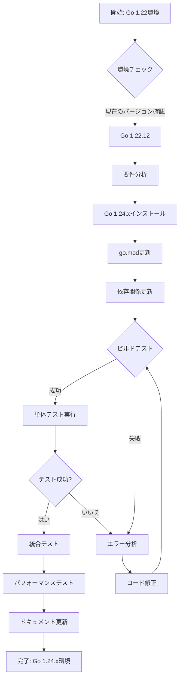
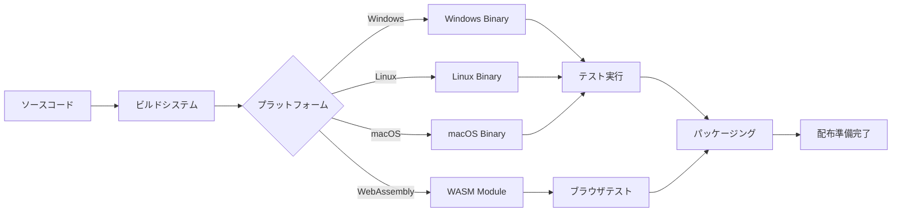
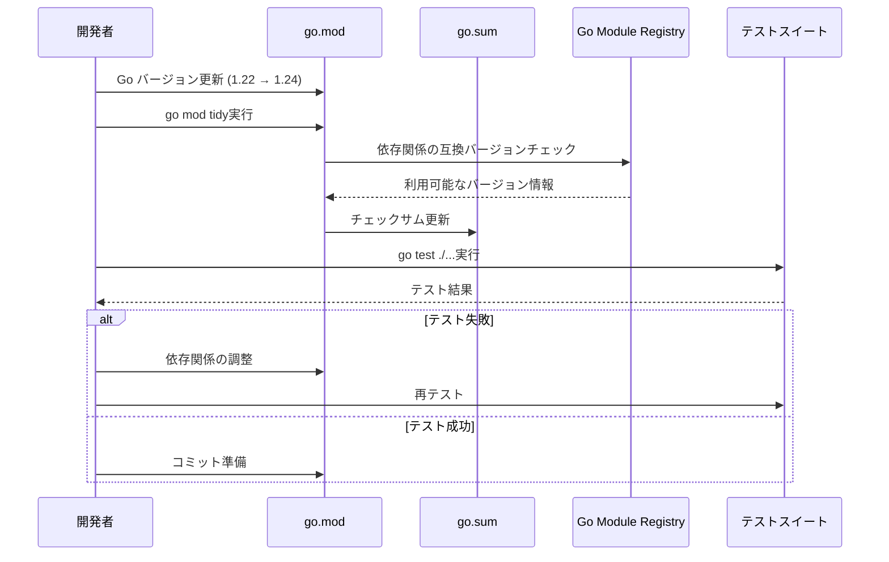
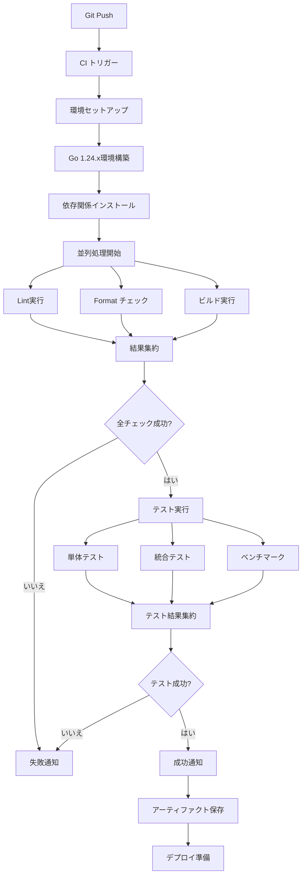
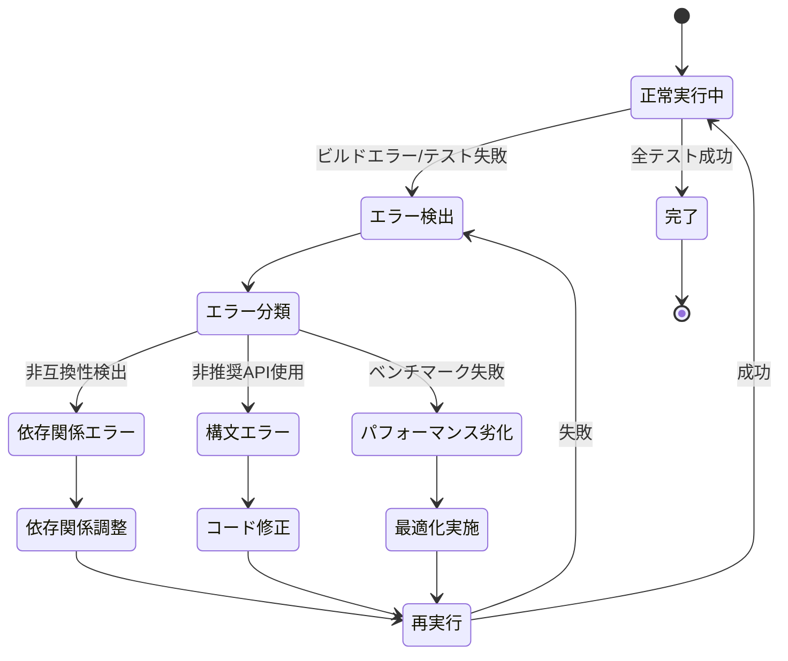
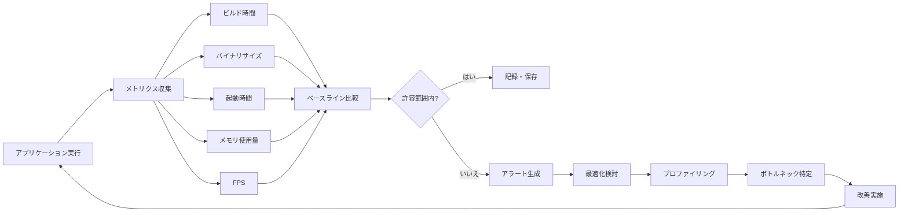
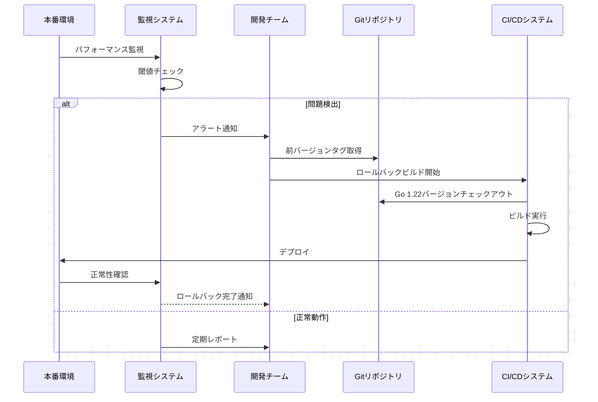
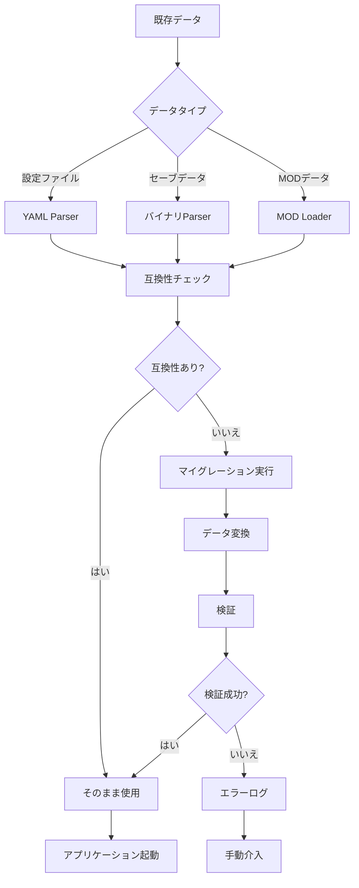

# Go Version Upgrade データフロー図

## アップグレードプロセスフロー

### 全体的なアップグレードフロー

## ビルドプロセスフロー

### マルチプラットフォームビルド

## 依存関係管理フロー

### 依存関係更新プロセス

## CI/CDパイプラインフロー

### 継続的インテグレーション

## エラーハンドリングフロー

### アップグレード時のエラー処理

## パフォーマンス監視フロー

### メトリクス収集と分析

## ロールバック戦略フロー

### 問題発生時のロールバック

## データ移行フロー

### 設定とセーブデータの互換性確保
