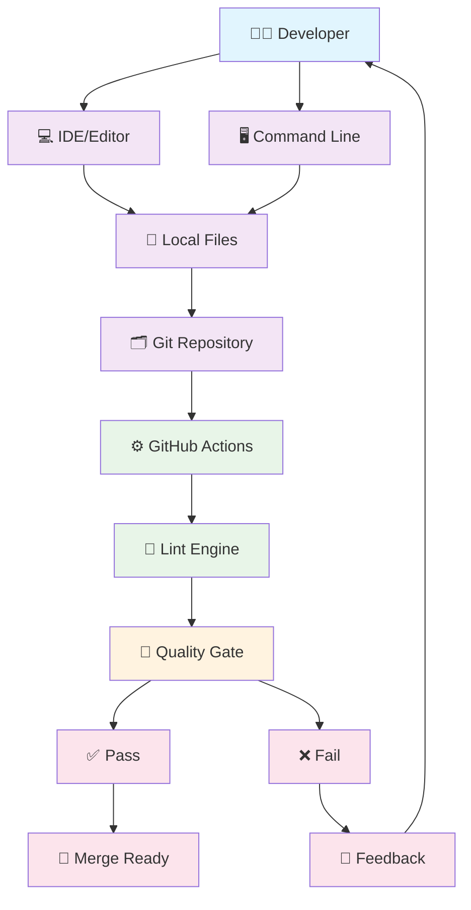
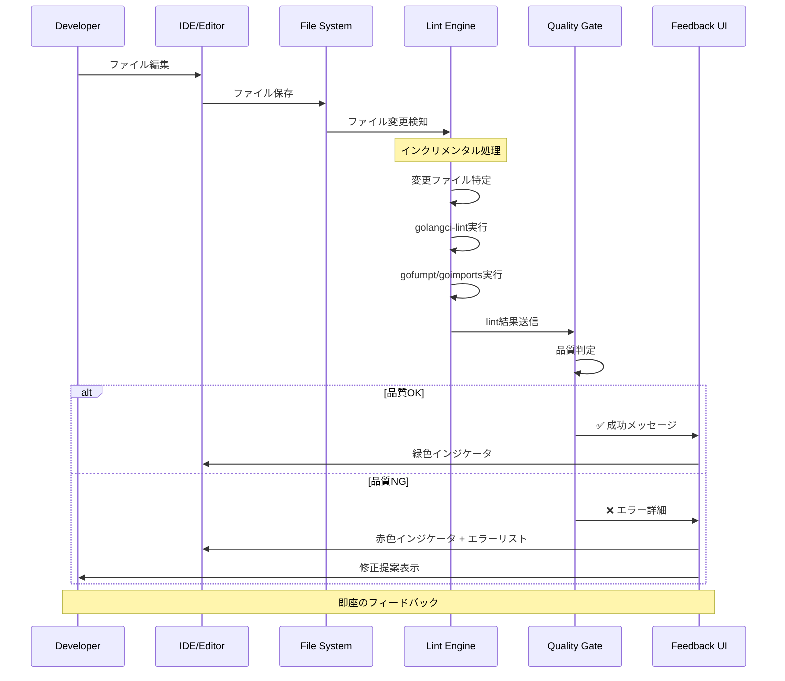
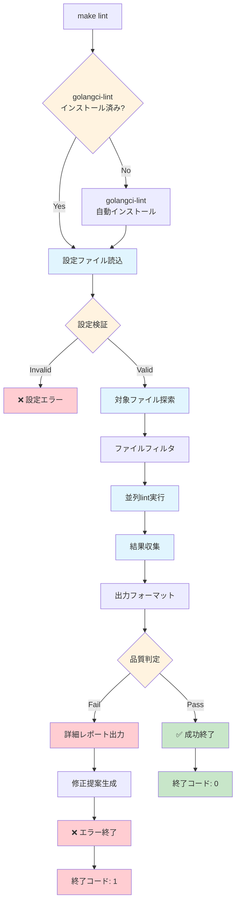
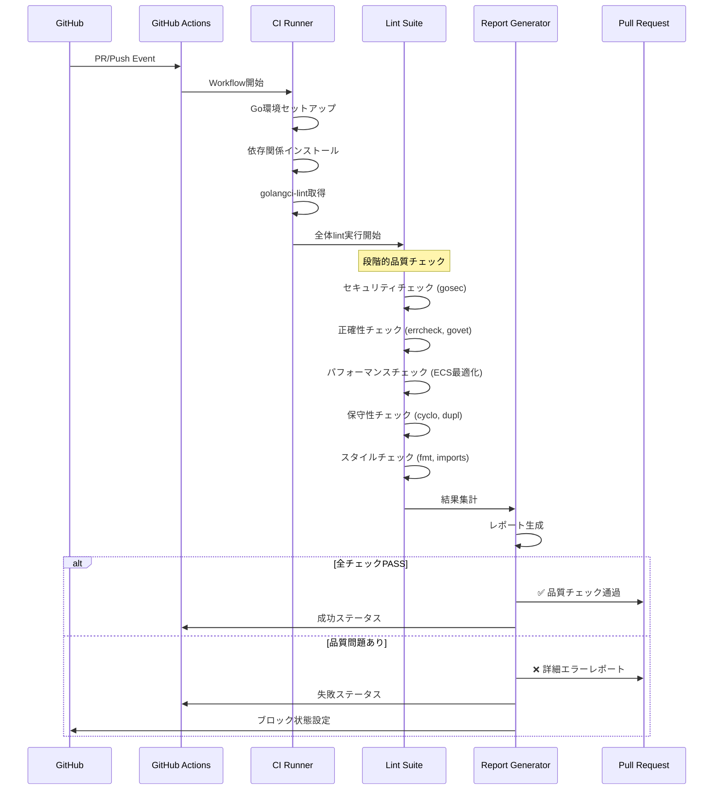
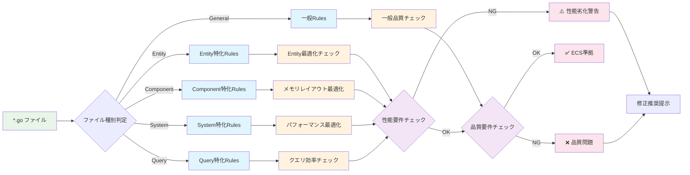
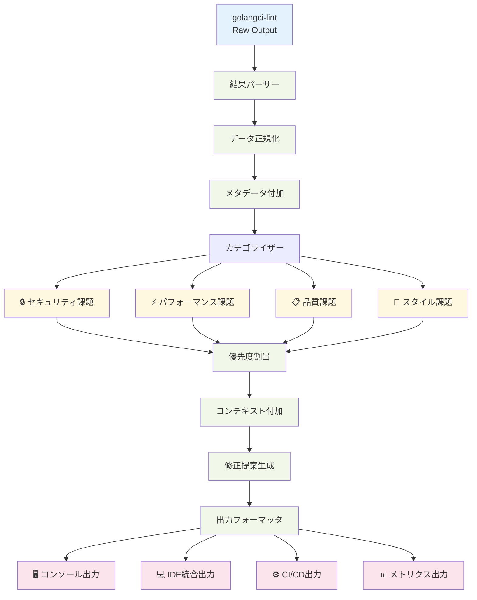
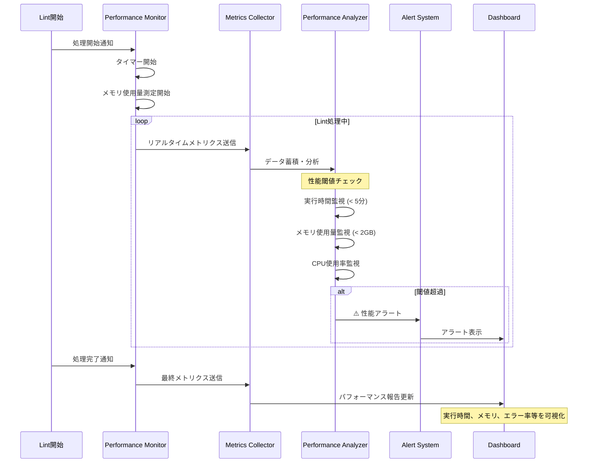
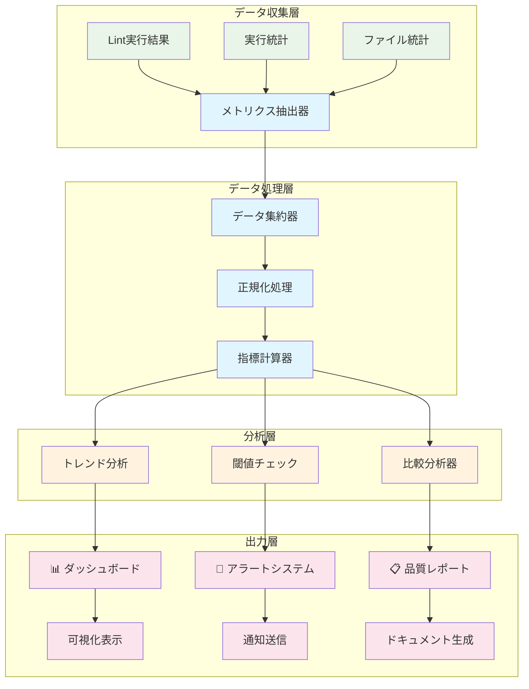
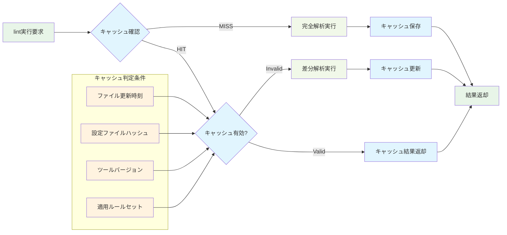

# Lint対応 データフロー図

## システム全体データフロー

### 概要フロー図



## 詳細処理フロー

### 1. 開発時リアルタイムlint処理



### 2. コマンドライン実行フロー



### 3. CI/CDパイプライン統合フロー



### 4. ECS Framework特化処理フロー



## データ変換フロー

### 5. lint結果データ変換パイプライン



### 6. パフォーマンス監視データフロー



## エラーハンドリングフロー

### 7. 例外・エラー処理フロー

```mermaid
flowchart TD
    LintExecution[Lint実行] --> ErrorDetection{エラー検出}
    
    ErrorDetection -->|システムエラー| SystemError[システムエラー]
    ErrorDetection -->|設定エラー| ConfigError[設定エラー]
    ErrorDetection -->|ツールエラー| ToolError[ツールエラー]
    ErrorDetection -->|タイムアウト| TimeoutError[タイムアウトエラー]
    ErrorDetection -->|正常| Success[正常終了]
    
    SystemError --> RetryLogic{リトライ可能?}
    ConfigError --> ConfigValidation[設定検証]
    ToolError --> ToolRecovery[ツール復旧処理]
    TimeoutError --> PartialResult[部分結果取得]
    
    RetryLogic -->|Yes| RetryExecution[リトライ実行]
    RetryLogic -->|No| FallbackMode[フォールバックモード]
    
    RetryExecution -->|成功| Success
    RetryExecution -->|失敗| FallbackMode
    
    ConfigValidation --> ConfigFix{自動修正可能?}
    ConfigFix -->|Yes| AutoFix[自動修正実行]
    ConfigFix -->|No| ManualFix[手動修正要求]
    
    ToolRecovery --> ToolReinstall[ツール再インストール]
    ToolReinstall --> RetryExecution
    
    PartialResult --> PartialReport[部分レポート生成]
    FallbackMode --> MinimalCheck[最小限チェック実行]
    
    AutoFix --> Success
    ManualFix --> ErrorReport[エラーレポート生成]
    PartialReport --> WarningExit[警告付き終了]
    MinimalCheck --> DegradedSuccess[機能縮退成功]
    
    classDef error fill:#ffcdd2
    classDef recovery fill:#fff3e0
    classDef success fill:#c8e6c9
    classDef warning fill:#ffecb3
    
    class SystemError,ConfigError,ToolError,TimeoutError,ErrorReport error
    class RetryLogic,ConfigValidation,ToolRecovery,RetryExecution,AutoFix recovery
    class Success,DegradedSuccess success  
    class PartialResult,PartialReport,WarningExit warning
```

## メトリクス収集・分析フロー

### 8. 品質メトリクス収集フロー



## データ永続化・キャッシュフロー

### 9. キャッシュ戦略フロー



この設計により、効率的で拡張性のあるlint処理システムが実現されます。各フローは独立性を保ちつつ、全体として統合されたエクスペリエンスを提供します。