# マッスルドリーマー〜観光編〜 2025年版開発計画書
*Golang + Ebitengine + モジュラーアーキテクチャ - オフライン完結型ゲーム*

## 📋 企画概要

### ゲームコンセプト
**タイトル**: マッスルドリーマー〜観光編〜  
**キャッチコピー**: 逃げろ！己の欲望から！  
**ジャンル**: サバイバル・アクション・ローグライト  
**プラットフォーム**: PC（Windows/Linux/macOS）、Web（WebAssembly）  
**技術スタック**: Go + Ebitengine v2.7+ + プラグインシステム  
**操作性**: マッスルプレイヤー移動のみ、筋肉スキル自動発動  
**動作環境**: **完全オフライン動作** - サーバー通信不要

### 設計思想：オフラインファースト
- すべての機能がローカルで完結
- インターネット接続不要でフル機能利用可能
- ローカルファイルベースのコンテンツ管理
- 将来的なオンライン機能は**オプション**として設計

---

## 🏗️ システムアーキテクチャ

### 全体システム構成図

```mermaid
graph TB
    subgraph "Game Application"
        A[Game Core Engine] --> B[Entity Component System]
        A --> C[Asset Management]
        A --> D[Input Handler]
        
        B --> E[Player System]
        B --> F[Enemy System]
        B --> G[Skill System]
        B --> H[Physics System]
        
        C --> I[Theme Loader]
        C --> J[Mod Manager]
        C --> K[Resource Cache]
        
        D --> L[Keyboard Input]
        D --> M[Mouse Input]
        D --> N[Gamepad Input]
    end
    
    subgraph "Content Systems"
        O[Theme System] --> P[Default Themes]
        O --> Q[Community Themes]
        
        R[Mod System] --> S[Script Engine]
        R --> T[Asset Override]
        R --> U[Behavior Mods]
        
        V[Save System] --> W[Local Save Files]
        V --> X[Settings Storage]
        V --> Y[Progress Data]
    end
    
    subgraph "Local Storage"
        Z[File System]
        Z --> AA[/themes/]
        Z --> BB[/mods/]
        Z --> CC[/saves/]
        Z --> DD[/assets/]
        Z --> EE[/config/]
    end
    
    A --> O
    A --> R
    A --> V
    O --> Z
    R --> Z
    V --> Z
```

### モジュラーアーキテクチャ設計

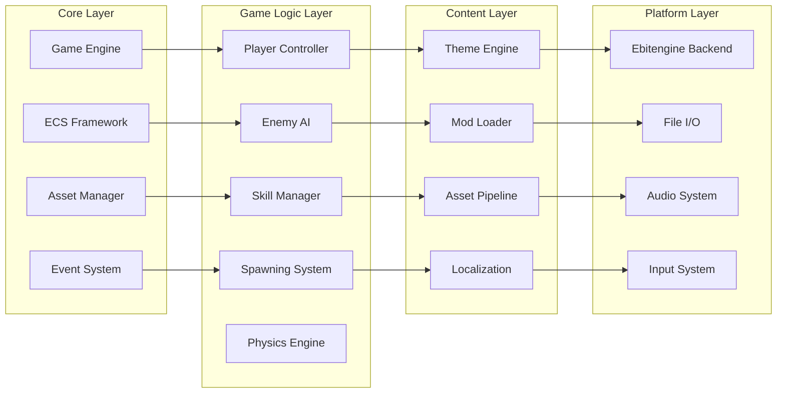

---

## 🎭 テーマシステム設計

### テーマアーキテクチャ

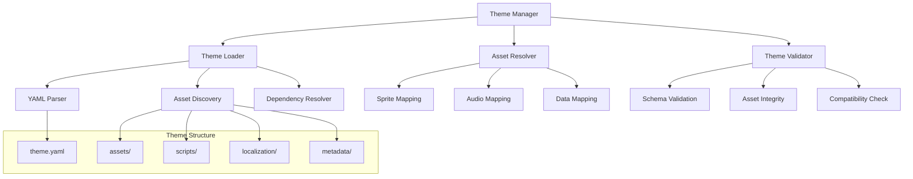

### テーマデータフロー

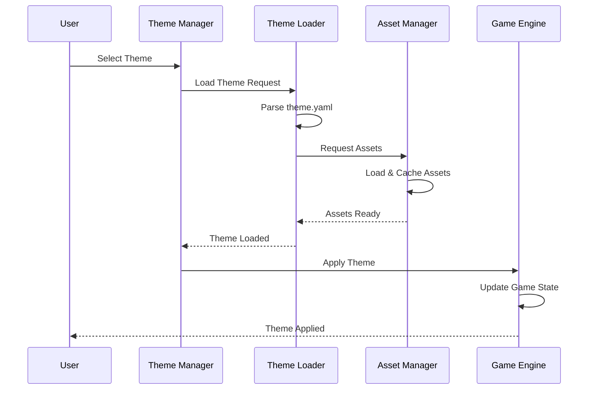

---

## 🔧 Modシステム設計

### Modアーキテクチャ

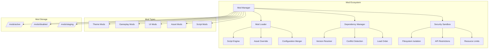

### Modセキュリティモデル

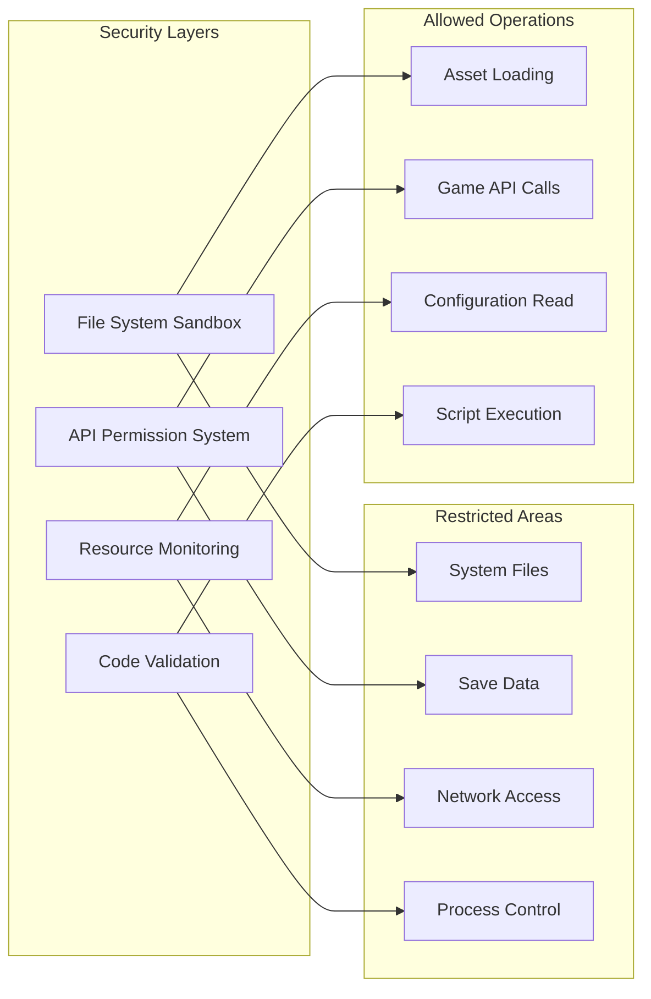

---

## 🎮 ゲームプレイシステム

### ECS（Entity Component System）構成

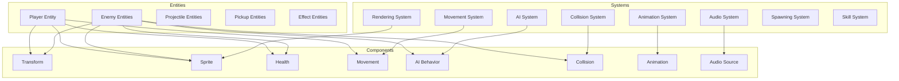

### ゲームループアーキテクチャ

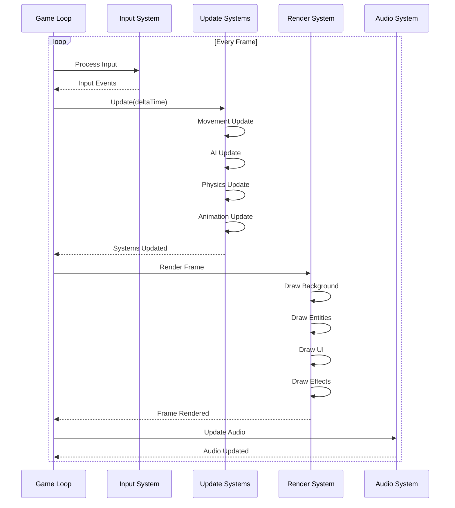

---

## 📁 プロジェクト構造

### ディレクトリ構成

```mermaid
graph LR
    subgraph "muscle-dreamer/"
        A[cmd/] --> A1[game/main.go]
        
        B[internal/] --> B1[core/]
        B --> B2[gameplay/]
        B --> B3[theme/]
        B --> B4[mod/]
        B --> B5[ui/]
        B --> B6[platform/]
        
        C[themes/] --> C1[default/]
        C --> C2[community/]
        C --> C3[templates/]
        
        D[mods/] --> D1[enabled/]
        D --> D2[disabled/]
        D --> D3[staging/]
        
        E[assets/] --> E1[sprites/]
        E --> E2[audio/]
        E --> E3[fonts/]
        E --> E4[ui/]
        
        F[saves/] --> F1[player/]
        F --> F2[settings/]
        F --> F3[progress/]
        
        G[config/] --> G1[game.yaml]
        G --> G2[themes.yaml]
        G --> G3[mods.yaml]
        
        H[tools/] --> H1[theme-creator/]
        H --> H2[mod-validator/]
        H --> H3[asset-optimizer/]
        
        I[docs/] --> I1[api/]
        I --> I2[guides/]
        I --> I3[examples/]
    end
```

### コンポーネント依存関係

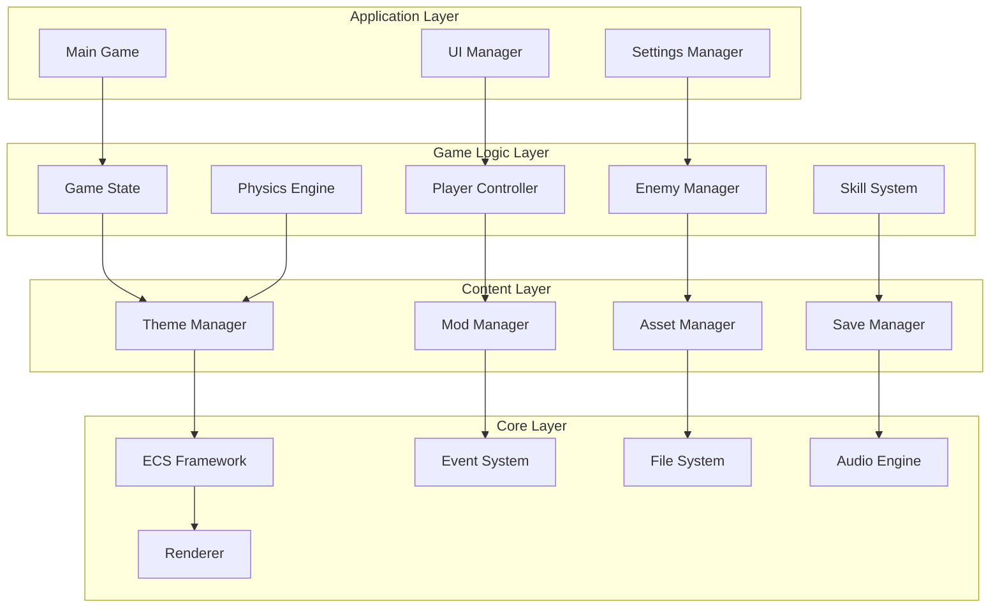

---

## 💾 データ管理システム

### ローカルストレージ設計

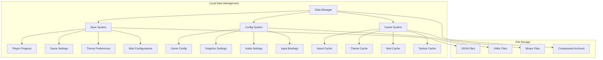

### データ永続化フロー

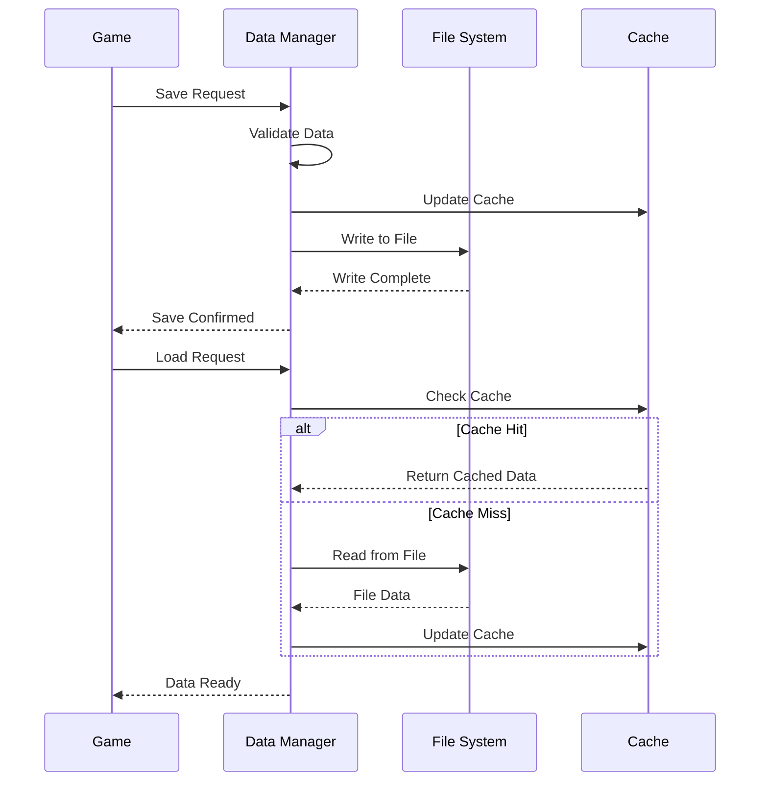

---

## 🎨 アセット管理システム

### アセットパイプライン

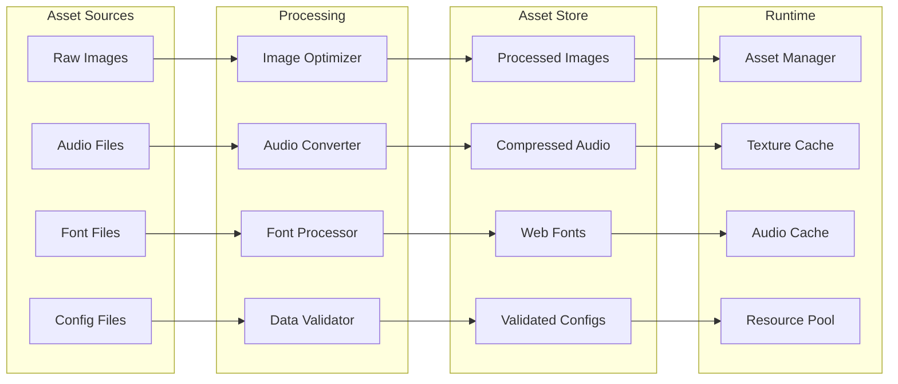

### リソース管理フロー

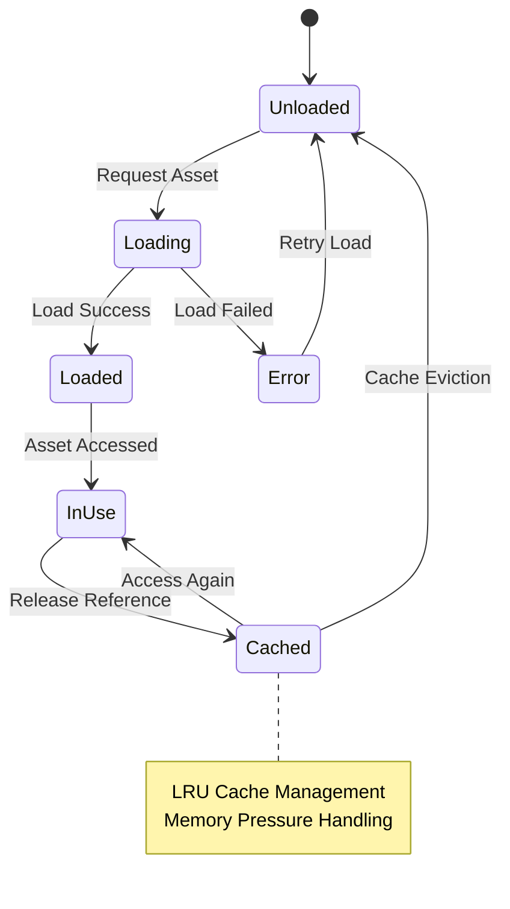

---

## 🔧 開発ツール設計

### 開発ツールチェーン

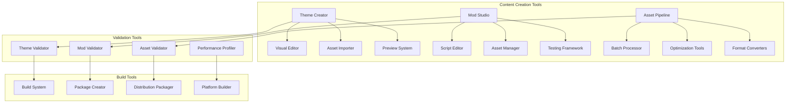

### ビルドパイプライン

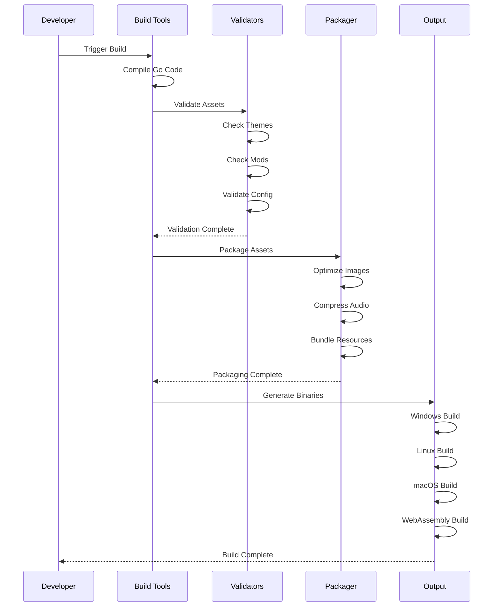

---

## 🧪 テスト戦略

### テストアーキテクチャ

```mermaid
graph TB
    subgraph "Test Types"
        A[Unit Tests] --> A1[Component Tests]
        A --> A2[System Tests]
        A --> A3[Utility Tests]
        
        B[Integration Tests] --> B1[Theme Loading]
        B --> B2[Mod Integration]
        B --> B3[Asset Pipeline]
        
        C[Performance Tests] --> C1[Memory Usage]
        C --> C2[Frame Rate]
        C --> C3[Load Times]
        
        D[Security Tests] --> D1[Mod Sandbox]
        D --> D2[File Access]
        D --> D3[Resource Limits]
    end
    
    subgraph "Test Infrastructure"
        E[Test Runner]
        F[Mock Framework]
        G[Performance Monitor]
        H[Coverage Reporter]
    end
    
    A --> E
    B --> F
    C --> G
    D --> H
```

### 継続的品質保証

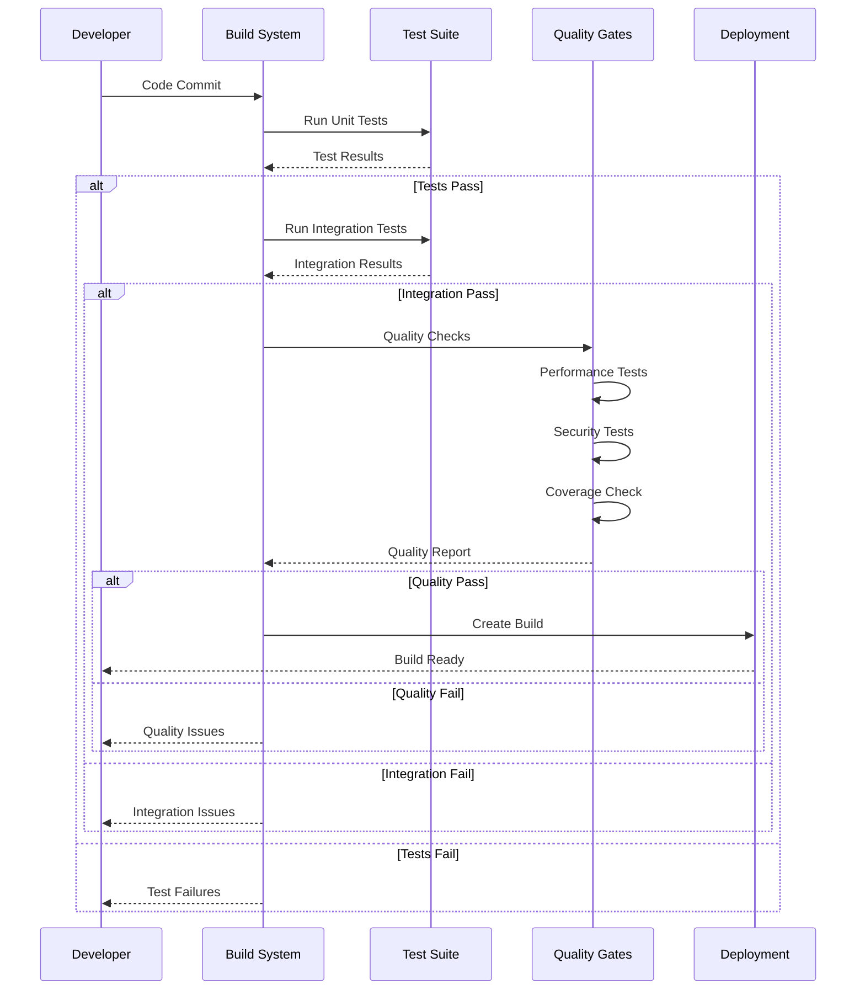

---

## 📱 マルチプラットフォーム対応

### プラットフォーム抽象化

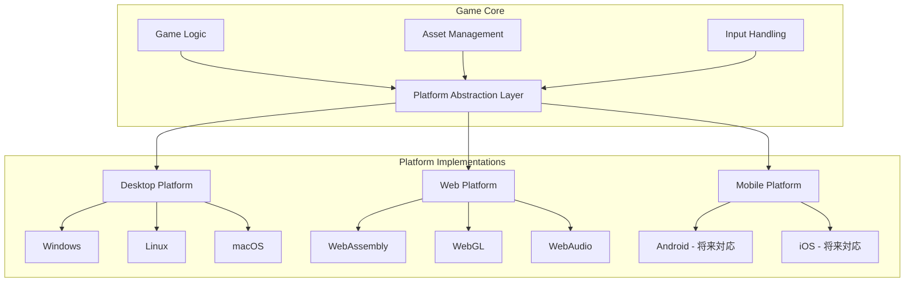

### WebAssembly最適化

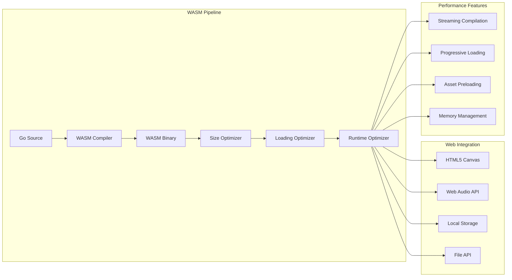

---

## 🔒 セキュリティ設計

### Modセキュリティフレームワーク

```mermaid
graph TB
    subgraph "Security Layers"
        A[Permission System] --> A1[File Access Control]
        A --> A2[API Access Control]
        A --> A3[Resource Limits]
        
        B[Sandboxing] --> B1[Filesystem Isolation]
        B --> B2[Memory Isolation]
        B --> B3[Process Isolation]
        
        C[Validation] --> C1[Code Analysis]
        C --> C2[Asset Validation]
        C --> C3[Signature Verification]
    end
    
    subgraph "Runtime Protection"
        D[Execution Monitor]
        E[Resource Monitor]
        F[Behavior Monitor]
        G[Error Handler]
    end
    
    A --> D
    B --> E
    C --> F
    
    D --> G
    E --> G
    F --> G
```

### セキュリティポリシー

```mermaid
stateDiagram-v2
    [*] --> Untrusted
    Untrusted --> Scanning : Load Mod
    Scanning --> Approved : Pass Validation
    Scanning --> Rejected : Fail Validation
    Approved --> Sandboxed : Execute
    Sandboxed --> Running : Permission Granted
    Sandboxed --> Blocked : Permission Denied
    Running --> Monitoring : Runtime Check
    Monitoring --> Running : Normal Behavior
    Monitoring --> Suspended : Suspicious Activity
    Suspended --> Running : Manual Review
    Suspended --> Rejected : Confirmed Threat
    Rejected --> [*]
```

---

## 📊 パフォーマンス最適化

### パフォーマンスアーキテクチャ

```mermaid
graph TB
    subgraph "Performance Systems"
        A[Memory Manager] --> A1[Object Pooling]
        A --> A2[Garbage Collection]
        A --> A3[Cache Management]
        
        B[Rendering Optimizer] --> B1[Sprite Batching]
        B --> B2[Culling System]
        B --> B3[LOD System]
        
        C[Asset Optimizer] --> C1[Texture Compression]
        C --> C2[Audio Compression]
        C --> C3[Lazy Loading]
        
        D[CPU Optimizer] --> D1[Parallel Processing]
        D --> D2[Task Scheduling]
        D --> D3[Profile-Guided Optimization]
    end
    
    subgraph "Monitoring"
        E[Performance Profiler]
        F[Memory Profiler]
        G[Frame Rate Monitor]
        H[Load Time Tracker]
    end
    
    A --> E
    B --> F
    C --> G
    D --> H
```

### リソース管理戦略

```mermaid
sequenceDiagram
    participant GM as Game Manager
    participant RM as Resource Manager
    participant Cache as Cache System
    participant Pool as Object Pool
    participant GC as Garbage Collector
    
    GM->>RM: Request Resource
    RM->>Cache: Check Cache
    
    alt Cache Hit
        Cache-->>RM: Return Cached
    else Cache Miss
        RM->>Pool: Get Object
        Pool-->>RM: Object Ready
        RM->>Cache: Store in Cache
    end
    
    RM-->>GM: Resource Ready
    
    Note over GM,GC: Usage Period
    
    GM->>RM: Release Resource
    RM->>Pool: Return to Pool
    RM->>Cache: Mark for Cleanup
    
    Cache->>GC: Cleanup Signal
    GC->>GC: Clean Unused Resources
```

---

## 🚀 リリース戦略

### リリース段階

```mermaid
gantt
    title 開発・リリーススケジュール
    dateFormat  YYYY-MM-DD
    section アルファ版
    コア実装           :active, alpha1, 2025-01-01, 2025-02-15
    基本テーマ作成     :alpha2, 2025-01-15, 2025-02-28
    内部テスト         :alpha3, 2025-02-15, 2025-03-01
    
    section ベータ版
    Modシステム実装    :beta1, 2025-03-01, 2025-03-30
    追加コンテンツ     :beta2, 2025-03-15, 2025-04-15
    パブリックベータ   :beta3, 2025-04-01, 2025-04-30
    
    section 正式版
    最終調整           :release1, 2025-04-15, 2025-05-15
    マスター作成       :release2, 2025-05-01, 2025-05-20
    配布開始           :release3, 2025-05-15, 2025-05-30
```

### 配布戦略

```mermaid
graph TB
    subgraph "配布チャネル"
        A[Direct Download] --> A1[公式サイト]
        A --> A2[GitHub Releases]
        
        B[ゲームプラットフォーム] --> B1[Steam - 将来対応]
        B --> B2[itch.io]
        B --> B3[Game Jolt]
        
        C[Web版] --> C1[公式サイト]
        C --> C2[GitHub Pages]
        C --> C3[Netlify]
    end
    
    subgraph "パッケージ形式"
        D[デスクトップ版]
        E[ポータブル版]
        F[WebAssembly版]
        G[ソースコード版]
    end
    
    A --> D
    A --> E
    B --> D
    C --> F
    A2 --> G
```

---

## 🌟 将来拡張性

### 拡張可能アーキテクチャ

```mermaid
graph TB
    subgraph "現在の機能"
        A[コアゲーム]
        B[テーマシステム]
        C[Modシステム]
        D[ローカル保存]
    end
    
    subgraph "将来の拡張 - Phase 1"
        E[マルチプレイヤー - オプション]
        F[ランキング - オプション]
        G[実績システム]
        H[統計システム]
    end
    
    subgraph "将来の拡張 - Phase 2"
        I[VR対応]
        J[AI生成コンテンツ]
        K[ユーザー投稿プラットフォーム]
        L[モバイル版]
    end
    
    A --> E
    B --> F
    C --> G
    D --> H
    
    E --> I
    F --> J
    G --> K
    H --> L
```

### モジュール拡張ポイント

```mermaid
graph LR
    subgraph "拡張可能ポイント"
        A[ゲームモード] --> A1[新ジャンル対応]
        
        B[入力システム] --> B1[VRコントローラー]
        B --> B2[ジェスチャー認識]
        
        C[レンダリング] --> C1[3Dグラフィックス]
        C --> C2[エフェクトシステム]
        
        D[AI システム] --> D1[機械学習AI]
        D --> D2[プロシージャル生成]
        
        E[ネットワーク] --> E1[P2P通信]
        E --> E2[クラウド同期]
    end
    
    subgraph "互換性保証"
        F[後方互換性]
        G[APIバージョニング]
        H[データマイグレーション]
    end
    
    A --> F
    B --> G
    C --> H
    D --> F
    E --> G
```

---

## 📋 開発チェックリスト

### 技術実装チェックリスト
- [ ] **コアエンジン実装**
  - [ ] ECSフレームワーク構築
  - [ ] ゲームループ実装
  - [ ] 入力システム実装
  - [ ] レンダリングシステム実装

- [ ] **テーマシステム実装**
  - [ ] YAML設定パーサー
  - [ ] アセットローダー
  - [ ] テーマ切り替え機能
  - [ ] バリデーション機能

- [ ] **Modシステム実装**
  - [ ] セキュアなスクリプト実行環境
  - [ ] ファイルシステム分離
  - [ ] API制限機能
  - [ ] 依存関係管理

- [ ] **ゲームプレイシステム**
  - [ ] プレイヤー操作システム
  - [ ] 敵AI実装
  - [ ] スキルシステム
  - [ ] 物理エンジン統合
  - [ ] 衝突判定システム

- [ ] **データ管理システム**
  - [ ] ローカルセーブシステム
  - [ ] 設定管理機能
  - [ ] プログレス追跡
  - [ ] データバックアップ機能

### コンテンツ制作チェックリスト
- [ ] **デフォルトテーマ作成**
  - [ ] マッスルドリーマーテーマ完成
  - [ ] キャラクタースプライト制作
  - [ ] 敵キャラクターデザイン
  - [ ] ステージ背景作成
  - [ ] UI要素デザイン

- [ ] **オーディオコンテンツ**
  - [ ] BGM作曲・制作
  - [ ] 効果音制作
  - [ ] 音声最適化
  - [ ] オーディオ実装

- [ ] **観光地ステージ**
  - [ ] 東京タワー周辺
  - [ ] 京都の寺院
  - [ ] 大阪城公園
  - [ ] 富士山周辺
  - [ ] 沖縄ビーチ

### 品質保証チェックリスト
- [ ] **テストフレームワーク**
  - [ ] ユニットテスト実装
  - [ ] 統合テスト実装
  - [ ] パフォーマンステスト
  - [ ] セキュリティテスト

- [ ] **プラットフォーム検証**
  - [ ] Windows動作確認
  - [ ] Linux動作確認
  - [ ] macOS動作確認
  - [ ] WebAssembly動作確認

- [ ] **最適化作業**
  - [ ] メモリ使用量最適化
  - [ ] フレームレート最適化
  - [ ] ロード時間最適化
  - [ ] バイナリサイズ最適化

### ドキュメント作成チェックリスト
- [ ] **開発者向けドキュメント**
  - [ ] アーキテクチャ仕様書
  - [ ] API リファレンス
  - [ ] テーマ作成ガイド
  - [ ] Mod開発ガイド

- [ ] **ユーザー向けドキュメント**
  - [ ] ゲーム操作マニュアル
  - [ ] インストールガイド
  - [ ] トラブルシューティング
  - [ ] FAQ作成

### 配布準備チェックリスト
- [ ] **ビルドシステム**
  - [ ] マルチプラットフォームビルド
  - [ ] 自動テスト統合
  - [ ] パッケージ作成自動化
  - [ ] 配布ファイル検証

- [ ] **リリース準備**
  - [ ] バージョン管理システム
  - [ ] リリースノート作成
  - [ ] ライセンス表記確認
  - [ ] 法的事項確認

---

## 🎯 成功指標・評価基準

### 技術的成功指標

```mermaid
graph LR
    subgraph "パフォーマンス指標"
        A[フレームレート] --> A1[60 FPS維持]
        B[メモリ使用量] --> B1[< 256MB]
        C[起動時間] --> C1[< 3秒]
        D[ロード時間] --> D1[< 1秒/ステージ]
    end
    
    subgraph "品質指標"
        E[バグ密度] --> E1[< 1/KLOC]
        F[クラッシュ率] --> F1[< 0.1%]
        G[テストカバレッジ] --> G1[> 80%]
        H[セキュリティスコア] --> H1[AAA評価]
    end
    
    subgraph "拡張性指標"
        I[テーマ読み込み] --> I1[< 500ms]
        J[Mod実行オーバーヘッド] --> J1[< 5%]
        K[新機能追加コスト] --> K1[低]
        L[互換性維持] --> L1[100%]
    end
```

### ユーザー体験指標

```mermaid
graph TB
    subgraph "使いやすさ"
        A[学習コスト] --> A1[< 5分でプレイ可能]
        B[操作性] --> B1[直感的操作]
        C[UI応答性] --> C1[即座のフィードバック]
    end
    
    subgraph "楽しさ"
        D[リプレイ性] --> D1[多様なテーマ]
        E[カスタマイズ性] --> E1[Mod対応]
        F[達成感] --> F1[進歩システム]
    end
    
    subgraph "安定性"
        G[動作安定性] --> G1[長時間プレイ対応]
        H[データ保護] --> H1[セーブデータ保護]
        I[互換性] --> I1[多環境対応]
    end
```

---

## 🔮 技術的イノベーション

### 独自技術要素

```mermaid
graph TB
    subgraph "革新的アーキテクチャ"
        A[Dynamic Theme System] --> A1[実行時テーマ切り替え]
        A --> A2[アセット動的ロード]
        A --> A3[互換性保証機能]
        
        B[Secure Mod Framework] --> B1[サンドボックス実行]
        B --> B2[リソース制限]
        B --> B3[API権限管理]
        
        C[Modular ECS] --> C1[コンポーネント動的追加]
        C --> C2[システム動的変更]
        C --> C3[実行時拡張]
    end
    
    subgraph "パフォーマンス革新"
        D[Smart Caching] --> D1[予測的ロード]
        D --> D2[使用パターン学習]
        D --> D3[メモリ効率化]
        
        E[Adaptive Rendering] --> E1[デバイス性能検出]
        E --> E2[品質動的調整]
        E --> E3[バッテリー考慮]
    end
```

### 業界先進性

```mermaid
graph LR
    subgraph "従来の課題"
        A[固定コンテンツ]
        B[Mod脆弱性]
        C[プラットフォーム依存]
        D[パフォーマンス劣化]
    end
    
    subgraph "本プロジェクトの解決策"
        E[動的テーマシステム]
        F[セキュアMod実行]
        G[プラットフォーム抽象化]
        H[適応的最適化]
    end
    
    subgraph "競合優位性"
        I[完全オフライン動作]
        J[ユーザー生成コンテンツ]
        K[セキュリティファースト]
        L[モジュラー設計]
    end
    
    A --> E --> I
    B --> F --> J
    C --> G --> K
    D --> H --> L
```

---

## 📈 プロジェクト管理

### 開発マイルストーン

```mermaid
gantt
    title 詳細開発スケジュール
    dateFormat  YYYY-MM-DD
    section Phase 1: Foundation
    プロジェクト初期化       :milestone, foundation-start, 2025-01-01, 0d
    Go環境・依存関係セットアップ :setup, 2025-01-01, 3d
    ECSフレームワーク実装    :ecs, after setup, 7d
    基本ゲームループ実装     :gameloop, after ecs, 5d
    入力システム実装        :input, after gameloop, 4d
    レンダリング基盤実装     :render, after input, 6d
    Phase 1完了           :milestone, foundation-end, after render, 0d
    
    section Phase 2: Core Systems
    テーマシステム設計       :theme-design, after foundation-end, 3d
    テーマローダー実装       :theme-impl, after theme-design, 8d
    アセット管理システム     :asset, after theme-impl, 6d
    セーブシステム実装       :save, after asset, 5d
    Phase 2完了           :milestone, core-end, after save, 0d
    
    section Phase 3: Gameplay
    プレイヤーシステム       :player, after core-end, 5d
    敵AIシステム            :enemy, after player, 8d
    スキルシステム          :skill, after enemy, 6d
    物理・衝突判定          :physics, after skill, 7d
    ゲームバランス調整       :balance, after physics, 10d
    Phase 3完了           :milestone, gameplay-end, after balance, 0d
    
    section Phase 4: Content
    デフォルトテーマ作成     :default-theme, after gameplay-end, 14d
    観光地ステージ制作       :stages, after default-theme, 12d
    オーディオ制作          :audio, after stages, 10d
    UI/UX実装              :ui, after audio, 8d
    Phase 4完了           :milestone, content-end, after ui, 0d
    
    section Phase 5: Extensions
    Modシステム設計         :mod-design, after content-end, 4d
    セキュリティ実装        :security, after mod-design, 10d
    Modローダー実装         :mod-loader, after security, 8d
    開発ツール作成          :tools, after mod-loader, 12d
    Phase 5完了           :milestone, ext-end, after tools, 0d
    
    section Phase 6: Polish
    最適化・デバッグ        :optimize, after ext-end, 14d
    テスト・QA            :testing, after optimize, 10d
    ドキュメント作成        :docs, after testing, 8d
    リリース準備           :release-prep, after docs, 6d
    正式リリース           :milestone, release, after release-prep, 0d
```

### リスク管理戦略

```mermaid
graph TB
    subgraph "技術リスク"
        A[Ebitengine制約] --> A1[機能制限回避策]
        A --> A2[代替技術調査]
        
        B[WebAssembly制約] --> B1[パフォーマンス最適化]
        B --> B2[機能段階的実装]
        
        C[Modセキュリティ] --> C1[多層防御]
        C --> C2[継続的検証]
    end
    
    subgraph "スケジュールリスク"
        D[機能複雑化] --> D1[MVP重視]
        D --> D2[段階的実装]
        
        E[品質要求] --> E1[早期テスト]
        E --> E2[自動化投資]
        
        F[リソース不足] --> F1[優先順位明確化]
        F --> F2[外部リソース活用]
    end
    
    subgraph "緩和戦略"
        G[プロトタイプ検証]
        H[継続的統合]
        I[コミュニティフィードバック]
        J[段階的リリース]
    end
    
    A --> G
    B --> H
    C --> I
    D --> J
    E --> G
    F --> H
```

---

## 🎊 まとめ・プロジェクト価値

### プロジェクトの独自価値

```mermaid
mindmap
  root((マッスルドリーマー価値))
    技術革新
      オフライン完結
      セキュアMod
      動的テーマ
      モジュラー設計
    ユーザー価値
      カスタマイズ性
      コミュニティ参加
      継続的楽しさ
      学習コスト低
    開発者価値
      拡張しやすい
      メンテナンス性
      再利用可能
      技術学習
    コミュニティ価値
      ユーザー生成コンテンツ
      安全な環境
      創作支援
      知識共有
```

### 長期ビジョン

```mermaid
graph LR
    subgraph "短期目標（2025年）"
        A[完全動作するゲーム]
        B[基本テーマシステム]
        C[安全なModサポート]
        D[マルチプラットフォーム]
    end
    
    subgraph "中期目標（2026-2027年）"
        E[豊富なコンテンツ]
        F[活発なコミュニティ]
        G[高度なMod機能]
        H[モバイル対応]
    end
    
    subgraph "長期目標（2028年以降）"
        I[ジャンル横断プラットフォーム]
        J[AI支援コンテンツ生成]
        K[教育・ヘルスケア応用]
        L[オープンソースエコシステム]
    end
    
    A --> E --> I
    B --> F --> J
    C --> G --> K
    D --> H --> L
```

### 成功の定義

**技術的成功**: 
- 設計通りの機能実現
- 高いパフォーマンスとセキュリティ
- 優れた拡張性とメンテナンス性

**ユーザー成功**:
- 直感的で楽しいゲーム体験
- 豊富なカスタマイズオプション
- 安全で創造的なコミュニティ

**プロジェクト成功**:
- オンスケジュール・オンバジェット達成
- 継続的な改善とイノベーション
- ゲーム開発業界への技術貢献

---

*この開発計画書は、2025年の最新技術トレンドを反映した、持続可能で拡張可能なゲーム開発アプローチを提示します。オフライン完結型の設計により、ユーザーの自由度とプライバシーを最大限に尊重しながら、革新的なゲーム体験を提供することを目指しています。*