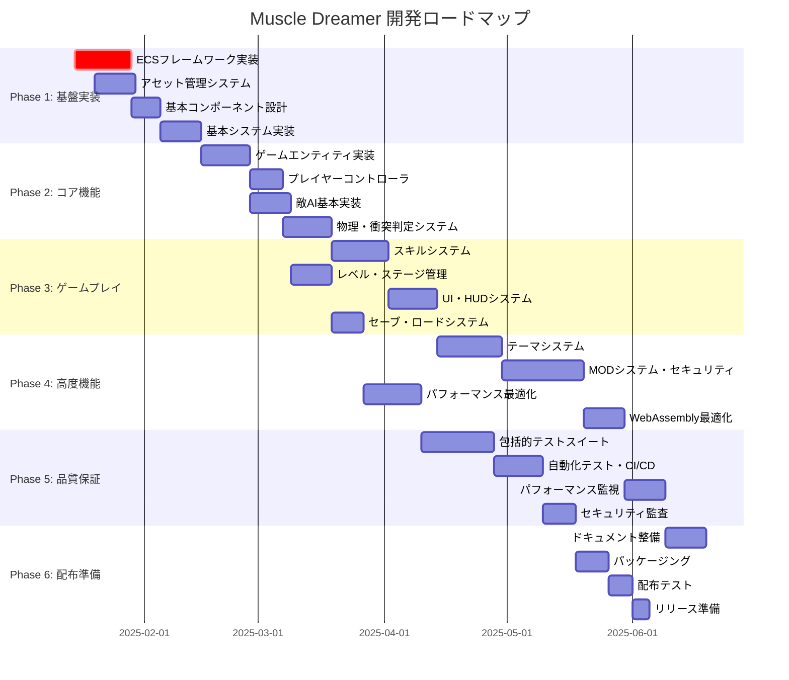
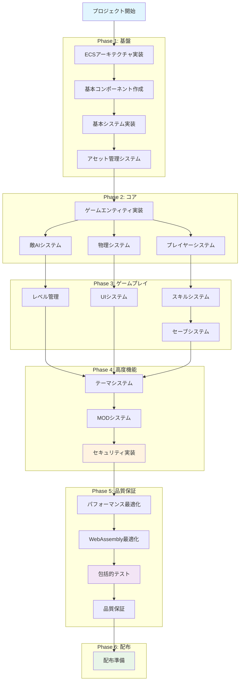
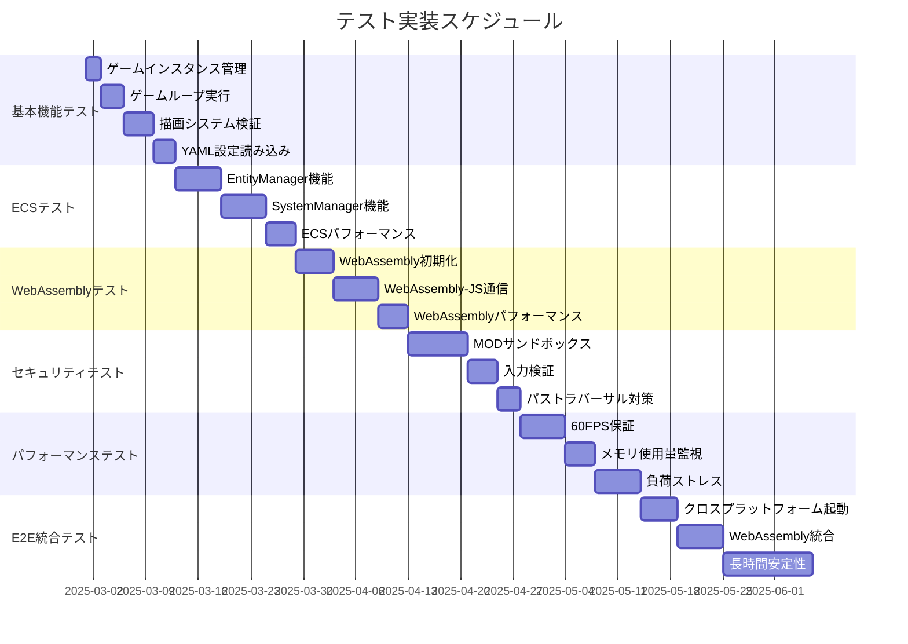
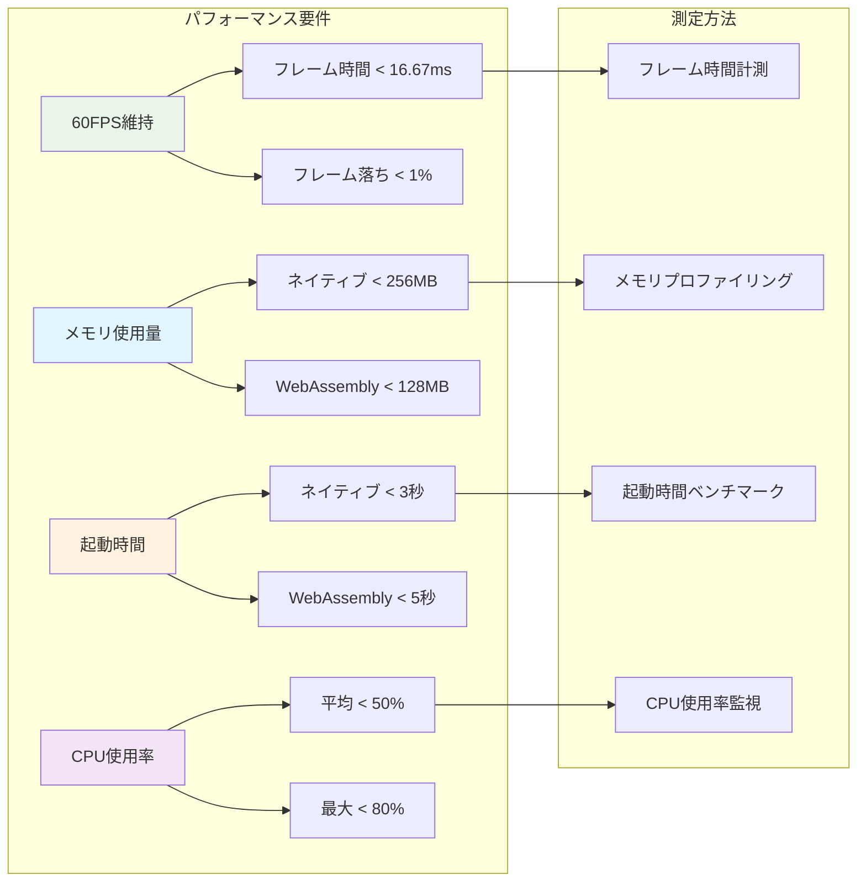
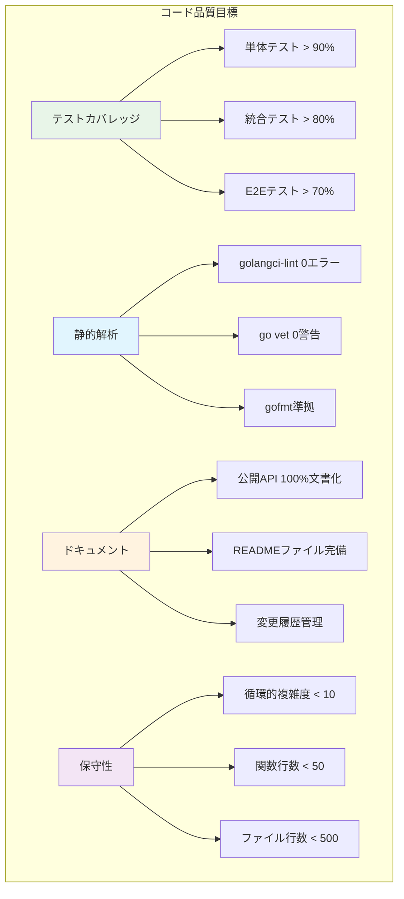
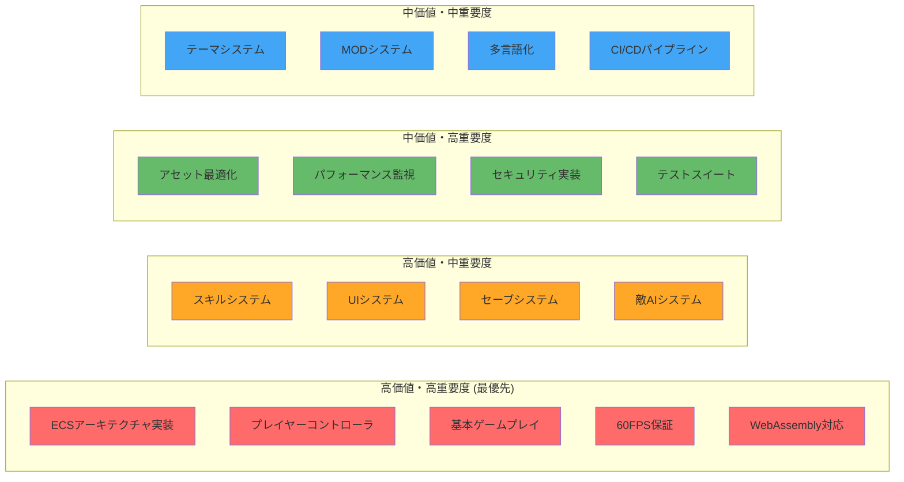
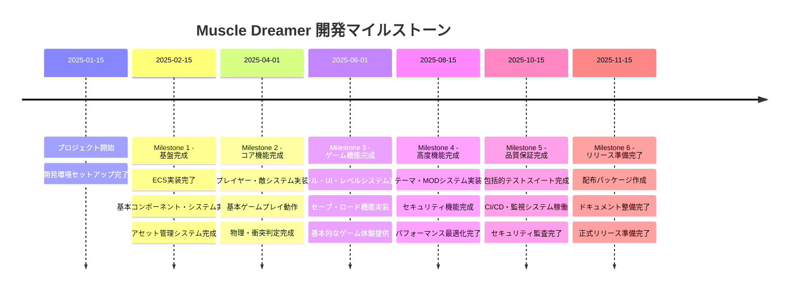

# Muscle Dreamer 開発タスクリスト

*包括的実装計画・2025年版*

---

## 📋 プロジェクト概要

**Muscle Dreamer**は、Go言語とEbitengineを使用した2Dサバイバルアクションローグライクゲームです。筋トレをテーマにしたユニークなゲーム体験を提供し、モジュラーテーマシステムとセキュアなMOD機能を特徴としています。

### 技術スタック
- **言語**: Go 1.23
- **ゲームエンジン**: Ebitengine v2.6.3
- **アーキテクチャ**: Entity Component System (ECS)
- **プラットフォーム**: Windows/Linux/macOS/WebAssembly
- **開発環境**: Docker Compose + Make

---

## 🗓️ 開発ロードマップ

---

## 📊 詳細タスクマトリクス

### Phase 1: 基盤実装 (4週間)

| タスクID | タスク名 | 優先度 | 推定工数 | 依存関係 | 担当領域 | 完了基準 |
|---------|---------|--------|----------|----------|----------|----------|
| **ECS-001** | Entity Manager実装 | 🔴高 | 16h | - | Core/ECS | エンティティCRUD操作完了 |
| **ECS-002** | Component Manager実装 | 🔴高 | 12h | ECS-001 | Core/ECS | コンポーネント管理完了 |
| **ECS-003** | System Manager実装 | 🔴高 | 14h | ECS-002 | Core/ECS | システム実行順序制御完了 |
| **ECS-004** | ECSアーキテクチャテスト | 🟡中 | 20h | ECS-003 | Testing | 単体・統合テスト完了 |
| **ASSET-001** | アセットローダー実装 | 🔴高 | 12h | - | Asset | 画像・音声読み込み完了 |
| **ASSET-002** | アセットキャッシュシステム | 🟡中 | 10h | ASSET-001 | Asset | メモリ効率化完了 |
| **ASSET-003** | アセット最適化機能 | 🟢低 | 8h | ASSET-002 | Asset | 圧縮・変換機能完了 |
| **COMP-001** | Transform Component | 🔴高 | 4h | ECS-002 | Components | 位置・回転・スケール |
| **COMP-002** | Sprite Component | 🔴高 | 6h | ASSET-001 | Components | スプライト描画 |
| **COMP-003** | Animation Component | 🟡中 | 8h | COMP-002 | Components | アニメーション制御 |
| **COMP-004** | Physics Component | 🔴高 | 10h | COMP-001 | Components | 物理属性定義 |
| **COMP-005** | Collision Component | 🔴高 | 8h | COMP-004 | Components | 衝突判定データ |
| **SYS-001** | Render System | 🔴高 | 12h | COMP-002 | Systems | 描画システム実装 |
| **SYS-002** | Animation System | 🟡中 | 10h | COMP-003 | Systems | アニメーション更新 |
| **SYS-003** | Physics System | 🔴高 | 16h | COMP-004 | Systems | 物理演算システム |

### Phase 2: コア機能 (6週間)

| タスクID | タスク名 | 優先度 | 推定工数 | 依存関係 | 担当領域 | 完了基準 |
|---------|---------|--------|----------|----------|----------|----------|
| **ENT-001** | プレイヤーエンティティ | 🔴高 | 12h | ECS-003 | Entities | プレイヤー基本実装 |
| **ENT-002** | 敵エンティティ基本型 | 🔴高 | 16h | ENT-001 | Entities | 敵キャラクター基本実装 |
| **ENT-003** | アイテムエンティティ | 🟡中 | 8h | ENT-001 | Entities | アイテム拾得システム |
| **ENT-004** | プロジェクタイルエンティティ | 🟡中 | 10h | SYS-003 | Entities | 弾丸・攻撃判定 |
| **PLAY-001** | プレイヤー入力システム | 🔴高 | 12h | ENT-001 | Player | キーボード・マウス対応 |
| **PLAY-002** | プレイヤー移動制御 | 🔴高 | 8h | PLAY-001 | Player | 移動・ジャンプ実装 |
| **PLAY-003** | プレイヤー攻撃システム | 🔴高 | 14h | PLAY-002 | Player | 基本攻撃・コンボ |
| **PLAY-004** | プレイヤーステータス管理 | 🟡中 | 10h | PLAY-003 | Player | HP・筋力・プロテイン |
| **AI-001** | 基本AI行動パターン | 🔴高 | 16h | ENT-002 | AI | 追跡・攻撃・パトロール |
| **AI-002** | AI状態管理システム | 🟡中 | 12h | AI-001 | AI | 状態遷移機械 |
| **AI-003** | 群体AI行動 | 🟢低 | 20h | AI-002 | AI | 集団行動パターン |
| **PHYS-001** | 衝突判定システム | 🔴高 | 18h | SYS-003 | Physics | AABB・円・ピクセル判定 |
| **PHYS-002** | 重力・摩擦システム | 🟡中 | 12h | PHYS-001 | Physics | 物理演算パラメータ |
| **PHYS-003** | エフェクト物理 | 🟢低 | 10h | PHYS-002 | Physics | パーティクル物理 |

### Phase 3: ゲームプレイ (8週間)

| タスクID | タスク名 | 優先度 | 推定工数 | 依存関係 | 担当領域 | 完了基準 |
|---------|---------|--------|----------|----------|----------|----------|
| **SKILL-001** | スキルフレームワーク | 🔴高 | 20h | PLAY-004 | Skills | スキル基盤システム |
| **SKILL-002** | プロテインビームスキル | 🔴高 | 12h | SKILL-001 | Skills | 遠距離攻撃実装 |
| **SKILL-003** | 筋肉バリアスキル | 🟡中 | 10h | SKILL-001 | Skills | 防御スキル実装 |
| **SKILL-004** | スキルツリーシステム | 🟡中 | 16h | SKILL-003 | Skills | 成長・アップグレード |
| **SKILL-005** | スキルエフェクト | 🟢低 | 14h | SKILL-004 | Skills | 視覚・音響効果 |
| **LEVEL-001** | ステージ管理システム | 🔴高 | 16h | ASSET-002 | Levels | ステージ読み込み・切替 |
| **LEVEL-002** | ステージ背景システム | 🟡中 | 12h | LEVEL-001 | Levels | 多層背景・パララックス |
| **LEVEL-003** | 敵スポーンシステム | 🔴高 | 14h | AI-001 | Levels | 敵出現パターン制御 |
| **LEVEL-004** | ボス戦システム | 🟡中 | 20h | LEVEL-003 | Levels | ボス敵・特殊行動 |
| **UI-001** | HUDシステム基盤 | 🔴高 | 14h | PLAY-004 | UI | UI描画フレームワーク |
| **UI-002** | ヘルス・プロテインバー | 🔴高 | 8h | UI-001 | UI | ステータス表示 |
| **UI-003** | スキルアイコン表示 | 🟡中 | 10h | SKILL-001 | UI | スキル状態・クールダウン |
| **UI-004** | メニューシステム | 🟡中 | 16h | UI-003 | UI | 設定・一時停止メニュー |
| **UI-005** | ゲームオーバー・クリア画面 | 🟢低 | 12h | UI-004 | UI | リザルト画面実装 |
| **SAVE-001** | セーブデータ構造設計 | 🟡中 | 8h | PLAY-004 | Save | JSON形式セーブデータ |
| **SAVE-002** | セーブ・ロード機能 | 🟡中 | 12h | SAVE-001 | Save | ファイルI/O実装 |
| **SAVE-003** | 設定データ管理 | 🟢低 | 6h | SAVE-002 | Save | ユーザー設定永続化 |

### Phase 4: 高度機能 (10週間)

| タスクID | タスク名 | 優先度 | 推定工数 | 依存関係 | 担当領域 | 完了基準 |
|---------|---------|--------|----------|----------|----------|----------|
| **THEME-001** | テーマローダー実装 | 🔴高 | 20h | ASSET-002 | Themes | YAML設定読み込み |
| **THEME-002** | テーマアセット置換 | 🔴高 | 16h | THEME-001 | Themes | 動的アセット切り替え |
| **THEME-003** | テーマ検証システム | 🟡中 | 12h | THEME-002 | Themes | テーマ整合性チェック |
| **THEME-004** | 多言語化システム | 🟡中 | 18h | THEME-003 | Themes | 国際化対応 |
| **MOD-001** | MODローダー基盤 | 🔴高 | 24h | THEME-004 | Mods | Luaスクリプト実行環境 |
| **MOD-002** | MODサンドボックス | 🔴高 | 32h | MOD-001 | Mods | セキュリティ制限実装 |
| **MOD-003** | MODAPI実装 | 🔴高 | 28h | MOD-002 | Mods | ゲーム操作API提供 |
| **MOD-004** | MODセキュリティ監査 | 🔴高 | 20h | MOD-003 | Mods | 脆弱性検証・テスト |
| **MOD-005** | MOD配布・管理システム | 🟢低 | 16h | MOD-004 | Mods | MOD有効化・無効化 |
| **OPT-001** | レンダリング最適化 | 🟡中 | 20h | SYS-001 | Optimization | 描画パフォーマンス改善 |
| **OPT-002** | メモリ使用量最適化 | 🟡中 | 16h | ASSET-002 | Optimization | メモリ効率化 |
| **OPT-003** | CPU使用率最適化 | 🟡中 | 18h | ECS-003 | Optimization | CPU負荷削減 |
| **OPT-004** | アセット圧縮・最適化 | 🟢低 | 12h | OPT-002 | Optimization | ファイルサイズ削減 |
| **WASM-001** | WebAssembly最適化 | 🟡中 | 16h | OPT-003 | WebAssembly | WASM特有最適化 |
| **WASM-002** | ブラウザ互換性確保 | 🟡中 | 12h | WASM-001 | WebAssembly | 複数ブラウザ対応 |
| **WASM-003** | WebAssemblyメモリ管理 | 🟡中 | 14h | WASM-002 | WebAssembly | メモリリーク対策 |

### Phase 5: 品質保証 (8週間)

| タスクID | タスク名 | 優先度 | 推定工数 | 依存関係 | 担当領域 | 完了基準 |
|---------|---------|--------|----------|----------|----------|----------|
| **TEST-001** | 単体テストスイート | 🔴高 | 32h | All Phase 1-4 | Testing | 90%以上コードカバレッジ |
| **TEST-002** | 統合テストスイート | 🔴高 | 28h | TEST-001 | Testing | システム間連携テスト |
| **TEST-003** | E2Eテストスイート | 🟡中 | 24h | TEST-002 | Testing | 完全シナリオテスト |
| **TEST-004** | パフォーマンステスト | 🔴高 | 20h | OPT-003 | Testing | 60FPS・メモリ制限確認 |
| **TEST-005** | セキュリティテスト | 🔴高 | 24h | MOD-004 | Testing | MOD脆弱性・攻撃耐性 |
| **TEST-006** | WebAssemblyテスト | 🟡中 | 16h | WASM-003 | Testing | ブラウザ環境テスト |
| **TEST-007** | クロスプラットフォームテスト | 🟡中 | 20h | TEST-006 | Testing | 全OS動作確認 |
| **CI-001** | CI/CDパイプライン構築 | 🟡中 | 16h | TEST-003 | CI/CD | 自動ビルド・テスト |
| **CI-002** | 自動デプロイシステム | 🟢低 | 12h | CI-001 | CI/CD | 自動配布パイプライン |
| **MONITOR-001** | パフォーマンス監視システム | 🟡中 | 14h | TEST-004 | Monitoring | リアルタイム監視 |
| **MONITOR-002** | エラー追跡システム | 🟡中 | 10h | MONITOR-001 | Monitoring | エラーログ・クラッシュ監視 |
| **SEC-001** | セキュリティ監査実施 | 🔴高 | 16h | TEST-005 | Security | 第三者セキュリティ監査 |
| **SEC-002** | セキュリティドキュメント | 🟡中 | 8h | SEC-001 | Security | セキュリティガイド作成 |

### Phase 6: 配布準備 (4週間)

| タスクID | タスク名 | 優先度 | 推定工数 | 依存関係 | 担当領域 | 完了基準 |
|---------|---------|--------|----------|----------|----------|----------|
| **DOC-001** | APIドキュメント作成 | 🟡中 | 16h | MOD-003 | Documentation | MOD開発者向けAPI文書 |
| **DOC-002** | ユーザーマニュアル作成 | 🟡中 | 12h | UI-004 | Documentation | プレイヤー向け操作説明 |
| **DOC-003** | 開発者ガイド作成 | 🟢低 | 10h | CI-002 | Documentation | 開発環境構築手順 |
| **DOC-004** | テーマ・MOD作成ガイド | 🟡中 | 14h | THEME-004 | Documentation | コンテンツ作成者向け |
| **PKG-001** | ネイティブバイナリパッケージ | 🔴高 | 12h | TEST-007 | Packaging | 実行ファイル配布形式 |
| **PKG-002** | WebAssembly配布パッケージ | 🔴高 | 10h | WASM-003 | Packaging | Web配布用ファイル |
| **PKG-003** | インストーラー作成 | 🟢低 | 8h | PKG-001 | Packaging | Windows/macOSインストーラー |
| **DEPLOY-001** | 配布テスト実施 | 🔴高 | 12h | PKG-002 | Deployment | 実環境配布テスト |
| **DEPLOY-002** | リリースノート作成 | 🟡中 | 4h | DEPLOY-001 | Deployment | 変更履歴・既知問題 |
| **REL-001** | 最終リリース準備 | 🔴高 | 8h | DEPLOY-002 | Release | リリース判定・承認 |

---

## 🏗️ システム実装フロー図

---

## 🧪 テスト統合計画

### 高度テストケース実装スケジュール (115時間)

### テストカテゴリ別詳細

| カテゴリ | テスト数 | 推定工数 | 重要度 | 実装フェーズ |
|---------|---------|----------|--------|-------------|
| **基本機能テスト** | 4 | 12h | 🔴高 | Phase 1 |
| **ECSアーキテクチャテスト** | 3 | 16h | 🔴高 | Phase 1-2 |
| **アセット・テーマテスト** | 3 | 12h | 🟡中 | Phase 3-4 |
| **WebAssemblyテスト** | 3 | 15h | 🟡中 | Phase 4 |
| **セキュリティテスト** | 3 | 15h | 🔴高 | Phase 4 |
| **パフォーマンステスト** | 3 | 16h | 🔴高 | Phase 5 |
| **E2E・統合テスト** | 3 | 23h | 🟡中 | Phase 5 |
| **自動化・CI/CD** | - | 16h | 🟡中 | Phase 5 |

---

## 📊 品質保証ダッシュボード

### パフォーマンス目標

### セキュリティチェックリスト

| セキュリティ項目 | 実装状況 | テスト状況 | 責任者 | 期限 |
|----------------|----------|-----------|--------|------|
| **MODサンドボックス実装** | ❌ 未実装 | ❌ 未テスト | MODチーム | Phase 4 |
| **ファイルアクセス制限** | ❌ 未実装 | ❌ 未テスト | MODチーム | Phase 4 |
| **ネットワークアクセス無効化** | ❌ 未実装 | ❌ 未テスト | MODチーム | Phase 4 |
| **入力検証・サニタイゼーション** | ❌ 未実装 | ❌ 未テスト | 入力チーム | Phase 3 |
| **パストラバーサル対策** | ❌ 未実装 | ❌ 未テスト | ファイルチーム | Phase 3 |
| **MODコード静的解析** | ❌ 未実装 | ❌ 未テスト | セキュリティチーム | Phase 4 |
| **実行時権限制御** | ❌ 未実装 | ❌ 未テスト | MODチーム | Phase 4 |
| **セキュリティ監査** | ❌ 未実施 | ❌ 未テスト | 外部監査 | Phase 5 |

### コード品質メトリクス

---

## 🎯 実装優先度マトリクス

### ビジネス価値 × 技術的重要度

---

## 📈 進捗追跡・KPI

### 主要成果指標 (KPI)

| カテゴリ | 指標 | 目標値 | 現在値 | Phase 1目標 | Phase 3目標 | Phase 6目標 |
|---------|------|--------|--------|-------------|-------------|-------------|
| **機能完成度** | 実装済み機能数 | 100% | 5% | 25% | 70% | 100% |
| **テストカバレッジ** | 単体テスト | 90% | 0% | 60% | 85% | 90% |
| **パフォーマンス** | 60FPS達成率 | 95% | N/A | 80% | 90% | 95% |
| **セキュリティ** | 脆弱性ゼロ | 0件 | N/A | N/A | 0件 | 0件 |
| **品質** | バグ密度 | <1/KLOC | N/A | <5/KLOC | <2/KLOC | <1/KLOC |
| **ドキュメント** | API文書化率 | 100% | 0% | 50% | 80% | 100% |

### マイルストーン

---

## 🚀 ネクストステップ

### 直近のアクション項目 (2週間以内)

1. **🔥 最優先**
   - ECS Entity Managerの実装開始
   - 基本的なコンポーネント構造の設計
   - アセットローダーの基本実装

2. **⚡ 高優先**
   - 開発環境の最終確認とセットアップ
   - コーディング規約とプロジェクト構造の確定
   - 基本的な単体テストフレームワークの準備

3. **📋 準備**
   - 詳細設計ドキュメントの作成
   - チーム内での技術選定の最終確認
   - 第1フェーズのタスク詳細化

### 長期的な戦略

- **Phase 1-2**: 安定した基盤とコア機能の確立
- **Phase 3-4**: 差別化機能（テーマ・MOD）の実装
- **Phase 5-6**: 品質保証と配布準備の徹底

### リスク管理

| リスク | 影響度 | 確率 | 対策 |
|-------|--------|------|------|
| **ECS実装の複雑化** | 高 | 中 | 段階的実装・プロトタイプ検証 |
| **WebAssembly性能問題** | 中 | 中 | 早期プロトタイプ・性能測定 |
| **MODセキュリティ脆弱性** | 高 | 低 | 外部セキュリティ監査・継続テスト |
| **スケジュール遅延** | 中 | 高 | バッファ時間確保・優先度調整 |

---

**🎮 Muscle Dreamer Development Team**  
*最終更新: 2025-01-15*  
*次回レビュー: 2025-02-01*
