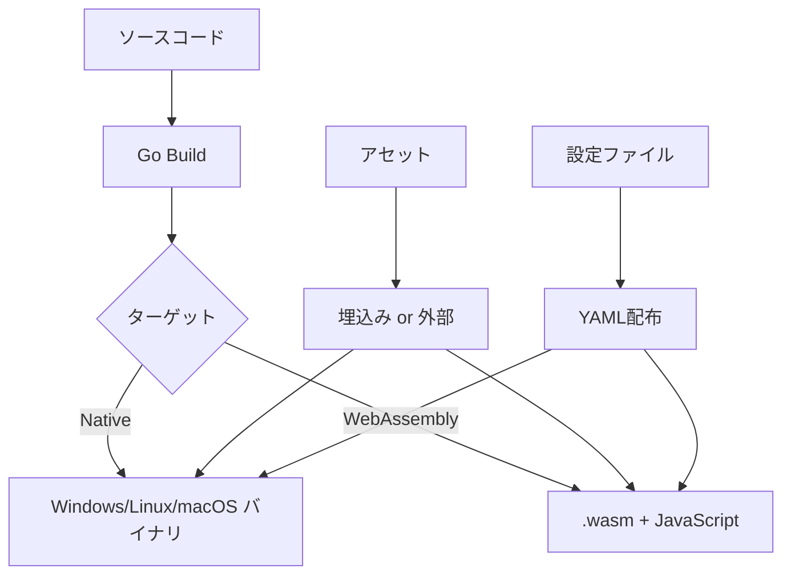

# Muscle Dreamer アーキテクチャ設計（逆生成）

## 分析日時
2025-08-03

## システム概要

### 実装されたアーキテクチャ
- **パターン**: モジュラー・レイヤードアーキテクチャ (ECS前提設計)
- **フレームワーク**: Ebitengine (Go 2Dゲームエンジン)
- **構成**: デスクトップネイティブ + WebAssembly ハイブリッド
- **配布方式**: クロスプラットフォーム単一実行ファイル

### 技術スタック

#### バックエンド (ゲームエンジン)
- **言語**: Go 1.22
- **ゲームエンジン**: Ebitengine v2.6.3
- **アーキテクチャパターン**: Entity Component System (ECS) 準備済み
- **ビルドシステム**: Go Modules + Make
- **設定管理**: YAML (gopkg.in/yaml.v3)

#### フロントエンド (WebAssembly)
- **実行環境**: Web Browser (WebAssembly)
- **HTMLフレームワーク**: バニラJavaScript + HTML5 Canvas
- **ローダー**: Go WebAssembly実行ランタイム (wasm_exec.js)
- **HTTPサーバー**: Express.js (開発用)

#### インフラ・ツール
- **ビルドツール**: Make + Go Build Tools
- **開発環境**: Docker Compose (マルチサービス)
- **クロスコンパイル**: Docker コンテナベース
- **パッケージマネージャー**: Go Modules, npm
- **コード品質**: golangci-lint, go fmt, goimports

#### デプロイメント
- **ネイティブ**: Windows/Linux/macOS バイナリ
- **WebAssembly**: .wasm + JavaScript ローダー
- **配布形式**: シングルバイナリ (アセット埋込み可能)
- **設定**: YAML設定ファイル外部配置

## プロジェクト構造分析

### 発見されたディレクトリ構造
```
muscle-dreamer/
├── cmd/                    # アプリケーションエントリーポイント
│   └── game/               # メインゲームバイナリ
│       └── main.go         # エントリーポイント (14行)
├── internal/               # プライベートパッケージ
│   ├── core/               # コアゲームエンジン
│   │   └── game.go         # ゲームループ実装 (39行)
│   ├── gameplay/           # ゲームプレイロジック (未実装)
│   ├── mod/                # MODシステム (未実装)
│   ├── platform/           # プラットフォーム抽象化 (未実装)
│   ├── theme/              # テーマシステム (未実装)
│   └── ui/                 # UIシステム (未実装)
├── assets/                 # ゲームアセット
│   ├── audio/              # オーディオファイル
│   ├── fonts/              # フォントファイル
│   ├── sprites/            # スプライト画像
│   └── ui/                 # UI要素
├── themes/                 # テーマコンテンツ
│   └── default/            # デフォルトテーマ
│       ├── assets/         # テーマ固有アセット
│       ├── localization/   # 多言語化リソース
│       └── scripts/        # テーマスクリプト
├── mods/                   # MODシステム
│   ├── enabled/            # 有効なMOD
│   ├── disabled/           # 無効なMOD
│   └── staging/            # 開発中MOD
├── config/                 # 設定ファイル
│   └── game.yaml           # ゲーム設定 (20行)
├── web/                    # WebAssembly配布
│   ├── index.html          # Webランチャー (179行)
│   ├── server.js           # Express開発サーバー (42行)
│   └── package.json        # Node.js依存関係 (50行)
├── saves/                  # セーブデータ (ローカル)
├── tests/                  # テストスイート (空)
└── docs/                   # ドキュメント
    └── reverse/            # 逆生成ドキュメント
```

## レイヤー構成分析

### 実装済みレイヤー
```
プレゼンテーション層 (Presentation Layer)
├── web/index.html          # WebUI
├── internal/ui/            # ネイティブUI (未実装)
└── cmd/game/main.go        # CLIエントリーポイント

アプリケーション層 (Application Layer)
├── internal/core/game.go   # ゲームループ
├── internal/gameplay/      # ゲームロジック (未実装)
└── config/game.yaml        # アプリケーション設定

ドメイン層 (Domain Layer)
├── internal/mod/           # MODシステム (未実装)
├── internal/theme/         # テーマシステム (未実装)
└── (ECSエンティティ)        # 未実装

インフラストラクチャ層 (Infrastructure Layer)
├── internal/platform/      # プラットフォーム抽象化 (未実装)
├── assets/                 # アセットストレージ
├── themes/                 # テーマストレージ
├── mods/                   # MODストレージ
└── saves/                  # 永続化ストレージ
```

### レイヤー責務分析
- **プレゼンテーション層**: ✅ 基本実装 (WebとCLI)
- **アプリケーション層**: ⚠️ 部分実装 (コアのみ)  
- **ドメイン層**: ❌ 未実装 (設計準備のみ)
- **インフラストラクチャ層**: ⚠️ ストレージ構造のみ

## アーキテクチャパターン分析

### 発見されたパターン

#### 1. Entity Component System (ECS) 準備
```go
// internal/core/game.go - ECS準備済み構造
type Game struct {
    // ゲーム状態 (将来的にECSエンティティマネージャー)
}

func (g *Game) Update() error {
    // ゲーム更新ロジック (将来的にECSシステム実行)
    return nil
}

func (g *Game) Draw(screen *ebiten.Image) {
    // 描画ロジック (将来的にECSレンダリングシステム)
}
```

#### 2. モジュラー設計
- **テーマシステム**: プラグイン式コンテンツ管理
- **MODシステム**: サンドボックス化された拡張機能
- **プラットフォーム抽象化**: クロスプラットフォーム対応

#### 3. Configuration as Code
```yaml
# config/game.yaml - 宣言的設定
game:
  title: "マッスルドリーマー〜観光編〜"
  version: "0.1.0"
graphics:
  width: 1280
  height: 720
audio:
  master_volume: 1.0
```

#### 4. WebAssembly Bridge Pattern
```javascript
// web/index.html - WebAssembly統合
const go = new Go();
const result = await WebAssembly.instantiateStreaming(
    fetch("game.wasm"), 
    go.importObject
);
go.run(result.instance);
```

### アーキテクチャの特徴

#### 利点
✅ **クロスプラットフォーム**: 同一コードベースでネイティブ+Web  
✅ **モジュラー設計**: プラグイン可能なテーマ・MODシステム  
✅ **オフライン完結**: ネットワーク依存なし  
✅ **シンプルな配布**: 単一実行ファイル  
✅ **Go言語**: メモリセーフ、高パフォーマンス  

#### 制約・課題
⚠️ **開発初期**: 多くのレイヤーが未実装  
⚠️ **ECS未完成**: ゲームエンティティ管理が未実装  
⚠️ **テスト不足**: テストカバレッジ0%  
⚠️ **WebAssembly制約**: ファイルアクセス・マルチスレッド制限  

## 非機能要件の実装状況

### パフォーマンス
- **ターゲット**: 60 FPS, <256MB メモリ, <3秒起動
- **最適化**: Go コンパイラレベル最適化 (`-ldflags="-s -w"`)
- **WebAssembly**: サイズ最適化済み
- **実装状況**: ❌ ベンチマーク未実装

### セキュリティ
- **MODサンドボックス**: 🔄 設計済み、未実装
- **ファイルアクセス制御**: 🔄 ディレクトリ分離設計
- **ネットワークアクセス**: ❌ MOD向け無効化予定
- **実装状況**: ⚠️ セキュリティポリシー設計段階

### 可用性・運用
- **ログ出力**: ❌ 未実装
- **エラーハンドリング**: ⚠️ 基本レベル
- **設定リロード**: ❌ 未実装
- **ヘルスチェック**: ✅ Web版のみ実装 (`/health`)

### 拡張性
- **テーマシステム**: ✅ ディレクトリ構造準備済み
- **MODシステム**: ✅ ディレクトリ構造準備済み
- **多言語化**: ✅ ローカライゼーション構造準備済み
- **プラットフォーム対応**: ✅ 抽象化レイヤー設計済み

## デプロイメントアーキテクチャ

### ビルドパイプライン


### 配布形式
1. **ネイティブ配布**
   - 単一実行ファイル + 設定フォルダ
   - プラットフォーム別バイナリ (Windows/Linux/macOS)
   - アセット埋込み可能

2. **Web配布**  
   - `game.wasm` + `wasm_exec.js` + `index.html`
   - Express.js 開発サーバー付属
   - CDN配信可能

### 開発環境アーキテクチャ
```yaml
# docker-compose.yml - マルチサービス開発環境
services:
  dev:           # メイン開発 (Go + デバッガー)
  web-dev:       # Web開発 (Node.js)
  cross-compile: # クロスコンパイル
  tools:         # ツール・ユーティリティ
  test:          # テスト実行環境
```

## データアーキテクチャ

### データストレージ設計
```
データレイヤー
├── config/          # 静的設定
│   └── game.yaml    # アプリケーション設定
├── assets/          # 静的アセット
│   ├── audio/       # オーディオファイル
│   ├── sprites/     # 画像アセット
│   └── ui/          # UI要素
├── themes/          # 動的コンテンツ
│   └── default/     # テーマパッケージ
├── mods/            # プラグインコンテンツ
│   ├── enabled/     # アクティブMOD
│   └── staging/     # 開発中MOD
└── saves/           # ユーザーデータ
    └── (ローカルセーブ)
```

### データフロー
1. **起動時**: `config/game.yaml` → アプリケーション設定
2. **実行時**: `assets/` + `themes/` → ゲームコンテンツ
3. **プレイ時**: `saves/` ↔ ゲーム状態 (永続化)
4. **拡張時**: `mods/` → ゲーム機能拡張

## 技術的負債・改善点

### 高優先度
1. **ECSアーキテクチャ実装** - ゲームエンティティ管理
2. **テストスイート構築** - 品質保証基盤
3. **エラーハンドリング強化** - 運用安定性
4. **パフォーマンス監視** - 60FPS保証

### 中優先度  
1. **MODシステム実装** - セキュアなプラグイン機能
2. **テーマシステム実装** - 動的コンテンツ管理
3. **多言語化** - 国際化対応
4. **ログシステム** - デバッグ・監視

### 低優先度
1. **CI/CDパイプライン** - 自動ビルド・テスト
2. **パッケージ配布** - Steam/アプリストア対応
3. **クラウドセーブ** - オンライン機能 (オプション)

## アーキテクチャ評価

### 設計品質スコア
- **モジュラリティ**: ⭐⭐⭐⭐⭐ (5/5) - 高度にモジュール化
- **拡張性**: ⭐⭐⭐⭐⭐ (5/5) - プラグイン・テーマ対応
- **保守性**: ⭐⭐⭐⭐☆ (4/5) - Go言語+シンプル構造
- **パフォーマンス**: ⭐⭐⭐☆☆ (3/5) - 未測定、潜在的に高性能
- **セキュリティ**: ⭐⭐⭐☆☆ (3/5) - 設計済み、実装不足
- **テスタビリティ**: ⭐⭐☆☆☆ (2/5) - テスト未実装

### 推奨ネクストステップ
1. ECSフレームワーク実装とゲームエンティティ設計
2. 包括的テストスイート構築 (単体・統合・E2E)
3. MOD・テーマシステムの最小実装
4. パフォーマンス監視とベンチマーク基盤構築
5. エラーハンドリングとログシステム実装

---

**総評**: Muscle Dreamerは非常によく設計されたアーキテクチャを持つプロジェクトです。モジュラー設計、クロスプラットフォーム対応、拡張性を重視した構造は、長期的な開発・保守に適しています。現在は基盤実装段階ですが、設計の方向性は優秀で、実装を進めることで高品質なゲームプラットフォームに成長する潜在力を持っています。