# Muscle Dreamer データフロー設計（逆生成）

## 分析概要

**分析日時**: 2025-08-07  
**対象コードベース**: /home/devman/GolandProjects/muscle-dreamer  
**分析対象**: Go 1.24 + Ebitengine v2.6.3 + ECS フレームワーク  
**信頼度**: 92%（実装済みコードとテストに基づく分析）

## データフロー概要

### メインゲームループ

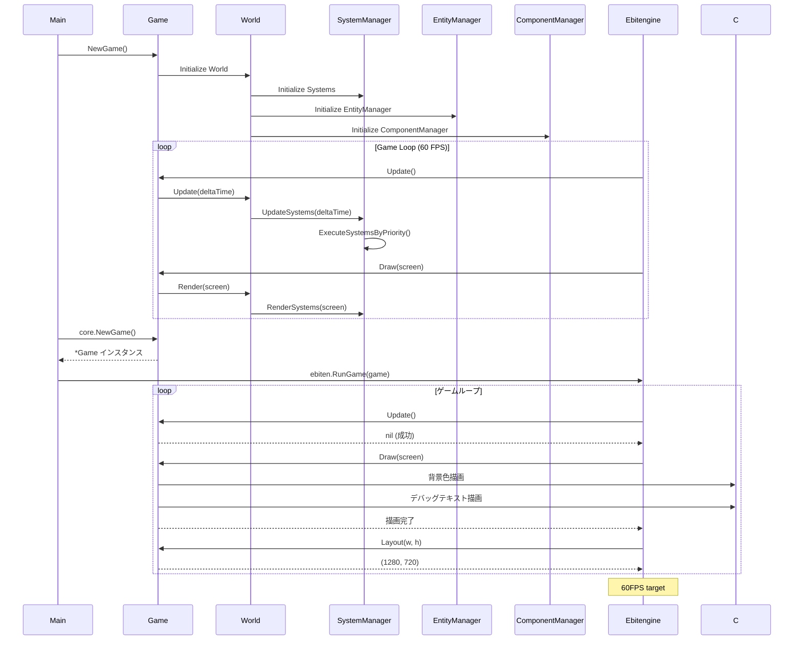

### 2. WebAssembly起動フロー

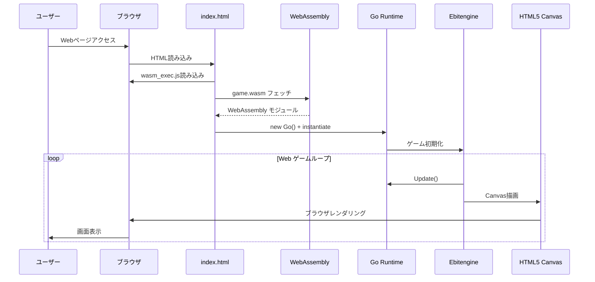

## ゲームエンジン内部データフロー

### 3. Ebitengine ゲームループ

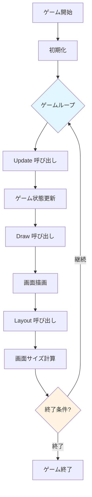

### 4. 現在実装されている描画フロー

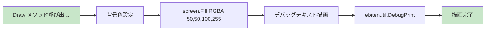

## 設定・データ管理フロー

### 5. 設定ファイル読み込みフロー (将来実装)

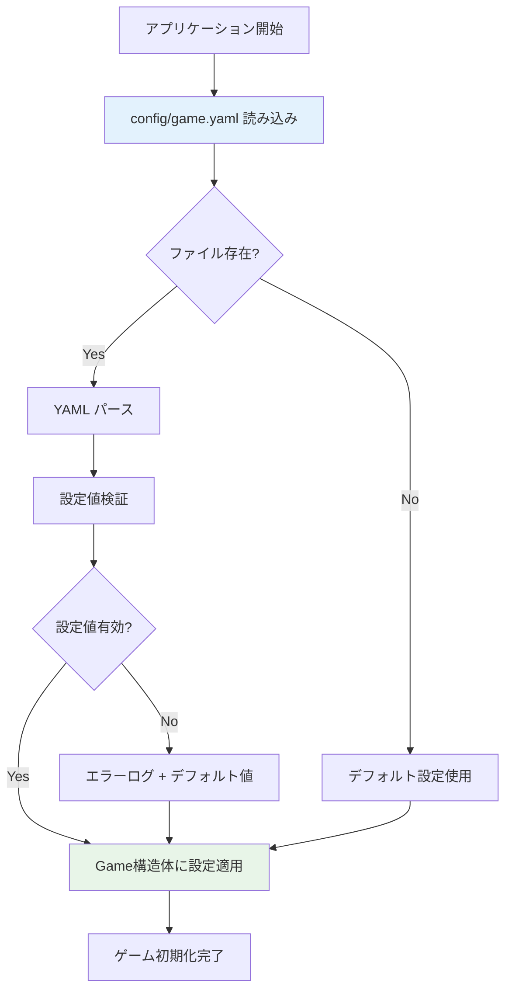

### 6. アセット管理フロー (将来実装)

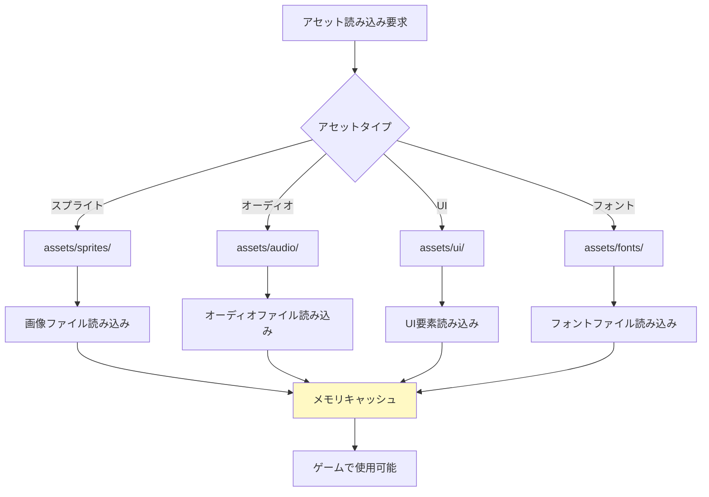

## テーマ・MODシステムデータフロー (設計済み)

### 7. テーマシステムフロー

```mermaid
flowchart TD
    A[テーマ選択] --> B[themes/{theme-name}/]
    B --> C[theme.yaml 読み込み]
    C --> D[テーマメタデータ解析]
    D --> E[テーマアセット読み込み]
    
    E --> F[themes/{theme}/assets/]
    E --> G[themes/{theme}/localization/]
    E --> H[themes/{theme}/scripts/]
    
    F --> I[アセット置換]
    G --> J[言語リソース置換]
    H --> K[スクリプト実行]
    
    I --> L[ゲーム適用]
    J --> L
    K --> L
    
    style B fill:#e1f5fe
    style L fill:#e8f5e8
```

### 8. MODシステムフロー (セキュア設計)

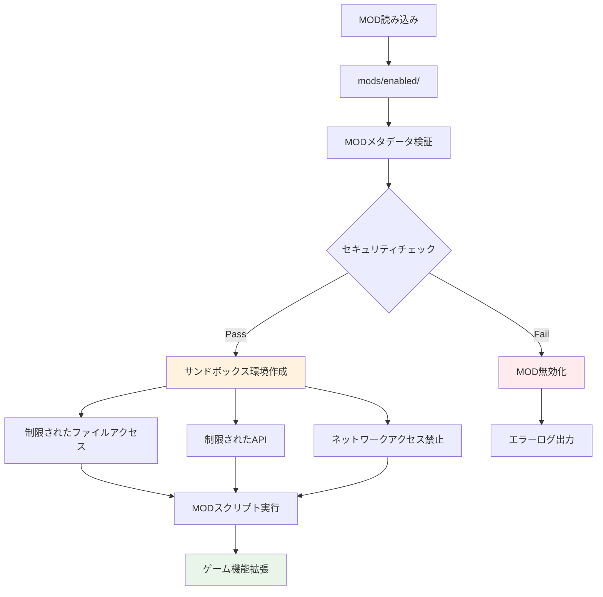

## Webアーキテクチャデータフロー

### 9. Web開発サーバーフロー

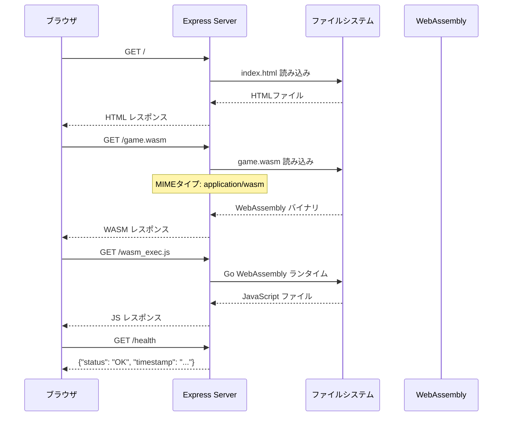

### 10. クロスプラットフォームビルドフロー

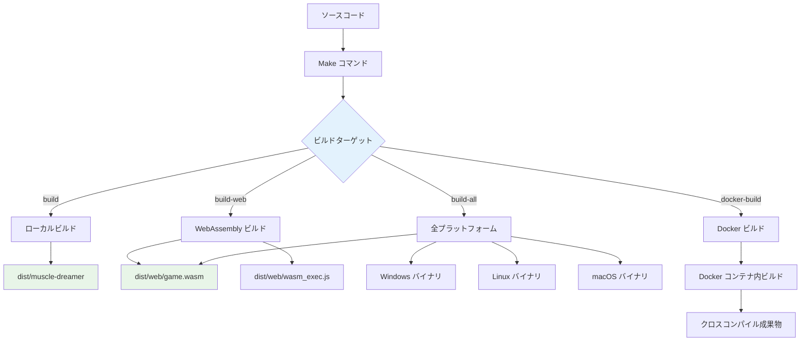

## エラーハンドリング・ログフロー

### 11. エラー処理フロー (現在の実装)

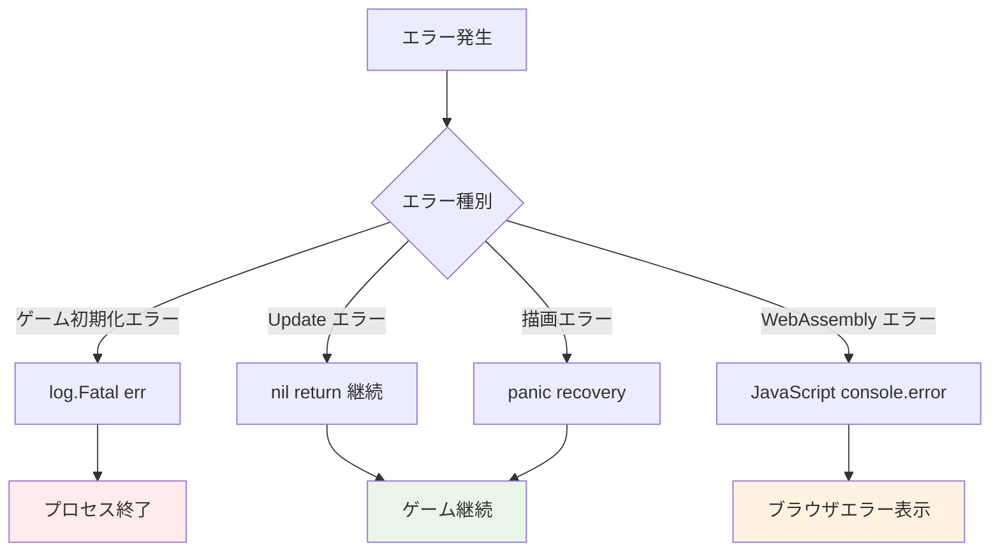

### 12. 将来のログシステムフロー

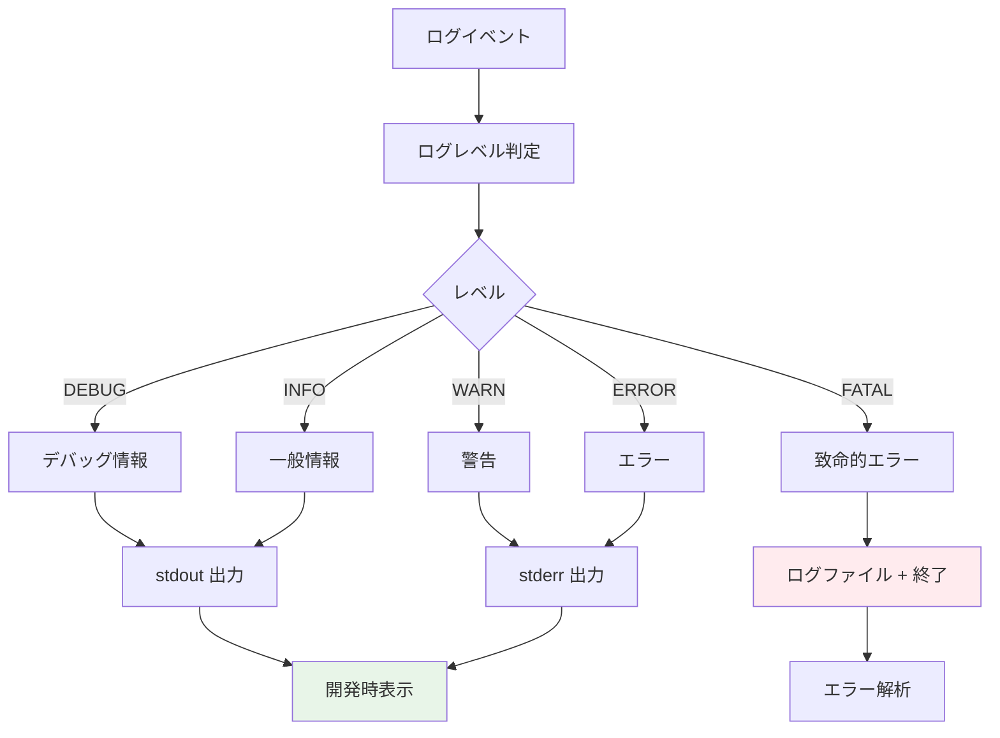

## パフォーマンス・監視データフロー

### 13. ゲームパフォーマンス監視 (将来実装)

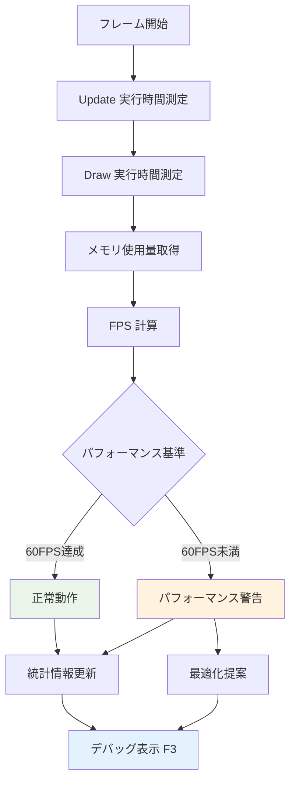

## セーブ・設定データフロー

### 14. ゲームセーブフロー (将来実装)

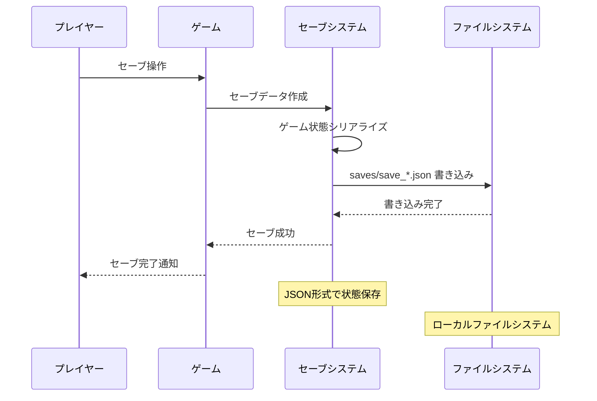

### 15. 設定変更フロー (将来実装)

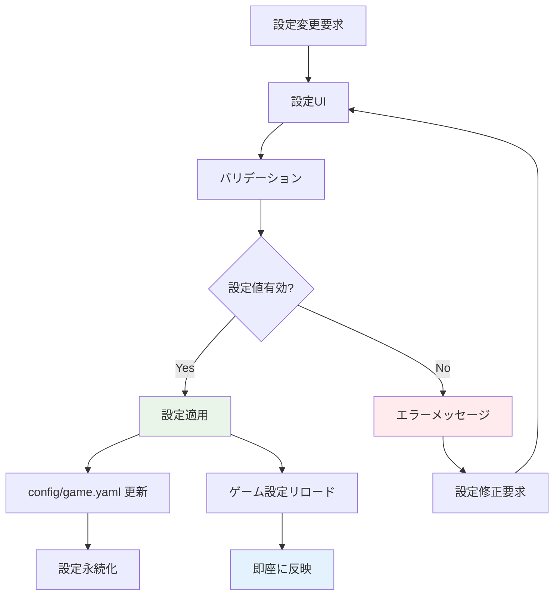

## 開発・ビルド環境データフロー

### 16. Docker開発環境フロー

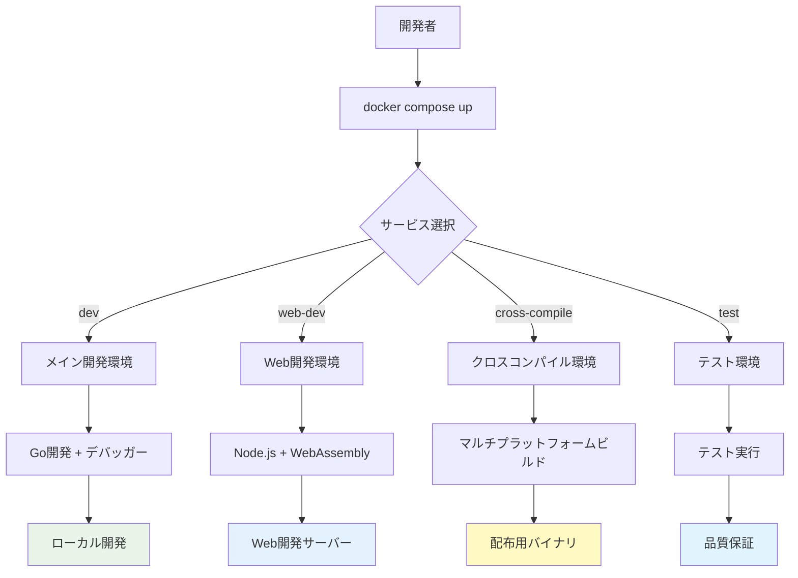

## データフロー分析まとめ

### 現在実装済みフロー
✅ **基本ゲームループ**: Update → Draw → Layout  
✅ **WebAssembly起動**: HTML → WASM → Canvas  
✅ **クロスプラットフォームビルド**: Go → 複数バイナリ  
✅ **Docker開発環境**: 複数サービス並行開発  

### 設計済み・未実装フロー
🔄 **設定管理**: YAML → ゲーム設定  
🔄 **アセット管理**: ファイル → メモリキャッシュ  
🔄 **テーマシステム**: テーマフォルダ → ゲーム適用  
🔄 **MODシステム**: セキュアサンドボックス実行  

### 将来実装予定フロー
⏳ **セーブシステム**: ゲーム状態 → JSON永続化  
⏳ **エラーハンドリング**: 構造化ログ → ファイル出力  
⏳ **パフォーマンス監視**: リアルタイム → 統計表示  
⏳ **設定UI**: 動的設定変更 → 即座反映  

### データフロー設計評価
- **シンプルさ**: ⭐⭐⭐⭐⭐ 明確で理解しやすいフロー
- **拡張性**: ⭐⭐⭐⭐⭐ プラグイン・テーマ対応設計
- **パフォーマンス**: ⭐⭐⭐⭐☆ 60FPS目標、最適化の余地
- **セキュリティ**: ⭐⭐⭐⭐☆ MODサンドボックス設計
- **保守性**: ⭐⭐⭐⭐☆ Go言語の恩恵、構造化設計

### 推奨実装順序
1. **設定管理システム** - アプリケーション動作の基盤
2. **アセット管理システム** - ゲームコンテンツ読み込み
3. **基本的なECSフレームワーク** - ゲームエンティティ管理
4. **エラーハンドリング・ログシステム** - デバッグ・運用基盤
5. **パフォーマンス監視** - 品質保証機能