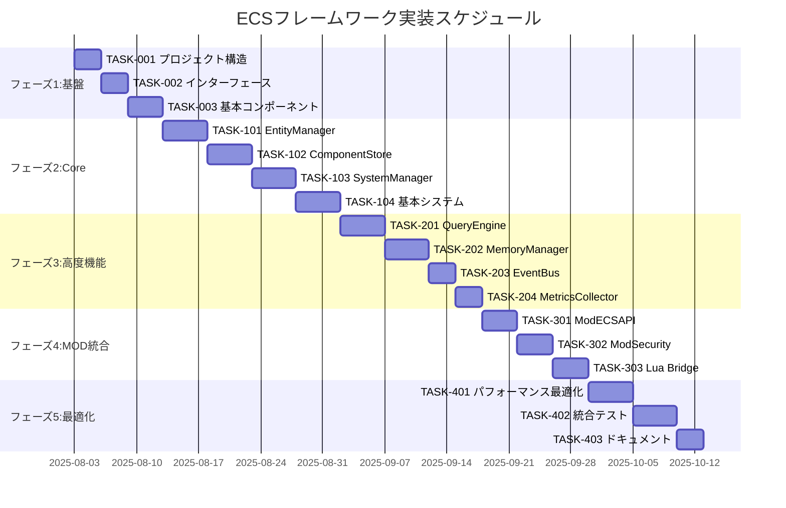

# ECSフレームワーク実装タスク

## 概要

全タスク数: 28
推定作業時間: 8週間（320時間）
クリティカルパス: TASK-001 → TASK-002 → TASK-101 → TASK-102 → TASK-201 → TASK-401

## マイルストーン

- **M1: 基盤構築完了** (週1末) - Core ECS インターフェース・基本実装
- **M2: ECS Core完成** (週2末) - EntityManager・ComponentStore・SystemManager
- **M3: 高度機能完成** (週4末) - QueryEngine・MemoryManager・Events
- **M4: MOD統合完成** (週6末) - MODサンドボックス・セキュリティ
- **M5: 最終版完成** (週8末) - パフォーマンス最適化・テスト完成

## タスク一覧

### フェーズ1: 基盤構築 (週1-2)

#### TASK-001: プロジェクト構造・基本設定

- [x] **タスク完了**
- **タスクタイプ**: DIRECT
- **要件リンク**: アーキテクチャ設計全体
- **依存タスク**: なし
- **実装詳細**:
  - `internal/core/ecs/` ディレクトリ構造作成
  - Go モジュール設定・依存関係定義
  - Makefile作成（build・test・lint・format）
  - GitHub Actions CI/CD設定
  - golangci-lint設定
- **テスト要件**:
  - [ ] ビルド成功テスト
  - [ ] lint通過テスト
  - [ ] CI/CD パイプライン動作確認
- **完了条件**:
  - [ ] ディレクトリ構造完成
  - [ ] Makefile・CI設定完成
  - [ ] 基本ビルドが通る

#### TASK-002: コアインターフェース定義

- [x] **タスク完了**
- **タスクタイプ**: DIRECT
- **要件リンク**: REQ-001, REQ-401, REQ-402
- **依存タスク**: TASK-001
- **実装詳細**:
  - `interfaces.go` から実装ファイルに分割
  - `world.go` - World インターフェース実装
  - `entity.go` - EntityManager インターフェース実装
  - `component.go` - ComponentStore インターフェース実装
  - `system.go` - SystemManager インターフェース実装
  - 基本型定義（EntityID・ComponentType・SystemType）
- **テスト要件**:
  - [ ] インターフェース整合性テスト
  - [ ] 型定義テスト
  - [ ] コンパイル成功確認
- **完了条件**:
  - [ ] 全インターフェース定義完成
  - [ ] 型安全性確保
  - [ ] ドキュメント完成

#### TASK-003: 基本コンポーネント実装

- [x] **タスク完了**
- **タスクタイプ**: TDD
- **要件リンク**: REQ-002, REQ-005
- **依存タスク**: TASK-002
- **実装詳細**:
  - `components/transform.go` - TransformComponent実装
  - `components/sprite.go` - SpriteComponent実装
  - `components/physics.go` - PhysicsComponent実装
  - `components/health.go` - HealthComponent実装
  - `components/ai.go` - AIComponent実装
  - Component インターフェース実装
- **テスト要件**:
  - [ ] 単体テスト: 各コンポーネントのGetType()
  - [ ] 単体テスト: コンポーネントデータ操作
  - [ ] 単体テスト: Clone・Validate実装
- **完了条件**:
  - [ ] 全基本コンポーネント実装完成
  - [ ] 型安全性・データ整合性確保
  - [ ] テストカバレッジ100%

### フェーズ2: Core ECS実装 (週2-3)

#### TASK-101: EntityManager実装

- [x] **タスク完了**
- **タスクタイプ**: TDD
- **要件リンク**: REQ-001, REQ-101, REQ-401
- **依存タスク**: TASK-003
- **実装詳細**:
  - エンティティID生成・管理機能
  - エンティティライフサイクル管理
  - 親子関係・階層管理
  - エンティティタグ機能
  - ID再利用・メモリプール基礎
- **テスト要件**:
  - [ ] 単体テスト: エンティティ作成・削除
  - [ ] 単体テスト: ID一意性保証
  - [ ] 単体テスト: 親子関係管理
  - [ ] 単体テスト: タグ検索機能
  - [ ] 統合テスト: 大量エンティティ処理（1000個）
- **エラーハンドリング**:
  - [ ] 無効EntityIDアクセス
  - [ ] 存在しないエンティティ操作
  - [ ] 循環参照防止
- **完了条件**:
  - [ ] 全EntityManager機能実装完成
  - [ ] パフォーマンステスト通過
  - [ ] エラーハンドリング完成

#### TASK-102: ComponentStore実装

- [x] **タスク完了**
- **タスクタイプ**: TDD
- **要件リンク**: REQ-002, REQ-005, REQ-104
- **依存タスク**: TASK-101
- **実装詳細**:
  - スパースセット実装（Entity → Component マッピング）
  - 型安全なコンポーネントストレージ
  - Structure of Arrays (SoA) メモリレイアウト
  - コンポーネント型動的登録
  - バルク操作・メモリ効率最適化
- **テスト要件**:
  - [ ] 単体テスト: コンポーネント追加・削除・取得
  - [ ] 単体テスト: 型安全性検証
  - [ ] 単体テスト: スパースセット効率性
  - [ ] 統合テスト: 大量コンポーネント処理（10,000個）
  - [ ] パフォーマンステスト: メモリ使用量・アクセス速度
- **エラーハンドリング**:
  - [ ] 存在しないコンポーネント取得
  - [ ] 重複コンポーネント追加処理
  - [ ] メモリ不足時の処理
- **完了条件**:
  - [ ] SoAメモリレイアウト実装完成
  - [ ] 型安全性・高速アクセス確保
  - [ ] パフォーマンス目標達成（<1ms検索）

#### TASK-103: SystemManager実装

- [x] **タスク完了**
- **タスクタイプ**: TDD
- **要件リンク**: REQ-003, REQ-102, REQ-402
- **依存タスク**: TASK-102
- **実装詳細**:
  - システム登録・実行順序管理
  - 依存関係グラフ・循環依存検出
  - システム並列実行制御
  - エラー隔離・グレースフル処理
  - パフォーマンス測定・監視
- **テスト要件**:
  - [ ] 単体テスト: システム登録・実行順序
  - [ ] 単体テスト: 循環依存検出
  - [ ] 単体テスト: エラー隔離機能
  - [ ] 統合テスト: 複数システム並列実行
  - [ ] パフォーマンステスト: 50システム実行時間（<10ms）
- **エラーハンドリング**:
  - [ ] 循環依存時の拒否
  - [ ] システム実行エラー時の継続
  - [ ] 実行時間超過時の処理
- **完了条件**:
  - [ ] 依存関係管理完成
  - [ ] 並列実行・エラー隔離完成
  - [ ] パフォーマンス目標達成

#### TASK-104: 基本システム実装

- [x] **タスク完了**
- **タスクタイプ**: TDD
- **要件リンク**: REQ-003, REQ-006
- **依存タスク**: TASK-103
- **実装詳細**:
  - `systems/movement.go` - MovementSystem実装
  - `systems/rendering.go` - RenderingSystem実装
  - `systems/physics.go` - PhysicsSystem実装
  - `systems/audio.go` - AudioSystem実装
  - システム基底実装・共通機能
- **テスト要件**:
  - [ ] 単体テスト: 各システムのUpdate/Render機能
  - [ ] 単体テスト: システム間データ整合性
  - [ ] 統合テスト: システム連携動作
  - [ ] パフォーマンステスト: システム実行効率
- **完了条件**:
  - [ ] 基本システム実装完成
  - [ ] ゲームループ動作確認
  - [ ] システム間連携動作確認

### フェーズ3: 高度機能実装 (週3-4)

#### TASK-201: QueryEngine実装

- [x] **タスク完了** (QueryBuilder部分実装完了、残り作業は次フェーズ)
- **タスクタイプ**: TDD
- **要件リンク**: REQ-004, NFR-002, NFR-003
- **依存タスク**: TASK-104
- **実装詳細**:
  - ✅ ビットセット操作による高速クエリ (ComponentBitSet実装完了)
  - ✅ QueryBuilder・複雑クエリ対応 (QueryBuilderImpl実装完了)
  - 🔄 クエリキャッシュ・最適化 (次フェーズ)
  - 🔄 リアルタイムクエリ更新 (次フェーズ)
  - 🔄 クエリパフォーマンス監視 (次フェーズ)
- **テスト要件**:
  - [ ] 単体テスト: ビットセット操作効率
  - [ ] 単体テスト: 複雑クエリ処理
  - [ ] 単体テスト: キャッシュ効率
  - [ ] パフォーマンステスト: 10,000エンティティクエリ（<1ms）
  - [ ] ストレステスト: 大量同時クエリ処理
- **完了条件**:
  - [ ] 高速クエリエンジン完成
  - [ ] パフォーマンス目標達成
  - [ ] キャッシュシステム最適化完成

#### TASK-202: MemoryManager実装

- [ ] **タスク完了**
- **タスクタイプ**: TDD
- **要件リンク**: REQ-005, NFR-001, NFR-004
- **依存タスク**: TASK-201
- **実装詳細**:
  - メモリプール管理・最適化
  - ガベージコレクション制御
  - メモリ断片化防止
  - メモリ使用量監視・制限
  - メモリリーク検出・防止
- **テスト要件**:
  - [ ] 単体テスト: メモリプール効率
  - [ ] 単体テスト: GC制御機能
  - [ ] 単体テスト: メモリリーク検出
  - [ ] パフォーマンステスト: メモリ使用効率（<100B/エンティティ）
  - [ ] 長期実行テスト: 24時間メモリ安定性
- **完了条件**:
  - [ ] メモリ管理システム完成
  - [ ] メモリ効率目標達成
  - [ ] 長期安定性確保

#### TASK-203: EventBus実装

- [ ] **タスク完了**
- **タスクタイプ**: TDD
- **要件リンク**: REQ-201, REQ-202
- **依存タスク**: TASK-202
- **実装詳細**:
  - 非同期イベント処理システム
  - イベントフィルタリング・ルーティング
  - サブスクリプション管理
  - イベント優先度・順序保証
  - イベントパフォーマンス最適化
- **テスト要件**:
  - [ ] 単体テスト: イベント配信・受信
  - [ ] 単体テスト: フィルタリング機能
  - [ ] 単体テスト: 非同期処理安全性
  - [ ] パフォーマンステスト: 大量イベント処理
  - [ ] 統合テスト: システム間イベント連携
- **完了条件**:
  - [ ] イベントシステム完成
  - [ ] 非同期処理安全性確保
  - [ ] パフォーマンス最適化完成

#### TASK-204: MetricsCollector実装

- [ ] **タスク完了**
- **タスクタイプ**: TDD
- **要件リンク**: NFR-301, NFR-302
- **依存タスク**: TASK-203
- **実装詳細**:
  - リアルタイムパフォーマンス監視
  - メトリクス収集・集計
  - しきい値監視・アラート
  - メトリクス履歴管理
  - パフォーマンスダッシュボード連携
- **テスト要件**:
  - [ ] 単体テスト: メトリクス収集精度
  - [ ] 単体テスト: しきい値監視
  - [ ] 単体テスト: アラート機能
  - [ ] 統合テスト: リアルタイム監視
  - [ ] パフォーマンステスト: 監視オーバーヘッド（<1%）
- **完了条件**:
  - [ ] メトリクス収集システム完成
  - [ ] リアルタイム監視機能完成
  - [ ] 低オーバーヘッド確保

### フェーズ4: MOD統合・セキュリティ (週5-6)

#### TASK-301: ModECSAPI実装

- [ ] **タスク完了**
- **タスクタイプ**: TDD
- **要件リンク**: NFR-101, REQ-301, REQ-302
- **依存タスク**: TASK-204
- **実装詳細**:
  - 制限されたECS API実装
  - MOD向けサンドボックス機能
  - API権限管理・制限
  - リソース使用量制限
  - MODとコアシステム分離
- **テスト要件**:
  - [ ] 単体テスト: API制限機能
  - [ ] 単体テスト: サンドボックス分離
  - [ ] 単体テスト: リソース制限
  - [ ] セキュリティテスト: API権限検証
  - [ ] 統合テスト: MOD実行環境
- **セキュリティ要件**:
  - [ ] 不正メモリアクセス防止
  - [ ] ファイルアクセス制限
  - [ ] システムAPI呼び出し制限
- **完了条件**:
  - [ ] MOD API完成
  - [ ] セキュリティ検証完了
  - [ ] サンドボックス動作確認

#### TASK-302: ModSecurityValidator実装

- [ ] **タスク完了**
- **タスクタイプ**: TDD
- **要件リンク**: NFR-101, NFR-102, REQ-402
- **依存タスク**: TASK-301
- **実装詳細**:
  - MODコード静的解析・検証
  - 権限管理・許可リスト制御
  - 危険API呼び出し検出
  - MOD実行時間・メモリ制限
  - セキュリティポリシー実装
- **テスト要件**:
  - [ ] セキュリティテスト: パストラバーサル攻撃防御
  - [ ] セキュリティテスト: システムコマンド実行防止
  - [ ] セキュリティテスト: ネットワークアクセス制限
  - [ ] 単体テスト: 権限管理機能
  - [ ] 統合テスト: MODセキュリティ検証
- **セキュリティ要件**:
  - [ ] `../../../etc/passwd` 攻撃防御
  - [ ] `rm -rf /` 実行防止
  - [ ] HTTP/TCP通信制限
- **完了条件**:
  - [ ] セキュリティ検証システム完成
  - [ ] 攻撃パターン防御確認
  - [ ] MOD権限管理完成

#### TASK-303: Lua Bridge実装

- [ ] **タスク完了**
- **タスクタイプ**: TDD
- **要件リンク**: REQ-303, Luaスクリプティング API
- **依存タスク**: TASK-302
- **実装詳細**:
  - Go ↔ Lua インターフェース実装
  - Lua向けECS API ラッパー
  - Luaスクリプト実行環境
  - エラーハンドリング・デバッグ支援
  - Luaコード動的ロード・アンロード
- **テスト要件**:
  - [ ] 単体テスト: Go-Lua データ変換
  - [ ] 単体テスト: Lua API ラッパー
  - [ ] 単体テスト: エラーハンドリング
  - [ ] 統合テスト: LuaからECS操作
  - [ ] パフォーマンステスト: Lua実行オーバーヘッド
- **完了条件**:
  - [ ] Lua統合完成
  - [ ] MODスクリプト実行確認
  - [ ] パフォーマンス最適化完成

### フェーズ5: 最適化・統合テスト (週7-8)

#### TASK-401: パフォーマンス最適化

- [ ] **タスク完了**
- **タスクタイプ**: TDD
- **要件リンク**: NFR-001, NFR-002, NFR-003
- **依存タスク**: TASK-303
- **実装詳細**:
  - CPU キャッシュ効率最適化
  - SIMD命令活用・並列化
  - メモリアクセスパターン最適化
  - システム実行順序最適化
  - プロファイリング・ボトルネック解析
- **テスト要件**:
  - [ ] パフォーマンステスト: 10,000エンティティ@60FPS
  - [ ] パフォーマンステスト: メモリ使用量<256MB
  - [ ] パフォーマンステスト: システム実行時間<10ms
  - [ ] ベンチマークテスト: 競合ライブラリ比較
  - [ ] プロファイリング: CPU・メモリホットスポット特定
- **最適化目標**:
  - [ ] フレーム時間<16.67ms（60FPS）
  - [ ] エンティティ作成1000個/フレーム
  - [ ] クエリ実行時間<1ms
- **完了条件**:
  - [ ] 全パフォーマンス目標達成
  - [ ] 最適化検証完了
  - [ ] ベンチマーク結果ドキュメント化

#### TASK-402: 統合・E2Eテスト

- [ ] **タスク完了**
- **タスクタイプ**: TDD
- **要件リンク**: 全要件
- **依存タスク**: TASK-401
- **実装詳細**:
  - 完全ゲームシナリオテスト
  - 大規模データ負荷テスト
  - 長期実行安定性テスト
  - MOD統合シナリオテスト
  - WebAssembly互換性テスト
- **テスト要件**:
  - [ ] E2Eテスト: プレイヤー・敵・アイテム統合
  - [ ] 負荷テスト: 100,000エンティティ処理
  - [ ] 安定性テスト: 24時間連続実行
  - [ ] MODテスト: ゾンビMOD統合シナリオ
  - [ ] WebAssemblyテスト: ブラウザ動作確認
- **品質基準**:
  - [ ] エラー発生率<0.01%
  - [ ] メモリリーク<50MB/24h
  - [ ] フレームレート安定性確保
- **完了条件**:
  - [ ] 全統合テスト通過
  - [ ] 品質基準達成
  - [ ] 本番環境での動作確認

#### TASK-403: ドキュメント・デプロイ準備

- [ ] **タスク完了**
- **タスクタイプ**: DIRECT
- **要件リンク**: NFR-302
- **依存タスク**: TASK-402
- **実装詳細**:
  - API ドキュメント生成（GoDoc）
  - 使用例・チュートリアル作成
  - パフォーマンス結果レポート
  - MOD開発ガイド更新
  - デプロイメント手順書作成
- **ドキュメント要件**:
  - [ ] API Reference完成
  - [ ] Getting Started Guide
  - [ ] MOD開発チュートリアル
  - [ ] パフォーマンス結果レポート
  - [ ] トラブルシューティングガイド
- **完了条件**:
  - [ ] 全ドキュメント完成
  - [ ] レビュー・校正完了
  - [ ] 公開準備完了

## サブタスクファイル構造

各タスクは以下の詳細ファイルで管理されます：

### TDDタスクの場合
```
docs/tasks/ecs-framework/
├── TASK-101/
│   ├── tdd-requirements.md      # 詳細要件定義
│   ├── tdd-testcases.md         # テストケース仕様
│   ├── tdd-red.md               # テスト実装（Red段階）
│   ├── tdd-green.md             # 最小実装（Green段階）
│   ├── tdd-refactor.md          # リファクタリング
│   └── tdd-verify-complete.md   # 完了確認・品質チェック
```

### DIRECTタスクの場合
```
docs/tasks/ecs-framework/
├── TASK-001/
│   ├── direct-setup.md          # 直接実装手順
│   └── direct-verify.md         # 動作確認・品質チェック
```

## 実行順序・依存関係



## 並列実行可能タスク

### フェーズ2 (週2-3)
- TASK-104 (基本システム) と TASK-201 (QueryEngine) は TASK-103 完了後に並列実行可能

### フェーズ3 (週3-4)
- TASK-203 (EventBus) と TASK-204 (MetricsCollector) は TASK-202 完了後に並列実行可能

### フェーズ4 (週5-6)
- TASK-302 (ModSecurity) と一部の TASK-303 (Lua Bridge) は並列実行可能

---

**🎯 実装開始準備完了**

このタスク計画により、ECSフレームワークの段階的・体系的な実装が可能になります。各タスクは明確な完了条件と品質基準を持ち、依存関係を考慮した効率的な実行順序で整理されています。

**次のステップ**: TASK-001から実装を開始し、各マイルストーンでの進捗確認を行いながら、高品質なECSフレームワークを構築していきます。