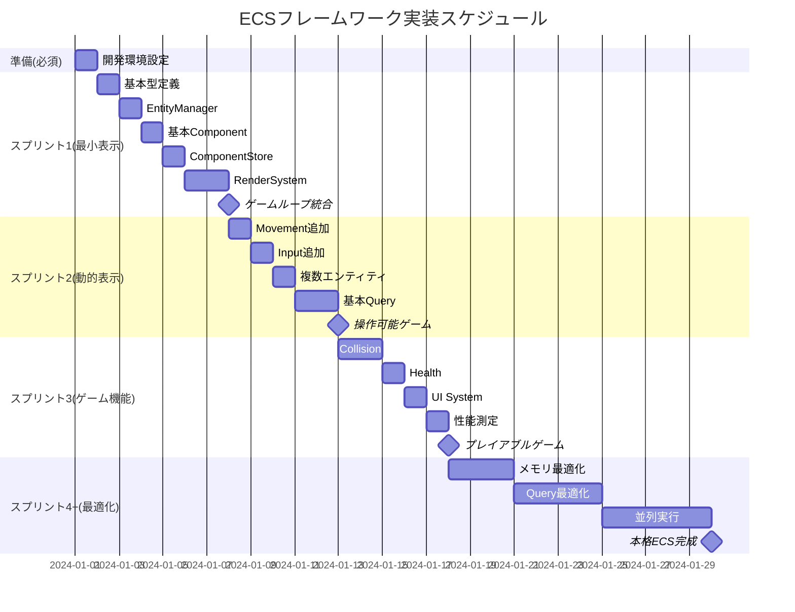

# ECSフレームワーク実装タスク（アジャイル対応）

## 概要

**開発方針**: アジャイル開発でゲーム画面表示を最優先
**全タスク数**: 30個（開発環境設定3個 + 実装27個）
**推定作業時間**: 71時間（準備5時間 + 実装66時間）
**クリティカルパス**: TASK-000 → TASK-001 → TASK-002 → TASK-101 → TASK-102 → TASK-201 → TASK-202

## 重要指針

- **小さなバッチサイズ**: 各タスクは1-4時間で完了可能
- **早期表示**: 最初のスプリントで基本的なスプライト表示を実現
- **仮実装優先**: 高度な機能は後回し、まずは動作する最小構成
- **段階的拡張**: 動作確認後に機能を追加・改善

## フェーズ0: 開発環境準備（実装前必須）

### TASK-000: 開発環境・linter・formatter設定
- [ ] **タスク完了**
- **タスクタイプ**: DIRECT
- **要件リンク**: 開発効率・コード品質確保
- **依存タスク**: なし
- **実装詳細**:
  - golangci-lint設定ファイル作成 (`.golangci.yml`)
  - VSCode設定 (`.vscode/settings.json`)
  - エディタ設定 (`.editorconfig`)
  - pre-commit hook設定（オプション）
  - 開発用Dockerコンテナでのツール準備
- **設定内容**:
  - [x] golangci-lint: 基本ルール + パフォーマンス重視設定
  - [x] gofmt + goimports自動実行
  - [ ] VSCode Go拡張設定（保存時自動format）
  - [ ] Makefileのlint・formatコマンド動作確認
- **完了条件**:
  - [ ] `make lint`がエラーなく実行される（現在：コードエラーで失敗）
  - [ ] `make format`でコードが自動整形される（現在：構文エラーで失敗）
  - [ ] コミット前にlint・formatが自動実行される（未実装）
- **設定ファイル例**:
  ```yaml
  # .golangci.yml の主要設定
  linters:
    enable:
      - gofmt
      - goimports
      - gosec
      - govet
      - ineffassign
      - misspell
      - gocritic
      - gocognit
      - cyclop
  
  linters-settings:
    gocognit:
      min-complexity: 15
    cyclop:
      max-complexity: 15
  ```
- **推定時間**: 2時間

## フェーズ1: 最小動作実装（スプリント1: 1週間）

### TASK-001: 基本インターフェース定義
- [ ] **タスク完了**
- **タスクタイプ**: DIRECT
- **要件リンク**: interfaces.go
- **依存タスク**: TASK-000
- **実装詳細**:
  - `internal/core/ecs/types.go` - 基本型定義のみ
  - EntityID, ComponentType, SystemTypeの最小実装
  - インターフェースは後で拡張予定
- **テスト要件**:
  - [ ] コンパイルエラーなしの確認
  - [ ] 基本型の作成・代入テスト
  - [ ] Ebitengineとの依存関係確認
- **完了条件**:
  - [ ] 基本型がコンパイル可能
  - [ ] Ebitengineとの統合確認
- **推定時間**: 1時間

### TASK-002: 最小EntityManager実装
- [ ] **タスク完了**
- **タスクタイプ**: TDD
- **要件リンク**: REQ-001, REQ-002
- **依存タスク**: TASK-001
- **実装詳細**:
  - `internal/core/ecs/entity.go` - 最小機能のみ
  - CreateEntity(), DestroyEntity()のみ
  - メモリ最適化は後回し（map使用でOK）
  - コンポーネント管理は次タスクで実装
- **テスト要件**:
  - [ ] 単体テスト: エンティティ作成・削除
  - [ ] 基本的なEntityID生成確認
- **完了条件**:
  - [ ] 100個のエンティティ作成・削除が動作
- **推定時間**: 2時間

### TASK-101: 基本コンポーネント実装
- [ ] **タスク完了**
- **タスクタイプ**: TDD  
- **要件リンク**: REQ-002
- **依存タスク**: TASK-002
- **実装詳細**:
  - `internal/core/ecs/components.go` - Transform, Spriteのみ
  - TransformComponent (X, Y, Rotation)
  - SpriteComponent (*ebiten.Image, Visible)
  - 他のコンポーネントは後回し
- **テスト要件**:
  - [ ] コンポーネント作成・取得・削除
  - [ ] 型安全性確認
- **完了条件**:
  - [ ] エンティティにコンポーネント追加可能
- **推定時間**: 2時間

### TASK-102: 最小ComponentStore実装
- [ ] **タスク完了**  
- **タスクタイプ**: TDD
- **要件リンク**: REQ-002
- **依存タスク**: TASK-101
- **実装詳細**:
  - `internal/core/ecs/component_store.go`
  - map[EntityID]map[ComponentType]Componentの単純実装
  - パフォーマンス最適化は後回し
  - RegisterComponentType()は仮実装
- **テスト要件**:
  - [ ] コンポーネント保存・取得・削除
  - [ ] 複数コンポーネント管理
- **完了条件**:
  - [ ] エンティティに複数コンポーネント追加可能
- **推定時間**: 3時間

### TASK-201: 最小RenderSystem実装
- [ ] **タスク完了**
- **タスクタイプ**: TDD
- **要件リンク**: REQ-003
- **依存タスク**: TASK-102
- **実装詳細**:
  - `internal/core/ecs/render_system.go`
  - Transform + Spriteコンポーネント持つエンティティを描画
  - 単純なループ処理（最適化は後回し）
  - レイヤー順序は未実装
- **テスト要件**:
  - [ ] レンダリング機能の単体テスト
  - [ ] 画面への描画確認
- **UI/UX要件**:
  - [ ] ✅ **画面表示**: 最低1個のスプライトが画面に表示される
  - [ ] 基本的な座標系で正しい位置に描画
- **完了条件**:
  - [ ] **🎯 スプライトが画面に表示される**
- **推定時間**: 3時間

### TASK-202: 最小SystemManager + ゲームループ統合
- [ ] **タスク完了**
- **タスクタイプ**: TDD
- **要件リンク**: REQ-003
- **依存タスク**: TASK-201
- **実装詳細**:
  - `internal/core/ecs/system_manager.go` - 最小実装
  - システム登録・実行のみ（依存関係管理は後回し）
  - `cmd/demo/main.go` - デモアプリケーション
  - Ebitengineのゲームループに統合
- **テスト要件**:
  - [ ] システム実行確認
  - [ ] ゲームループ統合テスト
- **UI/UX要件**:
  - [ ] ✅ **動作するゲーム**: ウィンドウが開き、スプライトが表示され続ける
  - [ ] 60FPS目標（パフォーマンス計測は簡易版）
- **完了条件**:
  - [ ] **🎯 動作するゲームデモが完成**
  - [ ] エンティティ作成→コンポーネント追加→画面表示の流れが動作
- **推定時間**: 4時間

**スプリント1完了時**: 静的なスプライトが画面に表示されるデモゲーム

---

## フェーズ2: 動的表示・相互作用（スプリント2: 1週間）

### TASK-301: VelocityComponent + MovementSystem
- [ ] **タスク完了**
- **タスクタイプ**: TDD
- **要件リンク**: REQ-003
- **依存タスク**: TASK-202
- **実装詳細**:
  - VelocityComponent (VX, VY)
  - MovementSystem - Transform更新
  - 60FPS対応のdeltaTime処理
- **テスト要件**:
  - [ ] 単体テスト: VelocityComponentの作成・更新
  - [ ] MovementSystemの位置更新ロジック
  - [ ] フレームレート非依存の動作確認
- **エラーハンドリング**:
  - [ ] 無効なdeltaTime値の処理
  - [ ] 極端な速度値の制限
  - [ ] Transform未取得時の安全な処理
- **UI/UX要件**:
  - [ ] ✅ **動くスプライト**: スプライトが滑らかに移動
  - [ ] 画面端での跳ね返りまたは消失
- **完了条件**:
  - [ ] **🎯 スプライトが動く**
- **推定時間**: 2時間

### TASK-302: 基本InputSystem実装
- [ ] **タスク完了**
- **タスクタイプ**: TDD
- **要件リンク**: REQ-004
- **依存タスク**: TASK-301
- **実装詳細**:
  - InputComponent (上下左右の移動入力)
  - InputSystem - キーボード入力をVelocityに反映
  - WASDまたは矢印キー対応
- **テスト要件**:
  - [ ] InputComponentの作成・更新テスト
  - [ ] キーボード入力の正確な反映確認
  - [ ] 複数キー同時押しの処理
- **エラーハンドリング**:
  - [ ] 無効なキー入力の無視
  - [ ] Input/Velocityコンポーネント未取得時の安全処理
  - [ ] 入力値の範囲制限
- **UI/UX要件**:
  - [ ] ✅ **操作可能**: キーボードでスプライト操作
  - [ ] 入力に対する即座の反応
- **完了条件**:
  - [ ] **🎯 プレイヤーがスプライトを操作可能**
- **推定時間**: 2時間

### TASK-303: 複数エンティティ表示
- [ ] **タスク完了**
- **タスクタイプ**: TDD
- **要件リンク**: REQ-001
- **依存タスク**: TASK-302
- **実装詳細**:
  - 複数エンティティの同時生成・表示
  - 異なる動きパターン（静的、動的、プレイヤー制御）
  - 基本的なクエリ機能（Transform+Spriteのエンティティ検索）
- **テスト要件**:
  - [ ] 100個エンティティの作成・削除テスト
  - [ ] 異なるコンポーネント組み合わせでの動作確認
  - [ ] 基本クエリ機能の正確性テスト
- **エラーハンドリング**:
  - [ ] エンティティ上限数の制御
  - [ ] メモリ不足時の適切な処理
  - [ ] クエリ結果が空の場合の処理
- **UI/UX要件**:
  - [ ] ✅ **複数オブジェクト**: 画面に複数のスプライトが表示
  - [ ] パフォーマンス: 100個のエンティティで60FPS維持
- **完了条件**:
  - [ ] **🎯 複数オブジェクトが同時表示・動作**
- **推定時間**: 3時間

### TASK-304: 基本クエリエンジン実装
- [ ] **タスク完了**
- **タスクタイプ**: TDD
- **要件リンク**: REQ-004
- **依存タスク**: TASK-303
- **実装詳細**:
  - `internal/core/ecs/query.go` - 基本的なQueryWith実装
  - ビットマスクの仮実装（最適化は後回し）
  - QueryWith(ComponentType...)の基本機能
- **テスト要件**:
  - [ ] 複数コンポーネント条件でのエンティティ検索
  - [ ] 100エンティティで性能確認
- **完了条件**:
  - [ ] システムがクエリを使ってエンティティを効率的に検索
- **推定時間**: 3時間

**スプリント2完了時**: プレイヤー操作可能で複数オブジェクトが動作するゲーム

---

## フェーズ3: ゲーム機能拡張（スプリント3: 1週間）

### TASK-401: CollisionComponent + CollisionSystem
- [ ] **タスク完了**
- **タスクタイプ**: TDD
- **要件リンク**: REQ-005
- **依存タスク**: TASK-304
- **実装詳細**:
  - CollisionComponent (AABB境界ボックス)
  - CollisionSystem - 基本的な矩形衝突判定
  - 衝突イベント（仮実装）
- **テスト要件**:
  - [ ] AABB衝突判定ロジックの単体テスト
  - [ ] 境界値テスト（重なり、接触、分離）
  - [ ] 複数オブジェクト間の衝突検出テスト
- **エラーハンドリング**:
  - [ ] 無効な境界ボックスサイズの処理
  - [ ] Transform未取得時の安全な処理
  - [ ] 衝突判定処理時間の監視と制限
- **UI/UX要件**:
  - [ ] ✅ **衝突判定**: オブジェクト同士の相互作用
  - [ ] 視覚的フィードバック（色変更、エフェクトなど）
- **完了条件**:
  - [ ] **🎯 オブジェクト間の衝突検出・反応**
- **推定時間**: 4時間

### TASK-402: HealthComponent + ダメージシステム
- [ ] **タスク完了**
- **タスクタイプ**: TDD
- **要件リンク**: REQ-006
- **依存タスク**: TASK-401
- **実装詳細**:
  - HealthComponent (Current, Maximum)
  - ダメージ処理システム（衝突時HP減少）
  - エンティティ削除（HP 0時）
- **UI/UX要件**:
  - [ ] ✅ **ゲーム性**: HPシステムによるゲーム要素
  - [ ] HP表示（簡易版）
- **完了条件**:
  - [ ] **🎯 HP システムが動作し、ゲーム的要素が追加**
- **推定時間**: 3時間

### TASK-403: 基本UISystem実装
- [ ] **タスク完了**
- **タスクタイプ**: TDD
- **要件リンク**: UI要件
- **依存タスク**: TASK-402
- **実装詳細**:
  - UIComponent (Text, Position)
  - UISystem - テキスト描画
  - HP、エンティティ数、FPSの表示
- **UI/UX要件**:
  - [ ] ✅ **情報表示**: ゲーム状態の可視化
  - [ ] リアルタイム更新
- **完了条件**:
  - [ ] **🎯 ゲーム情報がUI として表示**
- **推定時間**: 3時間

### TASK-404: 基本パフォーマンス計測
- [ ] **タスク完了**
- **タスクタイプ**: DIRECT
- **要件リンク**: NFR-001, NFR-002
- **依存タスク**: TASK-403
- **実装詳細**:
  - フレーム時間計測
  - メモリ使用量監視（簡易版）
  - 1000エンティティでの性能テスト
- **テスト要件**:
  - [ ] フレーム時間測定の精度確認
  - [ ] メモリ使用量の監視動作確認
  - [ ] 1000エンティティでの負荷テスト実行
- **エラーハンドリング**:
  - [ ] 計測データ取得失敗時の代替処理
  - [ ] パフォーマンス低下時の警告出力
  - [ ] メモリ不足検出時の適切な処理
- **完了条件**:
  - [ ] **🎯 性能要件達成確認（1000エンティティ@60FPS）**
- **推定時間**: 2時間

**スプリント3完了時**: 基本的なゲーム要素（移動、衝突、HP、UI）を持つプレイアブルなデモ

---

## フェーズ4: 本格実装・最適化（後続スプリント）

### TASK-501: メモリ最適化実装
- [ ] **タスク完了**
- **タスクタイプ**: TDD
- **要件リンク**: NFR-004
- **依存タスク**: TASK-404
- **実装詳細**:
  - ComponentStore最適化（SoA構造）
  - メモリプール実装
  - EntityManagerのスパースセット化
- **完了条件**:
  - [ ] メモリ効率目標達成（100バイト/エンティティ以下）
- **推定時間**: 6時間

### TASK-502: 高度なクエリエンジン
- [ ] **タスク完了**
- **タスクタイプ**: TDD  
- **要件リンク**: NFR-002
- **依存タスク**: TASK-501
- **実装詳細**:
  - ビットマスク最適化
  - アーキタイプベースのクエリ
  - クエリキャッシュ機能
- **完了条件**:
  - [ ] 検索性能目標達成（10,000エンティティから1ms以内）
- **推定時間**: 8時間

### TASK-503: 並列システム実行
- [ ] **タスク完了**
- **タスクタイプ**: TDD
- **要件リンク**: NFR-003  
- **依存タスク**: TASK-502
- **実装詳細**:
  - システム依存関係グラフ
  - goroutineによる並列実行
  - 同期・排他制御
- **完了条件**:
  - [ ] 複数システムの安全な並列実行
- **推定時間**: 10時間

### TASK-601: イベントシステム実装
- [ ] **タスク完了**
- **タスクタイプ**: TDD
- **要件リンク**: イベント要件
- **依存タスク**: TASK-503
- **実装詳細**:
  - EventManagerインターフェース
  - 非同期イベント処理
  - システム間通信
- **推定時間**: 6時間

### TASK-602: MODサンドボックスAPI
- [ ] **タスク完了**
- **タスクタイプ**: TDD
- **要件リンク**: NFR-101, NFR-102
- **依存タスク**: TASK-601
- **実装詳細**:
  - ModECSAPI実装
  - 権限管理システム
  - サンドボックス化
- **推定時間**: 8時間

### TASK-000-B: Docker開発環境・ツール準備（並行実行可）
- [ ] **タスク完了**
- **タスクタイプ**: DIRECT
- **要件リンク**: 開発効率
- **依存タスク**: TASK-000（並行実行可）
- **実装詳細**:
  - Dockerfileでのgolangci-lint・goimportsインストール
  - 開発コンテナ内でのツール動作確認
  - GitHub Actions/CI での自動チェック設定準備
- **完了条件**:
  - [ ] `docker compose exec dev make lint`が動作
  - [ ] `docker compose exec dev make format`が動作
  - [ ] コンテナ内外でツール統一性確保
- **推定時間**: 1時間

### TASK-000-C: 共同開発・チーム設定（オプション）
- [ ] **タスク完了**
- **タスクタイプ**: DIRECT
- **要件リンク**: チーム開発効率
- **依存タスク**: TASK-000
- **実装詳細**:
  - Git hooks設定（pre-commit, pre-push）
  - PR テンプレート作成
  - 開発ガイドライン文書作成
- **完了条件**:
  - [ ] コミット時自動lint・format実行
  - [ ] PRテンプレートでチェックリスト提供
  - [ ] チーム開発ルール明文化
- **推定時間**: 2時間

### TASK-701: シリアライゼーション
- [ ] **タスク完了**
- **タスクタイプ**: TDD
- **要件リンク**: REQ-302
- **依存タスク**: TASK-602
- **実装詳細**:
  - WorldSerializer実装
  - セーブ・ロード機能
  - バージョン管理
- **推定時間**: 6時間

### TASK-702: デバッグ・プロファイリング
- [ ] **タスク完了**
- **タスクタイプ**: TDD
- **要件リンク**: NFR-301, NFR-302
- **依存タスク**: TASK-701
- **実装詳細**:
  - パフォーマンスプロファイラー
  - メモリリーク検出
  - デバッグUI
- **推定時間**: 4時間

## 実行順序とマイルストーン



## 重要な成功指標

### スプリント1終了時
- [ ] **🎯 静的スプライトが画面に表示される**
- [ ] 基本的なECSアーキテクチャが動作

### スプリント2終了時  
- [ ] **🎯 プレイヤーがキーボードでスプライトを操作可能**
- [ ] 複数オブジェクトが同時に動作

### スプリント3終了時
- [ ] **🎯 ゲーム的要素（衝突、HP、UI）が動作**
- [ ] 1000エンティティで60FPS達成

### 最終完成時
- [ ] **🎯 10,000エンティティで60FPS達成**
- [ ] MODサポート
- [ ] 本格的なゲーム開発に利用可能

## 注意事項

1. **仮実装の積極的活用**: 完璧を求めず、動作する最小実装を優先
2. **早期フィードバック**: 各スプリント終了時に動作確認・デモ実施
3. **技術的負債の管理**: 仮実装部分を明記し、後のスプリントで改善
4. **テスト駆動**: 小さな機能でもテストを書いて品質担保
5. **継続的統合**: 毎タスク完了時にゲーム全体の動作確認

このタスク分割により、早期に動作するゲームを作成し、段階的にECSフレームワークを本格化していくアジャイル開発が可能になります。

## サブタスクテンプレート

### TDDタスクの場合

各TDDタスクは以下のTDDプロセスで実装:

1. `tdd-requirements.md` - 詳細要件定義
2. `tdd-testcases.md` - テストケース作成
3. `tdd-red.md` - テスト実装（失敗）
4. `tdd-green.md` - 最小実装
5. `tdd-refactor.md` - リファクタリング
6. `tdd-verify-complete.md` - 品質確認

### DIRECTタスクの場合

各DIRECTタスクは以下のDIRECTプロセスで実装:

1. `direct-setup.md` - 直接実装・設定
2. `direct-verify.md` - 動作確認・品質確認

## 共通エラーハンドリング要件

すべてのタスクは以下のエラーハンドリング要件を満たす必要があります：

### 基本原則
- [ ] 防御的プログラミング: 不正入力に対する適切な検証
- [ ] グレースフルエラー: システム全体の停止を回避
- [ ] 詳細ログ: デバッグに必要な情報の記録
- [ ] 型安全性: コンパイル時エラーチェックの活用

### エラー処理パターン
- [ ] 無効なEntityIDアクセス時の適切なエラー返却
- [ ] 存在しないコンポーネント取得時のnilまたはエラー返却
- [ ] システム実行時間超過時の警告ログ出力
- [ ] メモリ不足時のエラー処理とリカバリ

### パフォーマンス保護
- [ ] エンティティ数上限チェック
- [ ] コンポーネントサイズ制限監視
- [ ] システム登録数制限
- [ ] 並行アクセス時の排他制御

## 品質保証チェックリスト

各タスク完了時に以下を確認：

### コード品質
- [ ] golangci-lintでエラーなし
- [ ] gofmtで整形済み
- [ ] テストカバレッジ80%以上（TDDタスク）
- [ ] パフォーマンス要件達成

### 統合確認
- [ ] ゲーム全体が正常動作
- [ ] 既存機能に回帰なし
- [ ] メモリリークなし
- [ ] エラーログにクリティカルエラーなし

### ドキュメント
- [ ] コード内のコメント適切
- [ ] API使用例が明確
- [ ] 仮実装箇所の明記
- [ ] 将来改善点の記録