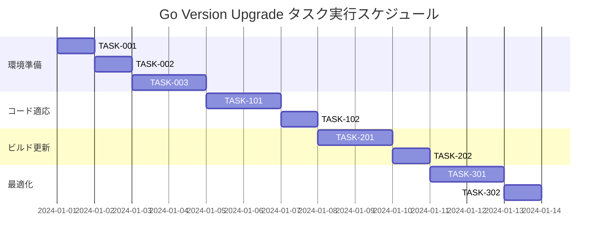

# Go Version Upgrade 実装タスク

## 概要

全タスク数: 10
推定作業時間: 8-10営業日
クリティカルパス: TASK-001 → TASK-002 → TASK-003 → TASK-101 → TASK-102 → TASK-201 → TASK-202 → TASK-301

## タスク一覧

### フェーズ1: 環境準備と基盤構築

#### TASK-001: Go 1.24.x環境構築とツール更新

- [ ] **タスク完了**
- **タスクタイプ**: DIRECT
- **要件リンク**: REQ-001, REQ-002, REQ-003
- **依存タスク**: なし
- **実装詳細**:
  - Go 1.24.5のインストール
  - gopls (Language Server) の更新
  - golangci-lint の更新
  - 開発環境（IDE）の設定更新
- **テスト要件**:
  - [ ] Go バージョン確認テスト
  - [ ] 開発ツールの動作確認テスト
- **完了条件**:
  - [ ] `go version` で Go 1.24.5 が表示される
  - [ ] gopls が最新バージョンで動作している
  - [ ] golangci-lint が最新バージョンで動作している

#### TASK-002: プロジェクト設定とビルドシステム更新

- [ ] **タスク完了**
- **タスクタイプ**: DIRECT  
- **要件リンク**: REQ-004, REQ-005, REQ-006
- **依存タスク**: TASK-001
- **実装詳細**:
  - go.mod の Go バージョン更新 (1.22 → 1.24)
  - Makefile の更新（Go 1.24.x対応）
  - Dockerfile の更新（ベースイメージ更新）
  - docker-compose.yml の更新
- **テスト要件**:
  - [ ] `go mod tidy` 実行テスト
  - [ ] ビルドシステムの動作確認
  - [ ] Docker イメージのビルドテスト
- **完了条件**:
  - [ ] go.mod で Go 1.24 が指定されている
  - [ ] make build が正常に動作する
  - [ ] Docker イメージが正常にビルドできる

#### TASK-003: 依存関係の更新と互換性確認

- [ ] **タスク完了**
- **タスクタイプ**: TDD
- **要件リンク**: REQ-007, REQ-008
- **依存タスク**: TASK-002
- **実装詳細**:
  - 全依存関係の互換性チェック
  - 必要に応じて依存関係のバージョン更新
  - go mod audit による脆弱性スキャン
  - go.sum の更新
- **テスト要件**:
  - [ ] 単体テスト: 依存関係の互換性テスト
  - [ ] 統合テスト: 全パッケージのビルドテスト
  - [ ] セキュリティテスト: 脆弱性スキャン
- **エラーハンドリング**:
  - [ ] 互換性のない依存関係の検出
  - [ ] 脆弱性のある依存関係の検出
- **完了条件**:
  - [ ] 全依存関係が Go 1.24 と互換性がある
  - [ ] 脆弱性スキャンで問題が検出されない

### フェーズ2: コード適応とテスト更新

#### TASK-101: コード品質向上とLinter対応

- [ ] **タスク完了**
- **タスクタイプ**: TDD
- **要件リンク**: REQ-009, REQ-010, REQ-016
- **依存タスク**: TASK-003
- **実装詳細**:
  - golangci-lint の新しいルールへの対応
  - 非推奨APIの置き換え
  - go vet での警告の修正
  - gofmt/goimports での整形
- **テスト要件**:
  - [ ] 単体テスト: 修正されたコードのテスト
  - [ ] 静的解析テスト: リンター実行
  - [ ] コード品質テスト: 複雑度チェック
- **完了条件**:
  - [ ] golangci-lint でエラーが0個
  - [ ] go vet でエラーが0個
  - [ ] 全ファイルが適切にフォーマットされている

#### TASK-102: テストフレームワークとベンチマーク更新

- [ ] **タスク完了**
- **タスクタイプ**: TDD
- **要件リンク**: REQ-011, REQ-012, REQ-017
- **依存タスク**: TASK-101
- **実装詳細**:
  - 既存テストの Go 1.24 互換性確認
  - ベンチマークテストの拡充
  - テストカバレッジの向上
  - レース条件テストの追加
- **テスト要件**:
  - [ ] 単体テスト: 全テストの実行確認
  - [ ] ベンチマークテスト: パフォーマンス測定
  - [ ] レース条件テスト: 並行処理安全性
- **完了条件**:
  - [ ] `go test ./...` が全て成功する
  - [ ] `go test -race ./...` が全て成功する
  - [ ] テストカバレッジが80%以上

### フェーズ3: ビルドとデプロイ更新

#### TASK-201: マルチプラットフォームビルド対応

- [ ] **タスク完了**
- **タスクタイプ**: TDD
- **要件リンク**: REQ-013, REQ-014
- **依存タスク**: TASK-102
- **実装詳細**:
  - Windows (amd64, arm64) ビルド
  - Linux (amd64, arm64) ビルド  
  - macOS (amd64, arm64) ビルド
  - WebAssembly ビルド
  - クロスコンパイル設定の最適化
- **テスト要件**:
  - [ ] プラットフォーム別ビルドテスト
  - [ ] バイナリサイズ確認テスト
  - [ ] 実行テスト（可能なプラットフォーム）
- **完了条件**:
  - [ ] 全プラットフォームでビルドが成功する
  - [ ] バイナリサイズが許容範囲内
  - [ ] WebAssembly ビルドが正常に動作する

#### TASK-202: CI/CDパイプライン更新

- [ ] **タスク完了**
- **タスクタイプ**: TDD
- **要件リンク**: REQ-018, REQ-019, REQ-020
- **依存タスク**: TASK-201
- **実装詳細**:
  - GitHub Actions ワークフローの更新
  - Docker ビルドパイプラインの更新
  - 並列ビルドの最適化
  - キャッシュ戦略の改善
- **テスト要件**:
  - [ ] CI パイプラインの実行テスト
  - [ ] 並列ビルドの動作確認
  - [ ] キャッシュ効果の確認
- **完了条件**:
  - [ ] CI パイプラインが正常に動作する
  - [ ] ビルド時間が改善されている
  - [ ] 全テストが CI で成功する

### フェーズ4: パフォーマンス最適化と監視

#### TASK-301: パフォーマンス測定と最適化

- [ ] **タスク完了**
- **タスクタイプ**: TDD
- **要件リンク**: REQ-015, REQ-021, REQ-022
- **依存タスク**: TASK-202
- **実装詳細**:
  - ベンチマーク結果の比較分析
  - パフォーマンスプロファイリング
  - メモリ使用量の最適化
  - 起動時間の最適化
- **テスト要件**:
  - [ ] ベンチマーク比較テスト
  - [ ] メモリ使用量テスト  
  - [ ] 起動時間測定テスト
  - [ ] プロファイリング分析
- **UI/UX要件**:
  - [ ] ゲーム実行時のフレームレート維持
  - [ ] 起動時間の短縮
  - [ ] メモリ使用量の最適化
- **完了条件**:
  - [ ] パフォーマンスがGo 1.22と同等以上
  - [ ] メモリ使用量が256MB以下
  - [ ] 起動時間が3秒以下

#### TASK-302: 監視とアラート設定

- [ ] **タスク完了**
- **タスクタイプ**: DIRECT
- **要件リンク**: REQ-023, REQ-024
- **依存タスク**: TASK-301
- **実装詳細**:
  - Prometheus メトリクス設定
  - アラートルールの設定
  - ダッシュボードの作成
  - ログ監視の設定
- **テスト要件**:
  - [ ] メトリクス収集テスト
  - [ ] アラート発生テスト
  - [ ] ダッシュボード表示テスト
- **完了条件**:
  - [ ] メトリクスが正常に収集されている
  - [ ] アラートが適切に動作する
  - [ ] 監視ダッシュボードが利用可能

## 実行順序

## 並行実行可能なタスクグループ

### グループA: 環境構築（順次実行必須）
- TASK-001 → TASK-002 → TASK-003

### グループB: コード品質（順次実行推奨）
- TASK-101 → TASK-102

### グループC: ビルドシステム（順次実行推奨）
- TASK-201 → TASK-202

### グループD: 最適化・監視（並行実行可能）
- TASK-301 と TASK-302（一部並行可能）

## リスク管理と対策

### 高リスク項目
- **WebAssembly互換性**: 新しいGoバージョンでのWASMビルド
- **依存関係の非互換**: サードパーティライブラリの対応状況
- **パフォーマンス劣化**: 新バージョンでの予期しない性能低下

### 軽減策
- 段階的なテストとロールバック準備
- 包括的なベンチマークテスト
- CI/CDでの自動検証

## 成功基準

1. **機能性**: 全既存機能が正常に動作する
2. **パフォーマンス**: Go 1.22と同等以上のパフォーマンス
3. **品質**: テストカバレッジ80%以上、リンターエラー0個
4. **互換性**: 全プラットフォームでのビルド成功
5. **セキュリティ**: 脆弱性スキャンでの問題0個

## 次のステップ

このタスクリストが承認されましたら、以下の手順で実装を開始します：

1. TASK-001から順次実行
2. 各タスクでTDD/DIRECTプロセスに従った実装
3. マイルストーン毎の品質確認
4. 最終統合テストとデプロイメント

実装を開始する準備ができましたら、お知らせください。