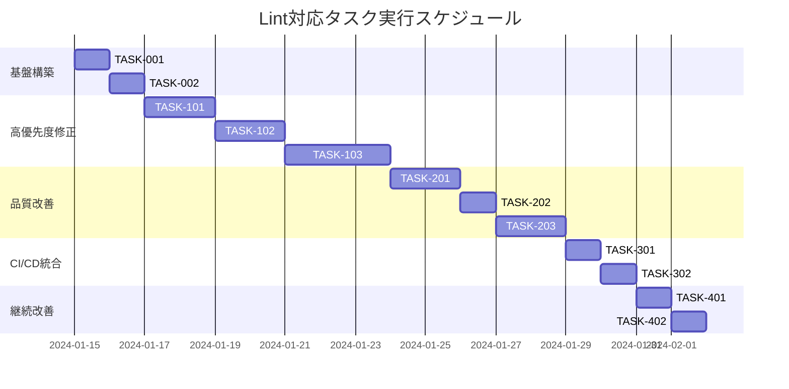

# Lint対応 実装タスク

## 概要

全タスク数: 12
推定作業時間: 16-20時間
クリティカルパス: TASK-001 → TASK-002 → TASK-101 → TASK-102 → TASK-201

## タスク一覧

### フェーズ1: 基盤構築・設定調整

#### TASK-001: golangci-lint設定の互換性修正

- [ ] **タスク完了**
- **タスクタイプ**: DIRECT
- **要件リンク**: REQ-001, REQ-404
- **依存タスク**: なし
- **実装詳細**:
  - `.golangci.yml`のlinter設定を最新バージョンに対応
  - `copyloopvar` → `exportloopref` または削除
  - `mnd` → `gomnd` に修正
  - サポートされていないlinterの調査と代替案検討
- **完了条件**:
  - [ ] `golangci-lint run --issues-exit-code=0` が設定エラーなしで実行完了
  - [ ] 設定したlinterが全て有効化されている
- **テスト要件**:
  - [ ] `make lint` コマンドの正常実行確認
  - [ ] 各linterが正しく動作することの確認

#### TASK-002: 現在のlintエラー状況の詳細分析

- [ ] **タスク完了**
- **タスクタイプ**: DIRECT
- **要件リンク**: REQ-001
- **依存タスク**: TASK-001
- **実装詳細**:
  - golangci-lint実行によるエラー件数と種類の把握
  - エラー分類（セキュリティ、品質、スタイル）
  - 修正優先度の決定とタスク詳細化
  - ファイル別・パッケージ別のエラー分布分析
- **完了条件**:
  - [ ] 全lintエラーがカテゴリ別に整理されている
  - [ ] 修正優先度が決定されている
  - [ ] 実装工数の見積もりが完了している
- **成果物**:
  - [ ] `docs/tasks/lint-analysis.md` - 詳細分析結果
  - [ ] 優先度付きエラーリスト

### フェーズ2: 高優先度エラー修正

#### TASK-101: セキュリティ関連エラー修正（gosec）

- [ ] **タスク完了**
- **タスクタイプ**: TDD
- **要件リンク**: REQ-001, NFR-101, NFR-102, NFR-103
- **依存タスク**: TASK-002
- **実装詳細**:
  - gosecによるセキュリティ警告の全解決
  - 機密情報のハードコーディング除去
  - 安全でないAPI使用の修正
  - 暗号化関連のベストプラクティス適用
- **テスト要件**:
  - [ ] セキュリティテスト: 修正箇所の脆弱性確認
  - [ ] 単体テスト: セキュリティ修正による機能への影響確認
  - [ ] 統合テスト: 認証・認可フローの正常動作確認
- **セキュリティチェックリスト**:
  - [ ] G101: ハードコードされたクレデンシャル
  - [ ] G102: ネットワークバインド設定
  - [ ] G103: 監査不要なタグ使用
  - [ ] G104: エラーハンドリング不備
  - [ ] G301-G306: ファイル権限問題
- **完了条件**:
  - [ ] `gosec` 関連エラーが0件
  - [ ] セキュリティベストプラクティスが適用されている

#### TASK-102: エラーハンドリング修正（errcheck, errorlint）

- [ ] **タスク完了**
- **タスクタイプ**: TDD
- **要件リンク**: REQ-001, NFR-201
- **依存タスク**: TASK-101
- **実装詳細**:
  - 未チェックエラーの全解決
  - エラーラッピングとフォーマットの統一
  - エラーチェーンの適切な実装
  - ECS固有のエラーハンドリングパターン適用
- **テスト要件**:
  - [ ] 単体テスト: 各エラーケースのテスト
  - [ ] 統合テスト: エラーハンドリングフローの確認
  - [ ] エラー処理のパフォーマンス影響測定
- **エラーハンドリング要件**:
  - [ ] 全てのエラーが適切にチェックされている
  - [ ] エラーメッセージが具体的で理解しやすい
  - [ ] エラーチェーンが適切に保持されている
  - [ ] ゲーム固有のエラー型が定義されている
- **完了条件**:
  - [ ] `errcheck` 関連エラーが0件
  - [ ] `errorlint` 関連エラーが0件

#### TASK-103: 静的解析エラー修正（staticcheck, govet）

- [ ] **タスク完了**
- **タスクタイプ**: TDD
- **要件リンク**: REQ-001, REQ-004
- **依存タスク**: TASK-102
- **実装詳細**:
  - staticcheckによる静的解析警告の解決
  - govet警告の修正
  - デッドコードの除去
  - 型安全性の向上
- **テスト要件**:
  - [ ] 静的解析によるコード品質検証
  - [ ] 修正による機能回帰テスト
  - [ ] パフォーマンステスト（ECS性能要件の維持）
- **解決対象**:
  - [ ] SA: 静的解析警告
  - [ ] ST: スタイル警告
  - [ ] QF: 品質改善提案
  - [ ] Printf関数の引数ミスマッチ
  - [ ] 到達不可能コード
- **完了条件**:
  - [ ] `staticcheck` 関連エラーが0件
  - [ ] `govet` 関連エラーが0件

### フェーズ3: 品質・スタイル改善

#### TASK-201: コード品質改善（unused, ineffassign, dupl）

- [ ] **タスク完了**
- **タスクタイプ**: TDD
- **要件リンク**: REQ-001, REQ-004, NFR-301
-**依存タスク**: TASK-103
- **実装詳細**:
  - 未使用変数・関数・インポートの除去
  - 無効な代入の修正
  - 重複コードのリファクタリング
  - コード複雑度の改善
- **テスト要件**:
  - [ ] リファクタリング後の機能テスト
  - [ ] パフォーマンステスト
  - [ ] ECS固有機能の回帰テスト
- **品質改善項目**:
  - [ ] デッドコード除去
  - [ ] 無効代入修正
  - [ ] 重複コード統合（閾値: 100トークン）
  - [ ] インポート最適化
- **完了条件**:
  - [ ] `unused` 関連エラーが0件
  - [ ] `ineffassign` 関連エラーが0件
  - [ ] `dupl` 関連エラーが許容範囲内

#### TASK-202: フォーマット・スタイル統一

- [ ] **タスク完了**
- **タスクタイプ**: DIRECT
- **要件リンク**: REQ-002, REQ-003, NFR-303
- **依存タスク**: TASK-201
- **実装詳細**:
  - gofumptによる統一フォーマット適用
  - goimportsによるimport整理
  - コメント記法の統一
  - 命名規約の統一
- **フォーマット要件**:
  - [ ] 全ての`.go`ファイルがgofumptでフォーマット済み
  - [ ] インポートがgoimportsで整理済み
  - [ ] 行長が140文字以下
  - [ ] 統一されたコメント記法
- **完了条件**:
  - [ ] `gofmt` 関連エラーが0件
  - [ ] `gofumpt` 関連エラーが0件
  - [ ] `goimports` 関連エラーが0件
  - [ ] `lll` 関連エラーが0件

#### TASK-203: ECS固有の最適化とルール適用

- [ ] **タスク完了**
- **タスクタイプ**: TDD
- **要件リンク**: REQ-005, REQ-402, NFR-003
- **依存タスク**: TASK-202
- **実装詳細**:
  - ECSパフォーマンス臨界パス最適化
  - メモリプール使用パターンの最適化
  - Entity/Component/Systemパターンの規約適用
  - ゲーム固有linter除外設定の精査
- **ECS最適化項目**:
  - [ ] パフォーマンス臨界パスでのmagic number許可
  - [ ] メモリ効率的なループ最適化
  - [ ] プリアロケーション設定の調整
  - [ ] 関数長制限の適切な除外設定
- **パフォーマンス要件**:
  - [ ] 10,000エンティティ@60FPS性能の維持
  - [ ] <1msクエリ性能の維持
  - [ ] <100B/entityメモリ効率の維持
- **完了条件**:
  - [ ] ECS性能要件を満たす
  - [ ] ゲーム固有パターンが適切に除外設定されている

### フェーズ4: CI/CD統合・自動化

#### TASK-301: GitHub Actions CI/CD統合

- [ ] **タスク完了**
- **タスクタイプ**: DIRECT
- **要件リンク**: REQ-102, REQ-104, NFR-202
- **依存タスク**: TASK-203
- **実装詳細**:
  - GitHub ActionsにおけるlintチェックWF追加
  - PR時の自動lintチェック設定
  - lint結果のPRコメント機能
  - lintエラー時のビルド失敗設定
- **CI/CD要件**:
  - [ ] PRでの自動lintチェック実行
  - [ ] lintエラー時のマージブロック
  - [ ] 変更ファイルのみの差分チェック
  - [ ] lint結果の自動コメント
- **ワークフロー設定**:
  - [ ] `.github/workflows/lint.yml` 作成
  - [ ] golangci-lintの自動インストール
  - [ ] キャッシュ設定によるパフォーマンス最適化
- **完了条件**:
  - [ ] PR作成時にlintチェックが自動実行される
  - [ ] lintエラー時にビルドが失敗する

#### TASK-302: 開発環境の改善

- [ ] **タスク完了**
- **タスクタイプ**: DIRECT
- **要件リンク**: REQ-301, NFR-202, NFR-203
- **依存タスク**: TASK-301
- **実装詳細**:
  - IDE統合用の設定ファイル生成
  - 開発者向けのlintツール自動インストール
  - `make` コマンドの改良
  - 開発フローの最適化
- **開発体験改善**:
  - [ ] VSCode設定ファイル（.vscode/settings.json）
  - [ ] GoLand設定エクスポート
  - [ ] make lintコマンドの自動ツールインストール
  - [ ] pre-commitフック設定（オプション）
- **完了条件**:
  - [ ] 開発者のセットアップが簡素化されている
  - [ ] IDEでlintエラーがリアルタイム表示される

### フェーズ5: 継続的改善・監視

#### TASK-401: メトリクス収集と可視化（オプション）

- [ ] **タスク完了**
- **タスクタイプ**: DIRECT
- **要件リンク**: REQ-303
- **依存タスク**: TASK-302
- **実装詳細**:
  - lint結果メトリクスの収集
  - 品質ダッシュボードの構築
  - コード品質トレンドの可視化
  - 継続的改善のためのKPI設定
- **メトリクス項目**:
  - [ ] lintエラー件数推移
  - [ ] カテゴリ別エラー分布
  - [ ] ファイル別品質スコア
  - [ ] 技術的負債指標
- **完了条件**:
  - [ ] 品質メトリクスが自動収集されている
  - [ ] ダッシュボードで可視化されている

#### TASK-402: ドキュメント整備・チーム教育

- [ ] **タスク完了**
- **タスクタイプ**: DIRECT
- **要件リンク**: NFR-303, REQ-301
- **依存タスク**: TASK-401
- **実装詳細**:
  - コード品質ガイドライン文書化
  - lintルールの詳細説明
  - 新規開発者向けオンボーディング資料
  - ベストプラクティス集の作成
- **ドキュメント作成項目**:
  - [ ] `docs/implementation/code-quality-guide.md`
  - [ ] `docs/implementation/lint-rules-explained.md` 
  - [ ] `docs/onboarding/development-setup.md`
  - [ ] チーム向けlint研修資料
- **完了条件**:
  - [ ] 全必要文書が作成されている
  - [ ] チームメンバーが新ルールを理解している

## 実行順序

## サブタスクテンプレート

### TDDタスクの場合

各TDDタスクは以下のプロセスで実装:

1. `tdd-requirements.md` - 詳細要件定義
2. `tdd-testcases.md` - テストケース作成  
3. `tdd-red.md` - テスト実装（失敗）
4. `tdd-green.md` - 最小実装
5. `tdd-refactor.md` - リファクタリング
6. `tdd-verify-complete.md` - 品質確認

### DIRECTタスクの場合

各DIRECTタスクは以下のプロセスで実装:

1. `direct-setup.md` - 直接実装・設定
2. `direct-verify.md` - 動作確認・品質確認

## リスクと対策

### 高リスク項目
- **ECSパフォーマンス劣化**: benchmarkテストによる継続監視
- **大量修正によるバグ混入**: 段階的な修正とテスト
- **CI/CDパフォーマンス劣化**: キャッシュ設定とincremental lint

### 中リスク項目  
- **開発効率の一時低下**: 段階的導入と教育
- **設定調整の繰り返し**: プロジェクト特性への最適化

### 軽微リスク項目
- **チームへの周知不足**: ドキュメント整備と研修

## 成功指標

### 定量指標
- [ ] golangci-lint run エラー件数: 0件
- [ ] lint実行時間: < 5分
- [ ] ビルド成功率: > 99%
- [ ] ECS性能要件維持: 10,000エンティティ@60FPS

### 定性指標
- [ ] コードレビュー効率向上
- [ ] 新規開発者オンボーディング時間短縮
- [ ] バグ検出率向上
- [ ] 技術的負債削減

## 関連ドキュメント

- `docs/spec/lint-compliance-requirements.md` - 要件定義
- `.golangci.yml` - Lint設定ファイル
- `Makefile` - ビルド・テストコマンド定義
- `CLAUDE.md` - 開発ワークフロー

---

*このタスクリストは EARS記法に基づく要件定義から生成されています。*