# マッスルドリーマー 技術仕様書
*詳細アーキテクチャ・実装仕様 2025年版*

## 🏗️ システムアーキテクチャ詳細

### Entity Component System (ECS) 設計

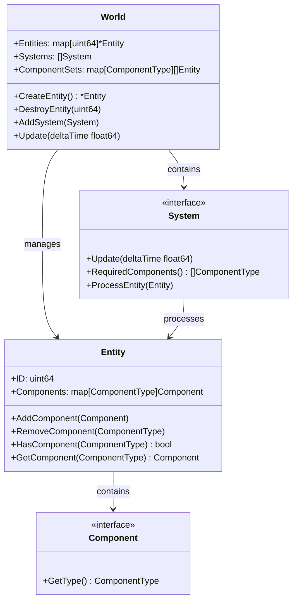
```mermaid
classDiagram
    class Entity {
        +ID: uint64
        +Components: map[ComponentType]Component
        +AddComponent(Component)
        +RemoveComponent(ComponentType)
        +HasComponent(ComponentType) bool
        +GetComponent(ComponentType) Component
    }
    
    class Component {
        <<interface>>
        +GetType() ComponentType
    }
    
    class System {
        <<interface>>
        +Update(deltaTime float64)
        +RequiredComponents() []ComponentType
        +ProcessEntity(Entity)
    }
    
    class World {
        +Entities: map[uint64]*Entity
        +Systems: []System
        +ComponentSets: map[ComponentType][]Entity
        +CreateEntity() *Entity
        +DestroyEntity(uint64)
        +AddSystem(System)
        +Update(deltaTime float64)
    }
    
    Entity --> Component : contains
    World --> Entity : manages
    World --> System : contains
    System --> Entity : processes
```

### コンポーネント型定義

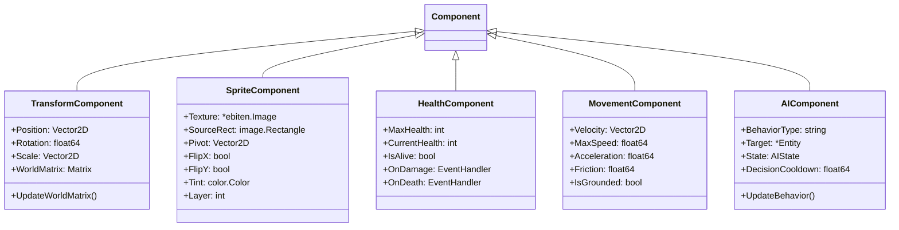
```mermaid
classDiagram
    class TransformComponent {
        +Position: Vector2D
        +Rotation: float64
        +Scale: Vector2D
        +WorldMatrix: Matrix
        +UpdateWorldMatrix()
    }
    
    class SpriteComponent {
        +Texture: *ebiten.Image
        +SourceRect: image.Rectangle
        +Pivot: Vector2D
        +FlipX: bool
        +FlipY: bool
        +Tint: color.Color
        +Layer: int
    }
    
    class HealthComponent {
        +MaxHealth: int
        +CurrentHealth: int
        +IsAlive: bool
        +OnDamage: EventHandler
        +OnDeath: EventHandler
    }
    
    class MovementComponent {
        +Velocity: Vector2D
        +MaxSpeed: float64
        +Acceleration: float64
        +Friction: float64
        +IsGrounded: bool
    }
    
    class AIComponent {
        +BehaviorType: string
        +Target: *Entity
        +State: AIState
        +DecisionCooldown: float64
        +UpdateBehavior()
    }
    
    Component <|-- TransformComponent
    Component <|-- SpriteComponent
    Component <|-- HealthComponent
    Component <|-- MovementComponent
    Component <|-- AIComponent
```

### システム処理フロー

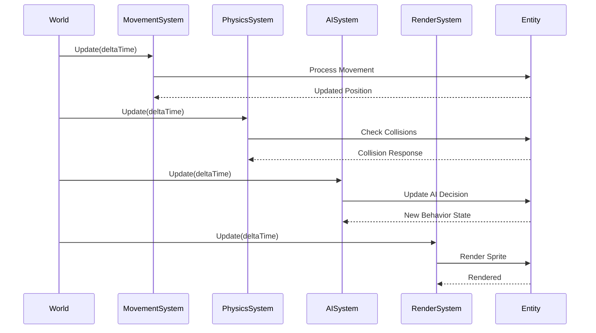
```mermaid
sequenceDiagram
    participant W as World
    participant MS as MovementSystem
    participant PS as PhysicsSystem
    participant AS as AISystem
    participant RS as RenderSystem
    participant E as Entity
    
    W->>MS: Update(deltaTime)
    MS->>E: Process Movement
    E-->>MS: Updated Position
    
    W->>PS: Update(deltaTime)
    PS->>E: Check Collisions
    E-->>PS: Collision Response
    
    W->>AS: Update(deltaTime)
    AS->>E: Update AI Decision
    E-->>AS: New Behavior State
    
    W->>RS: Update(deltaTime)
    RS->>E: Render Sprite
    E-->>RS: Rendered
```

---

## 🎭 テーマシステム詳細仕様

### テーマデータ構造

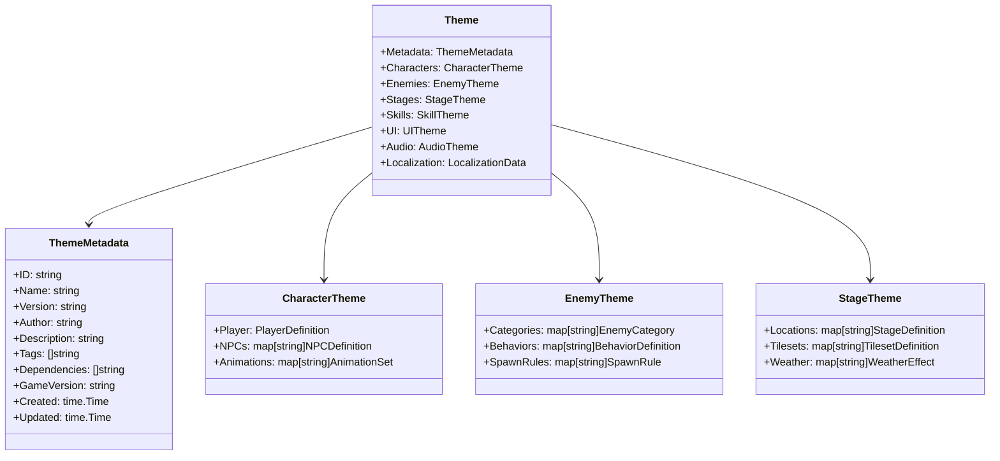
```mermaid
classDiagram
    class Theme {
        +Metadata: ThemeMetadata
        +Characters: CharacterTheme
        +Enemies: EnemyTheme
        +Stages: StageTheme
        +Skills: SkillTheme
        +UI: UITheme
        +Audio: AudioTheme
        +Localization: LocalizationData
    }
    
    class ThemeMetadata {
        +ID: string
        +Name: string
        +Version: string
        +Author: string
        +Description: string
        +Tags: []string
        +Dependencies: []string
        +GameVersion: string
        +Created: time.Time
        +Updated: time.Time
    }
    
    class CharacterTheme {
        +Player: PlayerDefinition
        +NPCs: map[string]NPCDefinition
        +Animations: map[string]AnimationSet
    }
    
    class EnemyTheme {
        +Categories: map[string]EnemyCategory
        +Behaviors: map[string]BehaviorDefinition
        +SpawnRules: map[string]SpawnRule
    }
    
    class StageTheme {
        +Locations: map[string]StageDefinition
        +Tilesets: map[string]TilesetDefinition
        +Weather: map[string]WeatherEffect
    }
    
    Theme --> ThemeMetadata
    Theme --> CharacterTheme
    Theme --> EnemyTheme
    Theme --> StageTheme
```

### テーマ読み込みプロセス

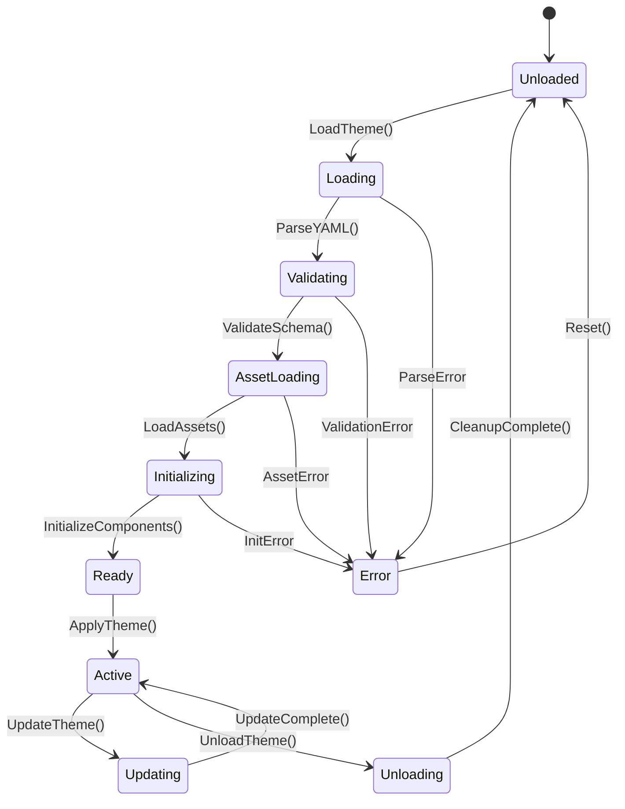
```mermaid
stateDiagram-v2
    [*] --> Unloaded
    Unloaded --> Loading : LoadTheme()
    Loading --> Validating : ParseYAML()
    Validating --> AssetLoading : ValidateSchema()
    AssetLoading --> Initializing : LoadAssets()
    Initializing --> Ready : InitializeComponents()
    Ready --> Active : ApplyTheme()
    Active --> Updating : UpdateTheme()
    Updating --> Active : UpdateComplete()
    Active --> Unloading : UnloadTheme()
    Unloading --> Unloaded : CleanupComplete()
    
    Loading --> Error : ParseError
    Validating --> Error : ValidationError
    AssetLoading --> Error : AssetError
    Initializing --> Error : InitError
    Error --> Unloaded : Reset()
```

### テーマバリデーションルール

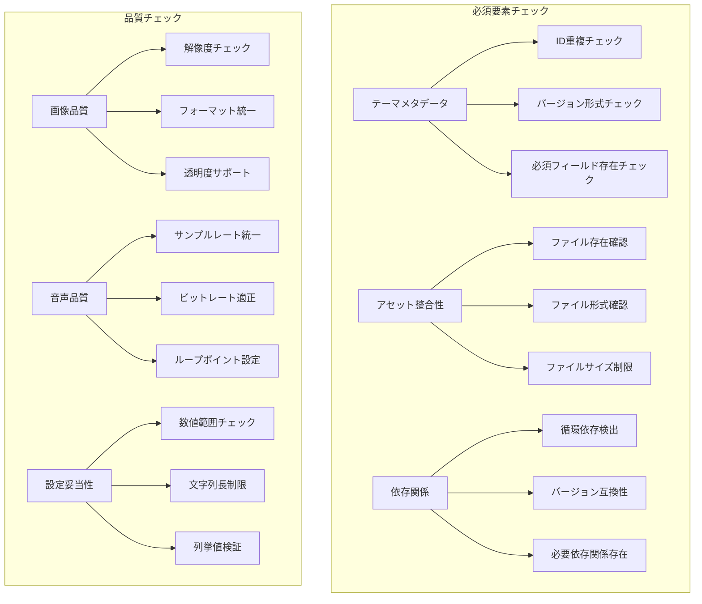
```mermaid
graph TB
    subgraph "必須要素チェック"
        A[テーマメタデータ] --> A1[ID重複チェック]
        A --> A2[バージョン形式チェック]
        A --> A3[必須フィールド存在チェック]
        
        B[アセット整合性] --> B1[ファイル存在確認]
        B --> B2[ファイル形式確認]
        B --> B3[ファイルサイズ制限]
        
        C[依存関係] --> C1[循環依存検出]
        C --> C2[バージョン互換性]
        C --> C3[必要依存関係存在]
    end
    
    subgraph "品質チェック"
        D[画像品質] --> D1[解像度チェック]
        D --> D2[フォーマット統一]
        D --> D3[透明度サポート]
        
        E[音声品質] --> E1[サンプルレート統一]
        E --> E2[ビットレート適正]
        E --> E3[ループポイント設定]
        
        F[設定妥当性] --> F1[数値範囲チェック]
        F --> F2[文字列長制限]
        F --> F3[列挙値検証]
    end
```

---

## 🔧 Modシステム詳細仕様

### Modアーキテクチャ

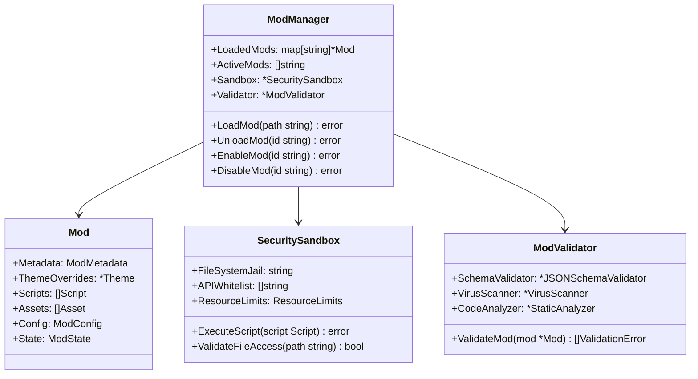
```mermaid
classDiagram
    class Mod {
        +Metadata: ModMetadata
        +ThemeOverrides: *Theme
        +Scripts: []Script
        +Assets: []Asset
        +Config: ModConfig
        +State: ModState
    }
    
    class ModManager {
        +LoadedMods: map[string]*Mod
        +ActiveMods: []string
        +Sandbox: *SecuritySandbox
        +Validator: *ModValidator
        +LoadMod(path string) error
        +UnloadMod(id string) error
        +EnableMod(id string) error
        +DisableMod(id string) error
    }
    
    class SecuritySandbox {
        +FileSystemJail: string
        +APIWhitelist: []string
        +ResourceLimits: ResourceLimits
        +ExecuteScript(script Script) error
        +ValidateFileAccess(path string) bool
    }
    
    class ModValidator {
        +SchemaValidator: *JSONSchemaValidator
        +VirusScanner: *VirusScanner
        +CodeAnalyzer: *StaticAnalyzer
        +ValidateMod(mod *Mod) []ValidationError
    }
    
    ModManager --> Mod
    ModManager --> SecuritySandbox
    ModManager --> ModValidator
```

### Modセキュリティレイヤー

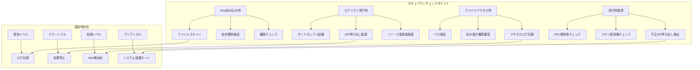
```mermaid
graph TB
    subgraph "セキュリティチェックポイント"
        A[Mod読み込み時] --> A1[ファイルスキャン]
        A --> A2[依存関係検証]
        A --> A3[権限チェック]
        
        B[スクリプト実行時] --> B1[サンドボックス起動]
        B --> B2[API呼び出し監視]
        B --> B3[リソース使用量監視]
        
        C[ファイルアクセス時] --> C1[パス検証]
        C --> C2[読み書き権限確認]
        C --> C3[アクセスログ記録]
        
        D[実行時監視] --> D1[CPU使用率チェック]
        D --> D2[メモリ使用量チェック]
        D --> D3[不正API呼び出し検出]
    end
    
    subgraph "違反時対応"
        E[警告レベル] --> E1[ログ記録]
        F[エラーレベル] --> F1[処理停止]
        G[危険レベル] --> G1[Mod無効化]
        H[クリティカル] --> H1[システム保護モード]
    end
    
    A1 --> E1
    B2 --> F1
    C3 --> G1
    D3 --> H1
```

### Mod API設計

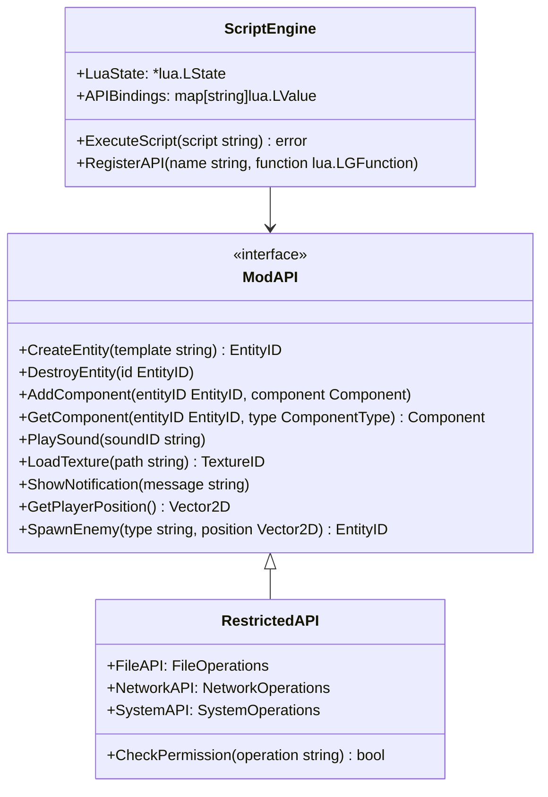
```mermaid
classDiagram
    class ModAPI {
        <<interface>>
        +CreateEntity(template string) EntityID
        +DestroyEntity(id EntityID)
        +AddComponent(entityID EntityID, component Component)
        +GetComponent(entityID EntityID, type ComponentType) Component
        +PlaySound(soundID string)
        +LoadTexture(path string) TextureID
        +ShowNotification(message string)
        +GetPlayerPosition() Vector2D
        +SpawnEnemy(type string, position Vector2D) EntityID
    }
    
    class RestrictedAPI {
        +FileAPI: FileOperations
        +NetworkAPI: NetworkOperations
        +SystemAPI: SystemOperations
        +CheckPermission(operation string) bool
    }
    
    class ScriptEngine {
        +LuaState: *lua.LState
        +APIBindings: map[string]lua.LValue
        +ExecuteScript(script string) error
        +RegisterAPI(name string, function lua.LGFunction)
    }
    
    ModAPI <|-- RestrictedAPI
    ScriptEngine --> ModAPI
```

---

## 💾 データ管理システム詳細

### セーブデータ構造

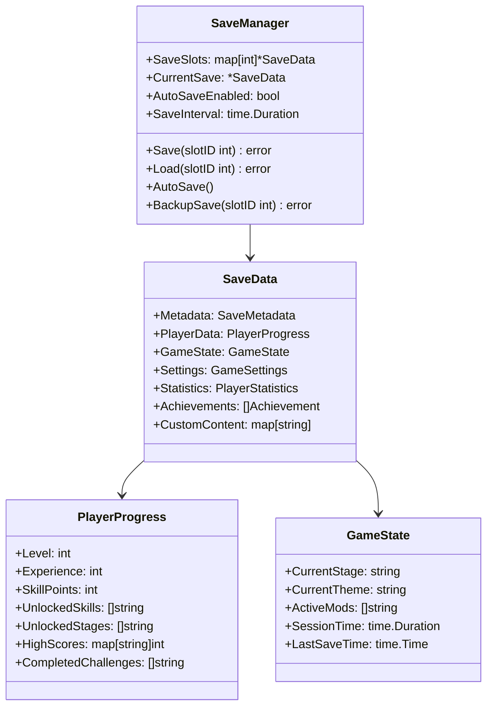
```mermaid
classDiagram
    class SaveManager {
        +SaveSlots: map[int]*SaveData
        +CurrentSave: *SaveData
        +AutoSaveEnabled: bool
        +SaveInterval: time.Duration
        +Save(slotID int) error
        +Load(slotID int) error
        +AutoSave()
        +BackupSave(slotID int) error
    }
    
    class SaveData {
        +Metadata: SaveMetadata
        +PlayerData: PlayerProgress
        +GameState: GameState
        +Settings: GameSettings
        +Statistics: PlayerStatistics
        +Achievements: []Achievement
        +CustomContent: map[string]
    }
    
    class PlayerProgress {
        +Level: int
        +Experience: int
        +SkillPoints: int
        +UnlockedSkills: []string
        +UnlockedStages: []string
        +HighScores: map[string]int
        +CompletedChallenges: []string
    }
    
    class GameState {
        +CurrentStage: string
        +CurrentTheme: string
        +ActiveMods: []string
        +SessionTime: time.Duration
        +LastSaveTime: time.Time
    }
    
    SaveManager --> SaveData
    SaveData --> PlayerProgress
    SaveData --> GameState
```

### セーブデータ暗号化

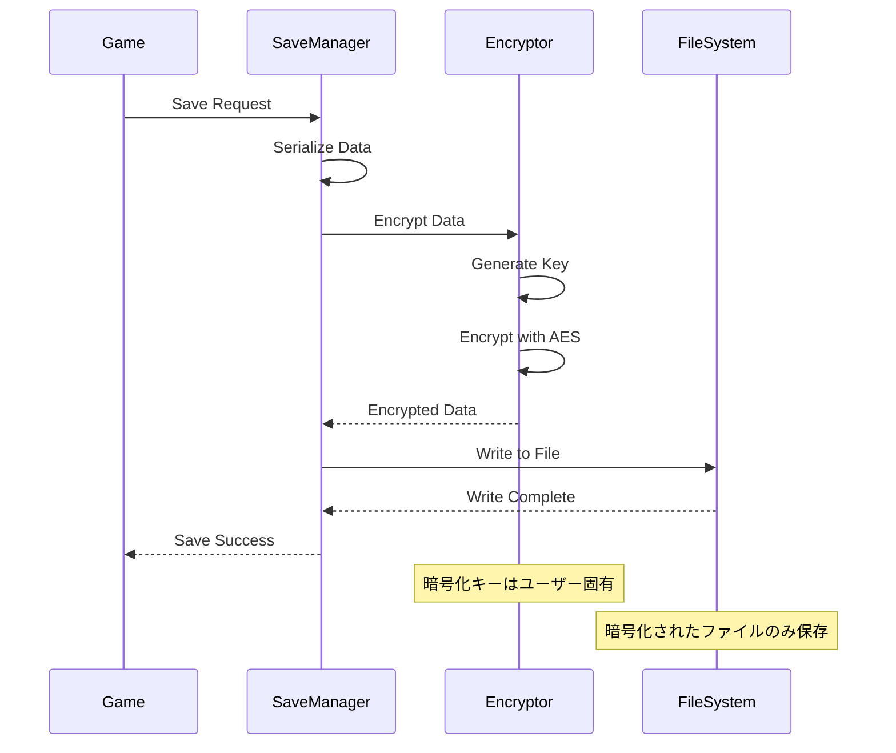
```mermaid
sequenceDiagram
    participant G as Game
    participant SM as SaveManager
    participant E as Encryptor
    participant FS as FileSystem
    
    G->>SM: Save Request
    SM->>SM: Serialize Data
    SM->>E: Encrypt Data
    E->>E: Generate Key
    E->>E: Encrypt with AES
    E-->>SM: Encrypted Data
    SM->>FS: Write to File
    FS-->>SM: Write Complete
    SM-->>G: Save Success
    
    Note over E: 暗号化キーはユーザー固有
    Note over FS: 暗号化されたファイルのみ保存
```

### 設定管理システム

```mermaid
graph TB
    subgraph "設定カテゴリ"
        A[グラフィックス設定] --> A1[解像度]
        A --> A2[フルスクリーン]
        A --> A3[VSync]
        A --> A4[品質レベル]
        
        B[オーディオ設定] --> B1[マスター音量]
        B --> B2[BGM音量]
        B --> B3[SE音量]
        B --> B4[オーディオデバイス]
        
        C[入力設定] --> C1[キーバインド]
        C --> C2[マウス感度]
        C --> C3[ゲームパッド設定]
        C --> C4[タッチ操作設定]
        
        D[ゲーム設定] --> D1[難易度]
        D --> D2[言語設定]
        D --> D3[UI設定]
        D --> D4[オートセーブ間隔]
        
        E[テーマ・Mod設定] --> E1[デフォルトテーマ]
        E --> E2[有効Modリスト]
        E --> E3[Mod読み込み順序]
        E --> E4[Modセキュリティレベル]
    end
    
    subgraph "設定永続化"
        F[設定ファイル] --> F1[config.yaml]
        F --> F2[keybinds.yaml]
        F --> F3[graphics.yaml]
        F --> F4[audio.yaml]
    end
    
    A --> F1
    B --> F4
    C --> F2
    D --> F1
    E --> F1
```

---

## 🎨 レンダリングシステム詳細

### レンダリングパイプライン

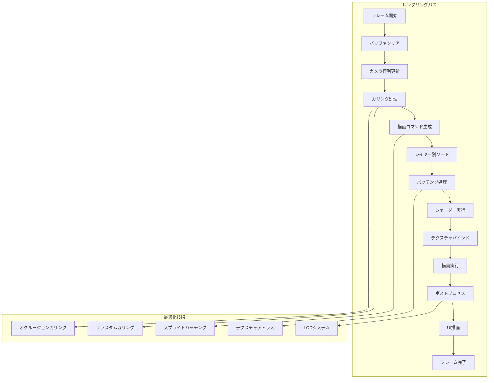
```mermaid
graph TB
    subgraph "レンダリングパス"
        A[フレーム開始] --> B[バッファクリア]
        B --> C[カメラ行列更新]
        C --> D[カリング処理]
        D --> E[描画コマンド生成]
        E --> F[レイヤー別ソート]
        F --> G[バッチング処理]
        G --> H[シェーダー実行]
        H --> I[テクスチャバインド]
        I --> J[描画実行]
        J --> K[ポストプロセス]
        K --> L[UI描画]
        L --> M[フレーム完了]
    end
    
    subgraph "最適化技術"
        N[スプライトバッチング]
        O[テクスチャアトラス]
        P[フラスタムカリング]
        Q[オクルージョンカリング]
        R[LODシステム]
    end
    
    D --> P
    E --> N
    G --> O
    D --> Q
    K --> R
```

### レンダリングコンポーネント

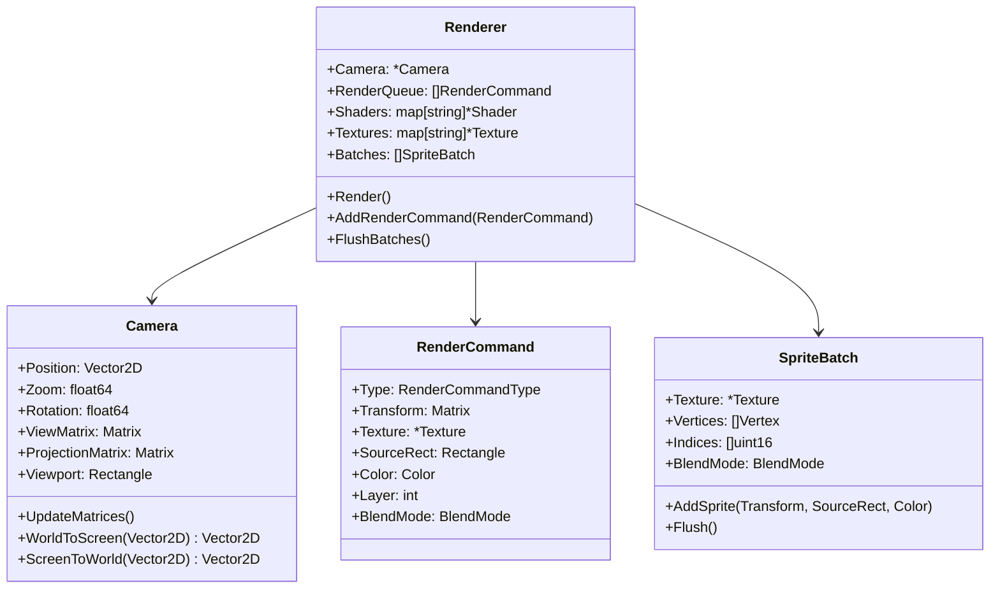
```mermaid
classDiagram
    class Renderer {
        +Camera: *Camera
        +RenderQueue: []RenderCommand
        +Shaders: map[string]*Shader
        +Textures: map[string]*Texture
        +Batches: []SpriteBatch
        +Render()
        +AddRenderCommand(RenderCommand)
        +FlushBatches()
    }
    
    class Camera {
        +Position: Vector2D
        +Zoom: float64
        +Rotation: float64
        +ViewMatrix: Matrix
        +ProjectionMatrix: Matrix
        +Viewport: Rectangle
        +UpdateMatrices()
        +WorldToScreen(Vector2D) Vector2D
        +ScreenToWorld(Vector2D) Vector2D
    }
    
    class RenderCommand {
        +Type: RenderCommandType
        +Transform: Matrix
        +Texture: *Texture
        +SourceRect: Rectangle
        +Color: Color
        +Layer: int
        +BlendMode: BlendMode
    }
    
    class SpriteBatch {
        +Texture: *Texture
        +Vertices: []Vertex
        +Indices: []uint16
        +BlendMode: BlendMode
        +AddSprite(Transform, SourceRect, Color)
        +Flush()
    }
    
    Renderer --> Camera
    Renderer --> RenderCommand
    Renderer --> SpriteBatch
```

### シェーダーシステム

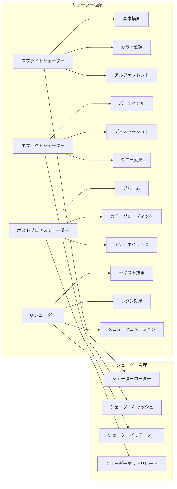
```mermaid
graph LR
    subgraph "シェーダー種類"
        A[スプライトシェーダー] --> A1[基本描画]
        A --> A2[カラー変調]
        A --> A3[アルファブレンド]
        
        B[エフェクトシェーダー] --> B1[パーティクル]
        B --> B2[ディストーション]
        B --> B3[グロー効果]
        
        C[ポストプロセスシェーダー] --> C1[ブルーム]
        C --> C2[カラーグレーディング]
        C --> C3[アンチエイリアス]
        
        D[UIシェーダー] --> D1[テキスト描画]
        D --> D2[ボタン効果]
        D --> D3[メニューアニメーション]
    end
    
    subgraph "シェーダー管理"
        E[シェーダーローダー]
        F[シェーダーキャッシュ]
        G[シェーダーバリデーター]
        H[シェーダーホットリロード]
    end
    
    A --> E
    B --> F
    C --> G
    D --> H
```

---

## 🔊 オーディオシステム詳細

### オーディオアーキテクチャ

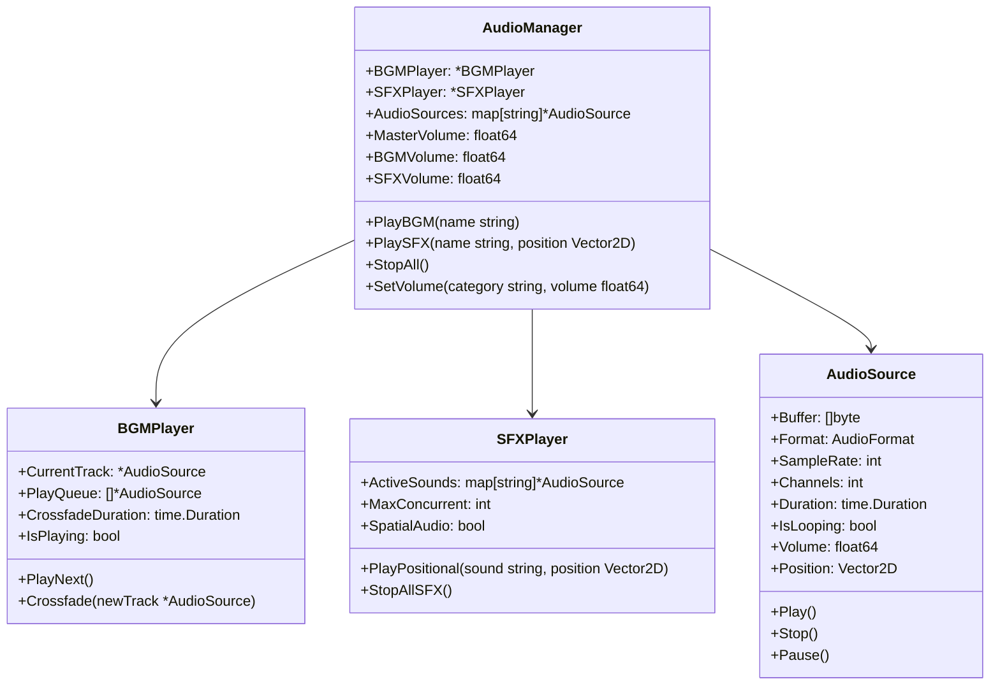
```mermaid
classDiagram
    class AudioManager {
        +BGMPlayer: *BGMPlayer
        +SFXPlayer: *SFXPlayer
        +AudioSources: map[string]*AudioSource
        +MasterVolume: float64
        +BGMVolume: float64
        +SFXVolume: float64
        +PlayBGM(name string)
        +PlaySFX(name string, position Vector2D)
        +StopAll()
        +SetVolume(category string, volume float64)
    }
    
    class AudioSource {
        +Buffer: []byte
        +Format: AudioFormat
        +SampleRate: int
        +Channels: int
        +Duration: time.Duration
        +IsLooping: bool
        +Volume: float64
        +Position: Vector2D
        +Play()
        +Stop()
        +Pause()
    }
    
    class BGMPlayer {
        +CurrentTrack: *AudioSource
        +PlayQueue: []*AudioSource
        +CrossfadeDuration: time.Duration
        +IsPlaying: bool
        +PlayNext()
        +Crossfade(newTrack *AudioSource)
    }
    
    class SFXPlayer {
        +ActiveSounds: map[string]*AudioSource
        +MaxConcurrent: int
        +SpatialAudio: bool
        +PlayPositional(sound string, position Vector2D)
        +StopAllSFX()
    }
    
    AudioManager --> BGMPlayer
    AudioManager --> SFXPlayer
    AudioManager --> AudioSource
```

### 空間オーディオシステム

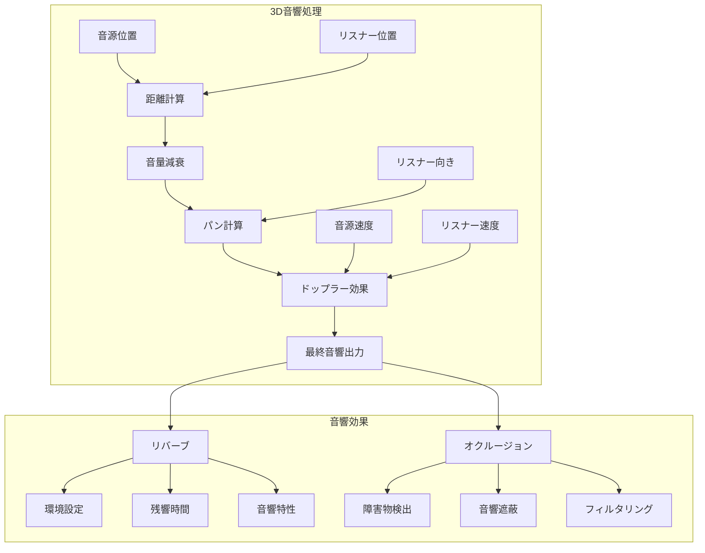
```mermaid
graph TB
    subgraph "3D音響処理"
        A[音源位置] --> B[距離計算]
        B --> C[音量減衰]
        C --> D[パン計算]
        D --> E[ドップラー効果]
        E --> F[最終音響出力]
        
        G[リスナー位置] --> B
        H[リスナー向き] --> D
        I[音源速度] --> E
        J[リスナー速度] --> E
    end
    
    subgraph "音響効果"
        K[リバーブ] --> K1[環境設定]
        K --> K2[残響時間]
        K --> K3[音響特性]
        
        L[オクルージョン] --> L1[障害物検出]
        L --> L2[音響遮蔽]
        L --> L3[フィルタリング]
    end
    
    F --> K
    F --> L
```

---

## 🎮 入力システム詳細

### 入力アーキテクチャ

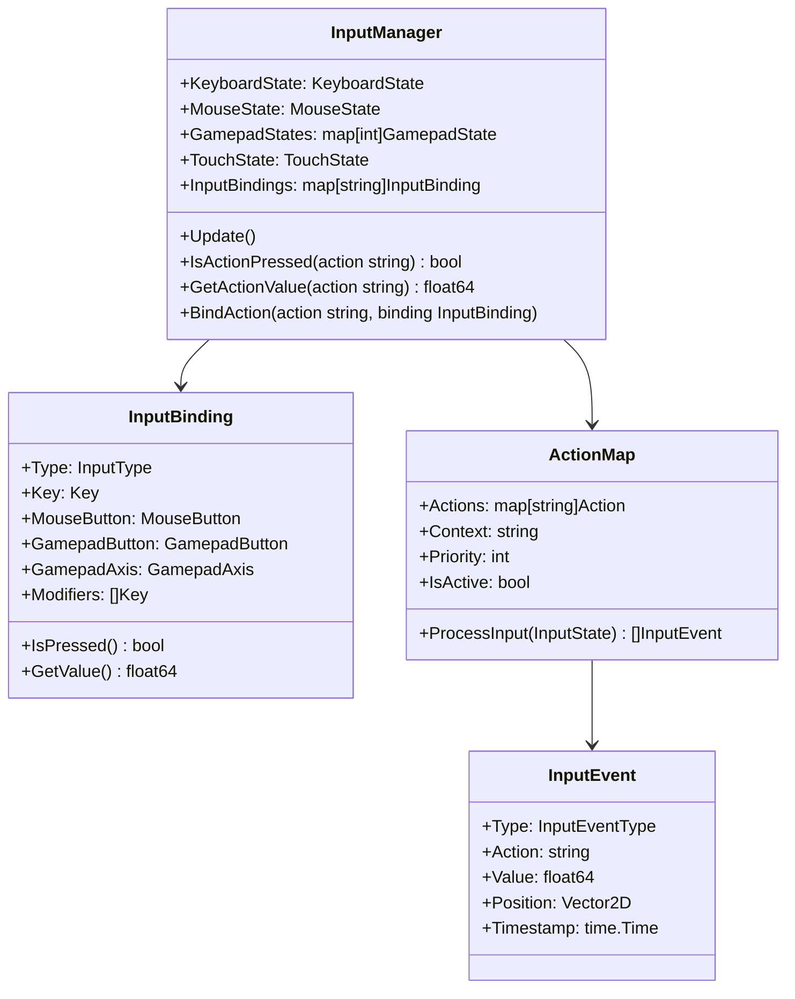
```mermaid
classDiagram
    class InputManager {
        +KeyboardState: KeyboardState
        +MouseState: MouseState
        +GamepadStates: map[int]GamepadState
        +TouchState: TouchState
        +InputBindings: map[string]InputBinding
        +Update()
        +IsActionPressed(action string) bool
        +GetActionValue(action string) float64
        +BindAction(action string, binding InputBinding)
    }
    
    class InputBinding {
        +Type: InputType
        +Key: Key
        +MouseButton: MouseButton
        +GamepadButton: GamepadButton
        +GamepadAxis: GamepadAxis
        +Modifiers: []Key
        +IsPressed() bool
        +GetValue() float64
    }
    
    class ActionMap {
        +Actions: map[string]Action
        +Context: string
        +Priority: int
        +IsActive: bool
        +ProcessInput(InputState) []InputEvent
    }
    
    class InputEvent {
        +Type: InputEventType
        +Action: string
        +Value: float64
        +Position: Vector2D
        +Timestamp: time.Time
    }
    
    InputManager --> InputBinding
    InputManager --> ActionMap
    ActionMap --> InputEvent
```

### プラットフォーム別入力対応

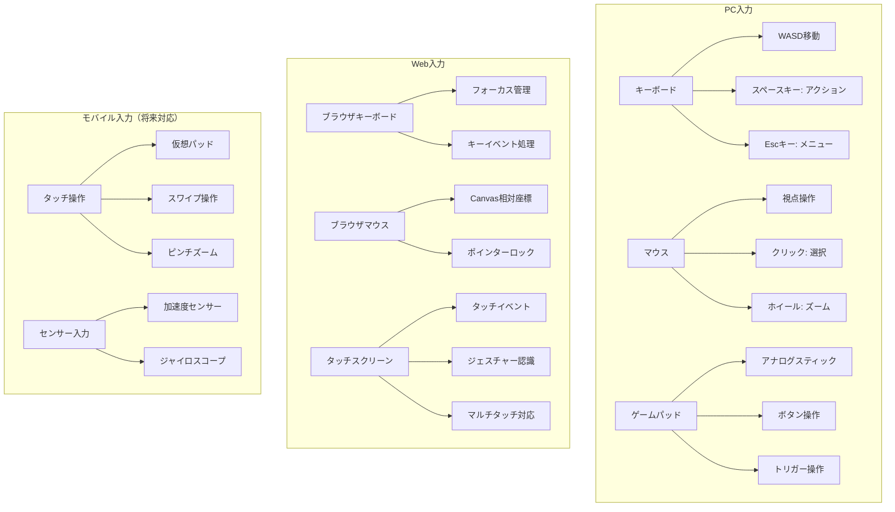
```mermaid
graph TB
    subgraph "PC入力"
        A[キーボード] --> A1[WASD移動]
        A --> A2[スペースキー: アクション]
        A --> A3[Escキー: メニュー]
        
        B[マウス] --> B1[視点操作]
        B --> B2[クリック: 選択]
        B --> B3[ホイール: ズーム]
        
        C[ゲームパッド] --> C1[アナログスティック]
        C --> C2[ボタン操作]
        C --> C3[トリガー操作]
    end
    
    subgraph "Web入力"
        D[ブラウザキーボード] --> D1[フォーカス管理]
        D --> D2[キーイベント処理]
        
        E[ブラウザマウス] --> E1[Canvas相対座標]
        E --> E2[ポインターロック]
        
        F[タッチスクリーン] --> F1[タッチイベント]
        F --> F2[ジェスチャー認識]
        F --> F3[マルチタッチ対応]
    end
    
    subgraph "モバイル入力（将来対応）"
        G[タッチ操作] --> G1[仮想パッド]
        G --> G2[スワイプ操作]
        G --> G3[ピンチズーム]
        
        H[センサー入力] --> H1[加速度センサー]
        H --> H2[ジャイロスコープ]
    end
```

---

## 🧮 物理エンジン詳細

### 物理システム設計

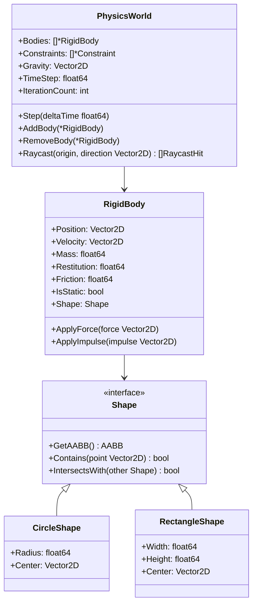
```mermaid
classDiagram
    class PhysicsWorld {
        +Bodies: []*RigidBody
        +Constraints: []*Constraint
        +Gravity: Vector2D
        +TimeStep: float64
        +IterationCount: int
        +Step(deltaTime float64)
        +AddBody(*RigidBody)
        +RemoveBody(*RigidBody)
        +Raycast(origin, direction Vector2D) []RaycastHit
    }
    
    class RigidBody {
        +Position: Vector2D
        +Velocity: Vector2D
        +Mass: float64
        +Restitution: float64
        +Friction: float64
        +IsStatic: bool
        +Shape: Shape
        +ApplyForce(force Vector2D)
        +ApplyImpulse(impulse Vector2D)
    }
    
    class Shape {
        <<interface>>
        +GetAABB() AABB
        +Contains(point Vector2D) bool
        +IntersectsWith(other Shape) bool
    }
    
    class CircleShape {
        +Radius: float64
        +Center: Vector2D
    }
    
    class RectangleShape {
        +Width: float64
        +Height: float64
        +Center: Vector2D
    }
    
    PhysicsWorld --> RigidBody
    RigidBody --> Shape
    Shape <|-- CircleShape
    Shape <|-- RectangleShape
```

### 衝突検出アルゴリズム

```mermaid
graph TB
    subgraph "Broad Phase（粗い判定）"
        A[空間分割] --> A1[グリッド分割]
        A --> A2[四分木]
        A --> A3[AABBツリー]
        
        B[ペア生成] --> B1[潜在的衝突ペア]
        B --> B2[フィルタリング]
    end
    
    subgraph "Narrow Phase（詳細判定）"
        C[形状判定] --> C1[円vs円]
        C --> C2[矩形vs矩形]
        C --> C3[円vs矩形]
        
        D[衝突情報] --> D1[接触点計算]
        D --> D2[侵入深度]
        D --> D3[接触法線]
    end
    
    subgraph "衝突応答"
        E[力積計算] --> E1[反発係数適用]
        E --> E2[摩擦力計算]
        E --> E3[速度更新]
        
        F[位置補正] --> F1[ペネトレーション解決]
        F --> F2[位置同期]
    end
    
    A --> C
    B --> C
    C --> E
    D --> F
```

---

## 🔒 セキュリティ実装詳細

### サンドボックス実装

```mermaid
graph TB
    subgraph "ファイルシステム制限"
        A[chroot jail] --> A1[/mods/sandbox/]
        A --> A2[読み取り専用領域]
        A --> A3[書き込み許可領域]
        
        B[パス検証] --> B1[../トラバーサル防止]
        B --> B2[シンボリックリンク制限]
        B --> B3[絶対パス拒否]
    end
    
    subgraph "API制限"
        C[許可APIホワイトリスト] --> C1[ゲーム操作API]
        C --> C2[アセット読み込みAPI]
        C --> C3[イベント送信API]
        
        D[禁止API] --> D1[ネットワークアクセス]
        D --> D2[プロセス制御]
        D --> D3[システム情報取得]
    end
    
    subgraph "リソース制限"
        E[CPU制限] --> E1[実行時間制限]
        E --> E2[CPU使用率制限]
        
        F[メモリ制限] --> F1[使用量上限]
        F --> F2[GC強制実行]
        
        G[I/O制限] --> G1[ファイル操作回数]
        G --> G2[読み書きサイズ制限]
    end
```

### セキュリティ監視システム

```mermaid
sequenceDiagram
    participant M as Mod
    participant S as Sandbox
    participant Mon as Security Monitor
    participant Log as Security Log
    participant Act as Action Handler
    
    M->>S: API Call
    S->>Mon: Permission Check
    Mon->>Mon: Validate Request
    
    alt Permitted
        Mon-->>S: Allow
        S->>Log: Log Access
        S-->>M: API Response
    else Denied
        Mon-->>S: Deny
        S->>Log: Log Violation
        S->>Act: Security Violation
        Act->>Act: Evaluate Threat Level
        
        alt Low Threat
            Act->>Log: Warning Level
        else Medium Threat
            Act->>M: Suspend Operation
        else High Threat
            Act->>Act: Disable Mod
            Act->>Log: Critical Alert
        end
        
        S-->>M: Access Denied
    end
```

---

## 🚀 パフォーマンス最適化詳細

### メモリ管理戦略

```mermaid
graph TB
    subgraph "オブジェクトプール"
        A[Entity Pool] --> A1[事前確保]
        A --> A2[再利用管理]
        A --> A3[自動拡張]
        
        B[Component Pool] --> B1[型別プール]
        B --> B2[サイズ最適化]
        
        C[Render Command Pool] --> C1[描画命令再利用]
        C --> C2[バッファリング]
    end
    
    subgraph "ガベージコレクション最適化"
        D[GC圧力軽減] --> D1[アロケーション削減]
        D --> D2[長寿命オブジェクト分離]
        
        E[GCチューニング] --> E1[GOGC設定]
        E --> E2[GC頻度調整]
    end
    
    subgraph "キャッシュ戦略"
        F[アセットキャッシュ] --> F1[LRU eviction]
        F --> F2[使用頻度追跡]
        F --> F3[メモリ圧力対応]
        
        G[計算結果キャッシュ] --> G1[行列計算]
        G --> G2[距離計算]
        G --> G3[衝突判定]
    end
```

### CPU最適化技術

```mermaid
graph LR
    subgraph "並列処理"
        A[Goroutine活用] --> A1[システム並列実行]
        A --> A2[ワーカープール]
        A --> A3[チャンネル通信]
        
        B[データ並列性] --> B1[エンティティ分割処理]
        B --> B2[SIMD最適化]
    end
    
    subgraph "処理最適化"
        C[早期終了] --> C1[距離判定最適化]
        C --> C2[視界カリング]
        
        D[データ局所性] --> D1[SoA配置]
        D --> D2[キャッシュフレンドリー]
        
        E[アルゴリズム最適化] --> E1[空間分割]
        E --> E2[効率的ソート]
    end
    
    subgraph "プロファイリング"
        F[CPU Profiling] --> F1[ホットスポット特定]
        F --> F2[ボトルネック解析]
        
        G[メモリプロファイリング] --> G1[アロケーション追跡]
        G --> G2[リーク検出]
    end
```

---

## 🌐 WebAssembly最適化

### WASM最適化戦略

```mermaid
graph TB
    subgraph "コンパイル最適化"
        A[Go → WASM] --> A1[TinyGo使用検討]
        A --> A2[バイナリサイズ削減]
        A --> A3[未使用コード除去]
        
        B[WASM後処理] --> B1[Brotli圧縮]
        B --> B2[ストリーミング読み込み]
        B --> B3[コード分割]
    end
    
    subgraph "実行時最適化"
        C[WebGL活用] --> C1[GPU描画]
        C --> C2[シェーダー最適化]
        
        D[Web Workers] --> D1[メインスレッド分離]
        D --> D2[並列計算]
        
        E[SharedArrayBuffer] --> E1[ゼロコピー通信]
        E --> E2[高速データ共有]
    end
    
    subgraph "ブラウザ最適化"
        F[Progressive Loading] --> F1[必要最小限読み込み]
        F --> F2[遅延読み込み]
        
        G[Cache Strategy] --> G1[ServiceWorker活用]
        G --> G2[アセットキャッシュ]
        
        H[Network最適化] --> H1[HTTP/2多重化]
        H --> H2[リソース優先度制御]
    end
```

### Webプラットフォーム統合

```mermaid
sequenceDiagram
    participant B as Browser
    participant SW as Service Worker
    participant WASM as WASM Module
    participant WebGL as WebGL Context
    participant Audio as Web Audio
    
    B->>SW: Check Cache
    SW-->>B: Cached Assets
    
    B->>WASM: Load Module
    WASM->>WASM: Initialize Game Engine
    
    WASM->>WebGL: Initialize Graphics
    WebGL-->>WASM: GL Context Ready
    
    WASM->>Audio: Initialize Audio
    Audio-->>WASM: Audio Context Ready
    
    loop Game Loop
        WASM->>WebGL: Render Frame
        WASM->>Audio: Update Audio
        B->>WASM: Input Events
    end
```

---

## 🔬 テスト・品質保証詳細

### テストピラミッド

```mermaid
graph TB
    subgraph "テスト階層"
        A[E2Eテスト] --> A1[ゲーム全体シナリオ]
        A --> A2[ユーザーワークフロー]
        A --> A3[パフォーマンステスト]
        
        B[統合テスト] --> B1[システム間連携]
        B --> B2[テーマ読み込み]
        B --> B3[Mod統合]
        B --> B4[プラットフォーム互換性]
        
        C[ユニットテスト] --> C1[個別関数]
        C --> C2[コンポーネント]
        C --> C3[システム]
        C --> C4[ユーティリティ]
    end
    
    subgraph "カバレッジ目標"
        D[ユニット: 90%+]
        E[統合: 80%+]
        F[E2E: 主要パス100%]
    end
    
    C --> D
    B --> E
    A --> F
```

### 自動化されたQA

```mermaid
graph LR
    subgraph "継続的品質保証"
        A[コードコミット] --> B[静的解析]
        B --> C[ユニットテスト]
        C --> D[統合テスト]
        D --> E[パフォーマンステスト]
        E --> F[セキュリティテスト]
        F --> G[ビルド生成]
        G --> H[E2Eテスト]
        H --> I[品質レポート]
    end
    
    subgraph "品質ゲート"
        J[テスト成功率 > 95%]
        K[カバレッジ > 80%]
        L[パフォーマンス基準クリア]
        M[セキュリティ脆弱性0]
    end
    
    I --> J
    I --> K
    I --> L
    I --> M
```

---

*この技術仕様書は、マッスルドリーマーの技術的実装における詳細な設計図として機能します。各システムの相互作用、パフォーマンス要件、セキュリティ考慮事項を包括的に定義し、実装チームにとって明確な指針を提供します。*