# マッスルドリーマー 技術仕様書
*詳細アーキテクチャ・実装仕様 2025年版*

## 🏗️ システムアーキテクチャ詳細

### Entity Component System (ECS) 設計


### コンポーネント型定義


### システム処理フロー


---

## 🎭 テーマシステム詳細仕様

### テーマデータ構造


### テーマ読み込みプロセス


### テーマバリデーションルール

```mermaid
graph TB
    subgraph "必須要素チェック"
        A[テーマメタデータ] --> A1[ID重複チェック]
        A --> A2[バージョン形式チェック]
        A --> A3[必須フィールド存在チェック]
        
        B[アセット整合性] --> B1[ファイル存在確認]
        B --> B2[ファイル形式確認]
        B --> B3[ファイルサイズ制限]
        
        C[依存関係] --> C1[循環依存検出]
        C --> C2[バージョン互換性]
        C --> C3[必要依存関係存在]
    end
    
    subgraph "品質チェック"
        D[画像品質] --> D1[解像度チェック]
        D --> D2[フォーマット統一]
        D --> D3[透明度サポート]
        
        E[音声品質] --> E1[サンプルレート統一]
        E --> E2[ビットレート適正]
        E --> E3[ループポイント設定]
        
        F[設定妥当性] --> F1[数値範囲チェック]
        F --> F2[文字列長制限]
        F --> F3[列挙値検証]
    end
```



---

## 🔧 Modシステム詳細仕様

### Modアーキテクチャ


### Modセキュリティレイヤー

```mermaid
graph TB
    subgraph "セキュリティチェックポイント"
        A[Mod読み込み時] --> A1[ファイルスキャン]
        A --> A2[依存関係検証]
        A --> A3[権限チェック]
        
        B[スクリプト実行時] --> B1[サンドボックス起動]
        B --> B2[API呼び出し監視]
        B --> B3[リソース使用量監視]
        
        C[ファイルアクセス時] --> C1[パス検証]
        C --> C2[読み書き権限確認]
        C --> C3[アクセスログ記録]
        
        D[実行時監視] --> D1[CPU使用率チェック]
        D --> D2[メモリ使用量チェック]
        D --> D3[不正API呼び出し検出]
    end
    
    subgraph "違反時対応"
        E[警告レベル] --> E1[ログ記録]
        F[エラーレベル] --> F1[処理停止]
        G[危険レベル] --> G1[Mod無効化]
        H[クリティカル] --> H1[システム保護モード]
    end
    
    A1 --> E1
    B2 --> F1
    C3 --> G1
    D3 --> H1
```



### Mod API設計


---

## 💾 データ管理システム詳細

### セーブデータ構造


### セーブデータ暗号化

```mermaid
sequenceDiagram
    participant G as Game
    participant SM as SaveManager
    participant E as Encryptor
    participant FS as FileSystem
    
    G->>SM: Save Request
    SM->>SM: Serialize Data
    SM->>E: Encrypt Data
    E->>E: Generate Key
    E->>E: Encrypt with AES
    E-->>SM: Encrypted Data
    SM->>FS: Write to File
    FS-->>SM: Write Complete
    SM-->>G: Save Success
    
    Note over E: 暗号化キーはユーザー固有
    Note over FS: 暗号化されたファイルのみ保存
```



### 設定管理システム

```mermaid
graph TB
    subgraph "設定カテゴリ"
        A[グラフィックス設定] --> A1[解像度]
        A --> A2[フルスクリーン]
        A --> A3[VSync]
        A --> A4[品質レベル]
        
        B[オーディオ設定] --> B1[マスター音量]
        B --> B2[BGM音量]
        B --> B3[SE音量]
        B --> B4[オーディオデバイス]
        
        C[入力設定] --> C1[キーバインド]
        C --> C2[マウス感度]
        C --> C3[ゲームパッド設定]
        C --> C4[タッチ操作設定]
        
        D[ゲーム設定] --> D1[難易度]
        D --> D2[言語設定]
        D --> D3[UI設定]
        D --> D4[オートセーブ間隔]
        
        E[テーマ・Mod設定] --> E1[デフォルトテーマ]
        E --> E2[有効Modリスト]
        E --> E3[Mod読み込み順序]
        E --> E4[Modセキュリティレベル]
    end
    
    subgraph "設定永続化"
        F[設定ファイル] --> F1[config.yaml]
        F --> F2[keybinds.yaml]
        F --> F3[graphics.yaml]
        F --> F4[audio.yaml]
    end
    
    A --> F1
    B --> F4
    C --> F2
    D --> F1
    E --> F1
```



---

## 🎨 レンダリングシステム詳細

### レンダリングパイプライン

```mermaid
graph TB
    subgraph "レンダリングパス"
        A[フレーム開始] --> B[バッファクリア]
        B --> C[カメラ行列更新]
        C --> D[カリング処理]
        D --> E[描画コマンド生成]
        E --> F[レイヤー別ソート]
        F --> G[バッチング処理]
        G --> H[シェーダー実行]
        H --> I[テクスチャバインド]
        I --> J[描画実行]
        J --> K[ポストプロセス]
        K --> L[UI描画]
        L --> M[フレーム完了]
    end
    
    subgraph "最適化技術"
        N[スプライトバッチング]
        O[テクスチャアトラス]
        P[フラスタムカリング]
        Q[オクルージョンカリング]
        R[LODシステム]
    end
    
    D --> P
    E --> N
    G --> O
    D --> Q
    K --> R
```



### レンダリングコンポーネント


### シェーダーシステム

```mermaid
graph LR
    subgraph "シェーダー種類"
        A[スプライトシェーダー] --> A1[基本描画]
        A --> A2[カラー変調]
        A --> A3[アルファブレンド]
        
        B[エフェクトシェーダー] --> B1[パーティクル]
        B --> B2[ディストーション]
        B --> B3[グロー効果]
        
        C[ポストプロセスシェーダー] --> C1[ブルーム]
        C --> C2[カラーグレーディング]
        C --> C3[アンチエイリアス]
        
        D[UIシェーダー] --> D1[テキスト描画]
        D --> D2[ボタン効果]
        D --> D3[メニューアニメーション]
    end
    
    subgraph "シェーダー管理"
        E[シェーダーローダー]
        F[シェーダーキャッシュ]
        G[シェーダーバリデーター]
        H[シェーダーホットリロード]
    end
    
    A --> E
    B --> F
    C --> G
    D --> H
```



---

## 🔊 オーディオシステム詳細

### オーディオアーキテクチャ


### 空間オーディオシステム

```mermaid
graph TB
    subgraph "3D音響処理"
        A[音源位置] --> B[距離計算]
        B --> C[音量減衰]
        C --> D[パン計算]
        D --> E[ドップラー効果]
        E --> F[最終音響出力]
        
        G[リスナー位置] --> B
        H[リスナー向き] --> D
        I[音源速度] --> E
        J[リスナー速度] --> E
    end
    
    subgraph "音響効果"
        K[リバーブ] --> K1[環境設定]
        K --> K2[残響時間]
        K --> K3[音響特性]
        
        L[オクルージョン] --> L1[障害物検出]
        L --> L2[音響遮蔽]
        L --> L3[フィルタリング]
    end
    
    F --> K
    F --> L
```



---

## 🎮 入力システム詳細

### 入力アーキテクチャ


### プラットフォーム別入力対応

```mermaid
graph TB
    subgraph "PC入力"
        A[キーボード] --> A1[WASD移動]
        A --> A2[スペースキー: アクション]
        A --> A3[Escキー: メニュー]
        
        B[マウス] --> B1[視点操作]
        B --> B2[クリック: 選択]
        B --> B3[ホイール: ズーム]
        
        C[ゲームパッド] --> C1[アナログスティック]
        C --> C2[ボタン操作]
        C --> C3[トリガー操作]
    end
    
    subgraph "Web入力"
        D[ブラウザキーボード] --> D1[フォーカス管理]
        D --> D2[キーイベント処理]
        
        E[ブラウザマウス] --> E1[Canvas相対座標]
        E --> E2[ポインターロック]
        
        F[タッチスクリーン] --> F1[タッチイベント]
        F --> F2[ジェスチャー認識]
        F --> F3[マルチタッチ対応]
    end
    
    subgraph "モバイル入力（将来対応）"
        G[タッチ操作] --> G1[仮想パッド]
        G --> G2[スワイプ操作]
        G --> G3[ピンチズーム]
        
        H[センサー入力] --> H1[加速度センサー]
        H --> H2[ジャイロスコープ]
    end
```



---

## 🧮 物理エンジン詳細

### 物理システム設計


### 衝突検出アルゴリズム

```mermaid
graph TB
    subgraph "Broad Phase（粗い判定）"
        A[空間分割] --> A1[グリッド分割]
        A --> A2[四分木]
        A --> A3[AABBツリー]
        
        B[ペア生成] --> B1[潜在的衝突ペア]
        B --> B2[フィルタリング]
    end
    
    subgraph "Narrow Phase（詳細判定）"
        C[形状判定] --> C1[円vs円]
        C --> C2[矩形vs矩形]
        C --> C3[円vs矩形]
        
        D[衝突情報] --> D1[接触点計算]
        D --> D2[侵入深度]
        D --> D3[接触法線]
    end
    
    subgraph "衝突応答"
        E[力積計算] --> E1[反発係数適用]
        E --> E2[摩擦力計算]
        E --> E3[速度更新]
        
        F[位置補正] --> F1[ペネトレーション解決]
        F --> F2[位置同期]
    end
    
    A --> C
    B --> C
    C --> E
    D --> F
```

---

## 🔒 セキュリティ実装詳細

### サンドボックス実装

```mermaid
graph TB
    subgraph "ファイルシステム制限"
        A[chroot jail] --> A1[/mods/sandbox/]
        A --> A2[読み取り専用領域]
        A --> A3[書き込み許可領域]
        
        B[パス検証] --> B1[../トラバーサル防止]
        B --> B2[シンボリックリンク制限]
        B --> B3[絶対パス拒否]
    end
    
    subgraph "API制限"
        C[許可APIホワイトリスト] --> C1[ゲーム操作API]
        C --> C2[アセット読み込みAPI]
        C --> C3[イベント送信API]
        
        D[禁止API] --> D1[ネットワークアクセス]
        D --> D2[プロセス制御]
        D --> D3[システム情報取得]
    end
    
    subgraph "リソース制限"
        E[CPU制限] --> E1[実行時間制限]
        E --> E2[CPU使用率制限]
        
        F[メモリ制限] --> F1[使用量上限]
        F --> F2[GC強制実行]
        
        G[I/O制限] --> G1[ファイル操作回数]
        G --> G2[読み書きサイズ制限]
    end
```

### セキュリティ監視システム

```mermaid
sequenceDiagram
    participant M as Mod
    participant S as Sandbox
    participant Mon as Security Monitor
    participant Log as Security Log
    participant Act as Action Handler
    
    M->>S: API Call
    S->>Mon: Permission Check
    Mon->>Mon: Validate Request
    
    alt Permitted
        Mon-->>S: Allow
        S->>Log: Log Access
        S-->>M: API Response
    else Denied
        Mon-->>S: Deny
        S->>Log: Log Violation
        S->>Act: Security Violation
        Act->>Act: Evaluate Threat Level
        
        alt Low Threat
            Act->>Log: Warning Level
        else Medium Threat
            Act->>M: Suspend Operation
        else High Threat
            Act->>Act: Disable Mod
            Act->>Log: Critical Alert
        end
        
        S-->>M: Access Denied
    end
```

---

## 🚀 パフォーマンス最適化詳細

### メモリ管理戦略

```mermaid
graph TB
    subgraph "オブジェクトプール"
        A[Entity Pool] --> A1[事前確保]
        A --> A2[再利用管理]
        A --> A3[自動拡張]
        
        B[Component Pool] --> B1[型別プール]
        B --> B2[サイズ最適化]
        
        C[Render Command Pool] --> C1[描画命令再利用]
        C --> C2[バッファリング]
    end
    
    subgraph "ガベージコレクション最適化"
        D[GC圧力軽減] --> D1[アロケーション削減]
        D --> D2[長寿命オブジェクト分離]
        
        E[GCチューニング] --> E1[GOGC設定]
        E --> E2[GC頻度調整]
    end
    
    subgraph "キャッシュ戦略"
        F[アセットキャッシュ] --> F1[LRU eviction]
        F --> F2[使用頻度追跡]
        F --> F3[メモリ圧力対応]
        
        G[計算結果キャッシュ] --> G1[行列計算]
        G --> G2[距離計算]
        G --> G3[衝突判定]
    end
```

### CPU最適化技術

```mermaid
graph LR
    subgraph "並列処理"
        A[Goroutine活用] --> A1[システム並列実行]
        A --> A2[ワーカープール]
        A --> A3[チャンネル通信]
        
        B[データ並列性] --> B1[エンティティ分割処理]
        B --> B2[SIMD最適化]
    end
    
    subgraph "処理最適化"
        C[早期終了] --> C1[距離判定最適化]
        C --> C2[視界カリング]
        
        D[データ局所性] --> D1[SoA配置]
        D --> D2[キャッシュフレンドリー]
        
        E[アルゴリズム最適化] --> E1[空間分割]
        E --> E2[効率的ソート]
    end
    
    subgraph "プロファイリング"
        F[CPU Profiling] --> F1[ホットスポット特定]
        F --> F2[ボトルネック解析]
        
        G[メモリプロファイリング] --> G1[アロケーション追跡]
        G --> G2[リーク検出]
    end
```

---

## 🌐 WebAssembly最適化

### WASM最適化戦略

```mermaid
graph TB
    subgraph "コンパイル最適化"
        A[Go → WASM] --> A1[TinyGo使用検討]
        A --> A2[バイナリサイズ削減]
        A --> A3[未使用コード除去]
        
        B[WASM後処理] --> B1[Brotli圧縮]
        B --> B2[ストリーミング読み込み]
        B --> B3[コード分割]
    end
    
    subgraph "実行時最適化"
        C[WebGL活用] --> C1[GPU描画]
        C --> C2[シェーダー最適化]
        
        D[Web Workers] --> D1[メインスレッド分離]
        D --> D2[並列計算]
        
        E[SharedArrayBuffer] --> E1[ゼロコピー通信]
        E --> E2[高速データ共有]
    end
    
    subgraph "ブラウザ最適化"
        F[Progressive Loading] --> F1[必要最小限読み込み]
        F --> F2[遅延読み込み]
        
        G[Cache Strategy] --> G1[ServiceWorker活用]
        G --> G2[アセットキャッシュ]
        
        H[Network最適化] --> H1[HTTP/2多重化]
        H --> H2[リソース優先度制御]
    end
```

### Webプラットフォーム統合

```mermaid
sequenceDiagram
    participant B as Browser
    participant SW as Service Worker
    participant WASM as WASM Module
    participant WebGL as WebGL Context
    participant Audio as Web Audio
    
    B->>SW: Check Cache
    SW-->>B: Cached Assets
    
    B->>WASM: Load Module
    WASM->>WASM: Initialize Game Engine
    
    WASM->>WebGL: Initialize Graphics
    WebGL-->>WASM: GL Context Ready
    
    WASM->>Audio: Initialize Audio
    Audio-->>WASM: Audio Context Ready
    
    loop Game Loop
        WASM->>WebGL: Render Frame
        WASM->>Audio: Update Audio
        B->>WASM: Input Events
    end
```

---

## 🔬 テスト・品質保証詳細

### テストピラミッド

```mermaid
graph TB
    subgraph "テスト階層"
        A[E2Eテスト] --> A1[ゲーム全体シナリオ]
        A --> A2[ユーザーワークフロー]
        A --> A3[パフォーマンステスト]
        
        B[統合テスト] --> B1[システム間連携]
        B --> B2[テーマ読み込み]
        B --> B3[Mod統合]
        B --> B4[プラットフォーム互換性]
        
        C[ユニットテスト] --> C1[個別関数]
        C --> C2[コンポーネント]
        C --> C3[システム]
        C --> C4[ユーティリティ]
    end
    
    subgraph "カバレッジ目標"
        D[ユニット: 90%+]
        E[統合: 80%+]
        F[E2E: 主要パス100%]
    end
    
    C --> D
    B --> E
    A --> F
```

### 自動化されたQA

```mermaid
graph LR
    subgraph "継続的品質保証"
        A[コードコミット] --> B[静的解析]
        B --> C[ユニットテスト]
        C --> D[統合テスト]
        D --> E[パフォーマンステスト]
        E --> F[セキュリティテスト]
        F --> G[ビルド生成]
        G --> H[E2Eテスト]
        H --> I[品質レポート]
    end
    
    subgraph "品質ゲート"
        J[テスト成功率 > 95%]
        K[カバレッジ > 80%]
        L[パフォーマンス基準クリア]
        M[セキュリティ脆弱性0]
    end
    
    I --> J
    I --> K
    I --> L
    I --> M
```

---

*この技術仕様書は、マッスルドリーマーの技術的実装における詳細な設計図として機能します。各システムの相互作用、パフォーマンス要件、セキュリティ考慮事項を包括的に定義し、実装チームにとって明確な指針を提供します。*